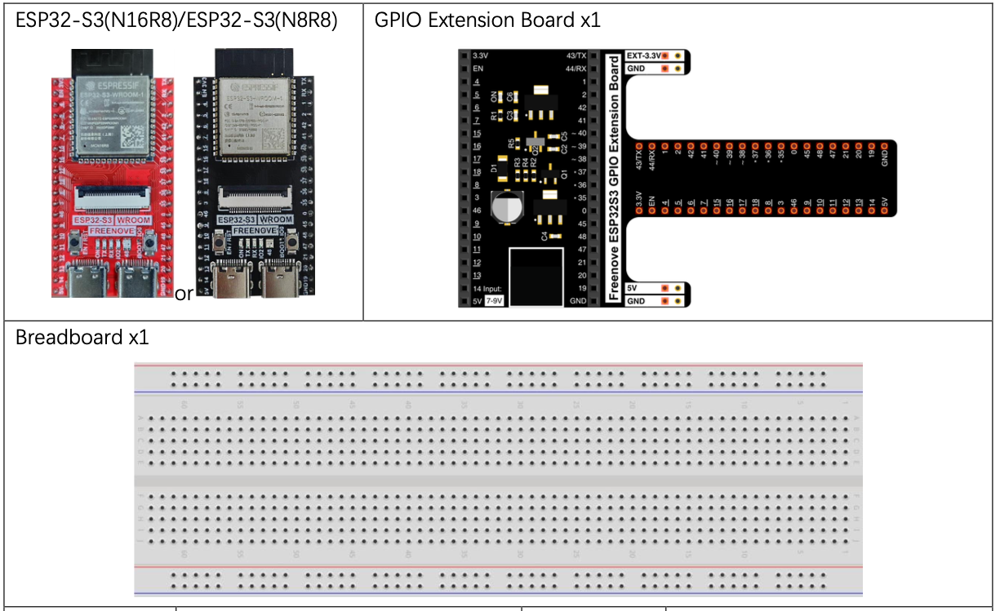

# Blink (Built-in LED)


Blink the built-in LED on the ESP32-S3 WROOM. This is the "Hello World" of microcontroller programming.

## New Concepts
- Thonny
- Python
- ESP32 Microcontroller
- Breadboard

## Component List



No external circuit required — this project is powered over USB and uses the LED built into the ESP32-S3 WROOM board (connected internally to GPIO2).


## Code

**File:** [`01_first_examples/code/Blink.py`](./code/Blink.py)

```python
from time import sleep_ms
from machine import Pin

led = Pin(2, Pin.OUT)  # create LED object from pin2, Set Pin2 to output

while True:
    led.value(1)    # Turn LED On
    sleep_ms(1000)
    led.value(0)    # Turn LED Off
    sleep_ms(1000)
```

---

## How to Run

### Online (while connected to PC)
1. Open Thonny and navigate to `01_first_examples/code/`.
2. Double-click `Blink.py` to open it.
3. Click **Stop/Restart backend** and wait for the connection to be confirmed.
4. Click **Run current script** — the LED starts blinking.

> If you disconnect the USB cable or press Reset, the code stops. Use [offline mode](../setup/advanced_setup.md#offline-mode) to persist it.

---

## Code Explanation


In plain language the code:

- Import the functions `sleep_ms` and `Pin` used in this project
- Setup GPIO Pin 2 as output and assign it to the led variable
- Loop forever 
  - Turn LED On
  - Sleep for 1 second
  - Turn LED Off
  - Sleep for 1 second


```python
# -- Setup --

# Import the functions `sleep_ms` and `Pin` used in this project
from time import sleep_ms
from machine import Pin

# Setup GPIO Pin 2 as output and assign it to the led variable
led = Pin(2, Pin.OUT)

# -- Program Loop --

# Loop forever
while True:
    led.value(1)    # Turn LED On
    sleep_ms(1000)  # Sleep for 1 second
    led.value(0)    # Turn LED Off
    sleep_ms(1000)  # Sleep for 1 second
```

> **DEFINITION** - GPIO stands for <u>**G**</u>eneral <u>**P**</u>urpose <u>**I**</u>nput <u>**O**</u>utput.  So this pin can either send out a signal, as in this case, or read in a signal, for example to read a button press.


---

## Key Concepts

- **`Pin(id, mode)`** — creates a GPIO object. `Pin.OUT` sets it as an output.
- **`led.value(0/1)`** — sets the pin LOW (0) or HIGH (1).
- **`sleep_ms(ms)`** — pauses execution for the given number of milliseconds.
- **`while True`** — infinite loop; runs forever until interrupted.
- Python uses **indentation** (not braces) to define code blocks.


## Further Exploration

Try the following:

- Make the LED flash very fast
  - Can you make it flash so fast it looks like it is on all the time?
- Make the LED on time different than the off time.


> Adapted from [Python_Tutorial.pdf](../Python_Tutorial.pdf) Project 1.1