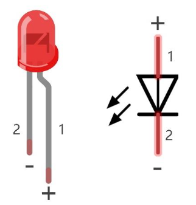
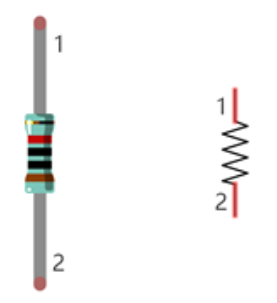
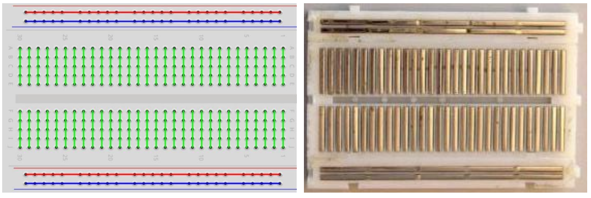

# Blink (External LED)


Blink an external LED wired to the ESP32-S3 via a breadboard. This introduces basic circuit concepts: LEDs, resistors, and breadboards.

## Component List


## Component Knowledge

### LED

An LED is a diode that emits light when current flows through it. It is **polar** — current must flow in the correct direction:



- **Longer pin** = positive (anode) → connect to GPIO / power
- **Shorter pin** = negative (cathode) → connect to GND

> **Warning:** Never connect an LED directly to power without a resistor. Operating voltage range: 1.9V–3.4V. Exceeding this will burn out the LED.

### Resistor

Resistors limit current flow, protecting the LED. Resistance is measured in Ohms (Ω). Value is indicated by coloured bands on the body.



Ohm's Law: **I = V / R**
- Example: 5V supply, 10kΩ resistor → I = 5V / 10,000Ω = 0.5mA

Resistors are **non-polar** — direction doesn't matter.

### Breadboard
Rows of holes on a breadboard are electrically connected internally. Insert components into the same row to connect them without soldering. Power rails (marked + and −) run along the sides.



---

## Circuit

**Wiring Instructions:**
- ESP32-S3 GPIO2 → 220Ω resistor → LED anode (longer pin)
- LED cathode (shorter pin) → GND


**Wiring notes:**
- Connect the longer pin (anode) of the LED toward the resistor/GPIO side.
- Disconnect all power before building the circuit, then reconnect once verified.

> **Caution:** Avoid short circuits — never connect 5V or 3.3V directly to GND.

---

## Code

**File:** [`./Blink.py`](./code/Blink.py)

```python
from time import sleep_ms
from machine import Pin

led = Pin(2, Pin.OUT)  # create LED object from pin2, Set Pin2 to output

try:
    while True:
        led.value(1)    # Set led turn on
        sleep_ms(1000)
        led.value(0)    # Set led turn off
        sleep_ms(1000)
except:
    pass
```

> The code is the same as before, GPIO2 controls both the built-in LED and the external LED wired in this circuit.

---

## How to Run

### Online (while connected to PC)
1. Open Thonny and navigate to `01_first_examples/code`.
2. Double-click `Blink.py`.
3. Click **Stop/Restart backend**, wait for connection.
4. Click **Run current script** — the external LED starts blinking.


## Further Exploration

Circuits can be represented with a wiring diagram like we saw above or a schematic diagram.  A wiring diagram shows how the circuit is connected in the real world, the schematic diagram shows how it is electrically connected.

Here is a schematic for this circuit


> Adapted from [Python_Tutorial.pdf](../Python_Tutorial.pdf) Project 1.2