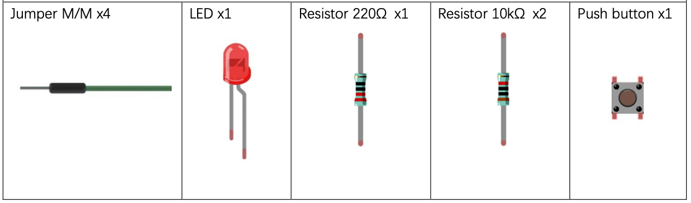
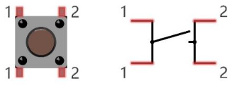
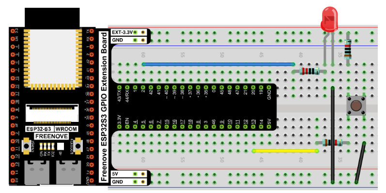
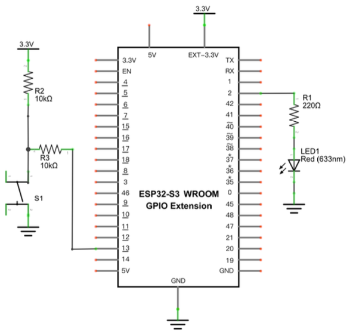

# Button & LED

Control an LED with a push button switch. When the button is pressed the LED turns ON; when released it turns OFF. Introduces the concept of input → control → output.


## Component List




## Component Knowledge

### Push Button Switch
This 4-pin push button is a 2-pole switch. The two pins on each side are internally connected. When the button is pressed, the left and right sides connect, completing the circuit.



Left pins are always connected to each other; right pins are always connected to each other. Pressing the button bridges left and right.

---

## Circuit

### Wiring Diagram



**Connections:**
- LED anode → 220Ω resistor → GPIO2
- LED cathode → GND
- Push button one side → GPIO13
- Push button other side → GND
- GPIO13 also connected via 10kΩ pull-up resistor to 3.3V

### Schematic Diagram



The internal pull-up (`Pin.PULL_UP`) in software replaces the need for an external pull-up resistor in this case, but the schematic uses external resistors for clarity.

> Disconnect all power before building the circuit. Reconnect once verified.

---

## Code

**File:** [`01_first_examples/code/ButtonAndLed.py`](./code/ButtonAndLed.py)

```python
from machine import Pin

led = Pin(2, Pin.OUT)

# create button object from pin13, Set Pin13 to Input
button = Pin(13, Pin.IN, Pin.PULL_UP)

try:
    while True:
        if not button.value():
            led.value(1)    # button pressed → LED on
        else:
            led.value(0)    # button released → LED off
except:
    pass
```

---

## How to Run

### Online
1. Open Thonny → `Micropython_Codes/02.1_ButtonAndLed/`.
2. Double-click `ButtonAndLed.py`.
3. Click **Run current script**.
4. Press the button — LED turns ON. Release — LED turns OFF.


## Code Explanation

### Create Input Pin

Sets GPIO13 as input with the internal pull-up resistor enabled. When the button is not pressed, the pin reads HIGH (1). When pressed (connected to GND), it reads LOW (0).

```python
button = Pin(13, Pin.IN, Pin.PULL_UP)
```

### Read Input Pin

`button.value()` returns `0` when pressed. `not 0` is `True`, so the LED turns on. When released, `button.value()` returns `1`, so the LED turns off.

```python
if not button.value():
    led.value(1)
else:
    led.value(0)
```

## Key Concepts

- **Input → Control → Output** pattern: button (input) → ESP32-S3 (control) → LED (output)
- **Pull-up resistor**: keeps the input pin HIGH when the button is not pressed, preventing a floating/undefined state
- **`if not button.value()`**: checks for LOW (pressed) state; equivalent to `if button.value() == 0`

## Further Exploration

- Modify code so the LED is normally on and turns off when the button is pressed.~
- Modify code so the LED blinks when button is pressed and is solid on when button is not pressed.

> Adapted from [Python_Tutorial.pdf](../Python_Tutorial.pdf) Project 2.1