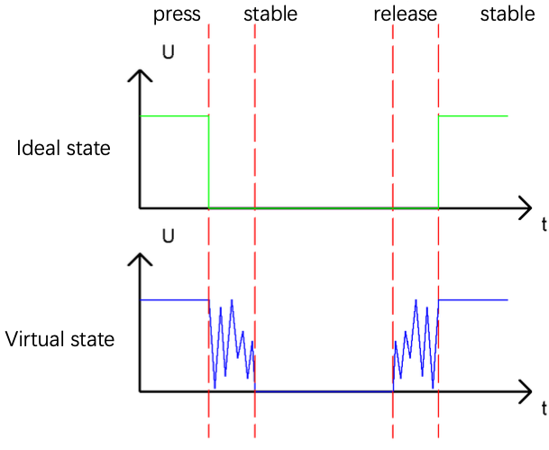

# Button and LED On and Off Switch


Toggle an LED on and off with a push button — press once to turn ON, press again to turn OFF. Unlike Project 2.1, the LED state persists after releasing the button. 

Uses the same components and circuit as Project 3

## New Concepts
- debouncing
- functions

### Concept: Debouncing

When a push button is pressed or released, the mechanical contacts briefly bounce — rapidly switching between connected and disconnected many times before settling. This is invisible to humans but causes a microcontroller to register multiple presses in one action.



**Solution:** After detecting a press, wait 20ms and check again. If still pressed, treat it as a genuine button press. This filters out the noise from bouncing.

### Concept: Functions

A function encapsulates code so it can be used multiple times using just the function name.  It also makes code easier to read and understand.

Defining a function

```python
def reverseGPIO():
    if led.value():
        led.value(0)
    else:
        led.value(1)
```

Calling a function

```python
reverseGPIO()
```

## Component List & Circuit Diagram

*Circuit and components are identical to Project 1.3*

## Code

**File:** [`01_first_examples/code/ButtonAndLed_OnOffSwitch.py`](./code/ButtonAndLed_OneOffSwitch.py)

```python
import time
from machine import Pin

led = Pin(2, Pin.OUT)
button = Pin(13, Pin.IN, Pin.PULL_UP)

def reverseGPIO():
    if led.value():
        led.value(0)
    else:
        led.value(1)

while True:
    if not button.value():          # button pressed?
        time.sleep_ms(20)           # wait 20ms (debounce)
        if not button.value():      # still pressed? (genuine press)
            reverseGPIO()           # toggle LED
            while not button.value():   # wait for release
                time.sleep_ms(20)
```

## How to Run

### Online
1. Open Thonny → `01_first_examples/code/`.
2. Double-click `ButtonAndLed_OnOffSwitch.py`.
3. Click **Run current script**.
4. Press the button — LED toggles ON/OFF with each press.

---

## Code Explanation

### Toggle function
```python
def reverseGPIO():
    if led.value():
        led.value(0)
    else:
        led.value(1)
```
Reads the current LED state and sets it to the opposite — ON becomes OFF, OFF becomes ON.

### Debounce logic
```python
if not button.value():        # 1. initial press detected
    time.sleep_ms(20)         # 2. wait 20ms
    if not button.value():    # 3. confirm still pressed
        reverseGPIO()         # 4. toggle
        while not button.value():  # 5. wait until released
            time.sleep_ms(20)
```

Step 5 prevents the LED from toggling again while the button is held down — the action fires once per press, not continuously.

---

## Key Concepts

- **Debouncing**: ignoring the brief noise when a button transitions state
- **Toggle pattern**: reading current state and setting its inverse
- **Defining functions** with `def` in MicroPython
- **Waiting for release**: important to avoid registering a single press as multiple events

## Further Exploration

- Rename the `reverseGPIO` button to something more descriptive.  For example `toggleLED`.

> Adapted from [Python_Tutorial.pdf](../Python_Tutorial.pdf) Project 2.2