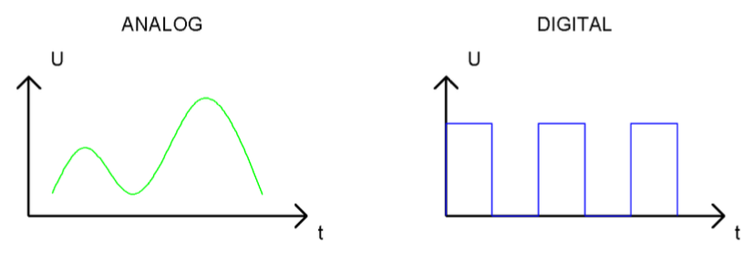
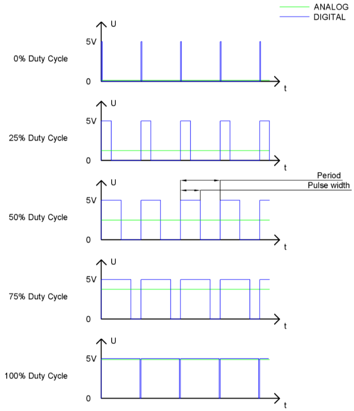
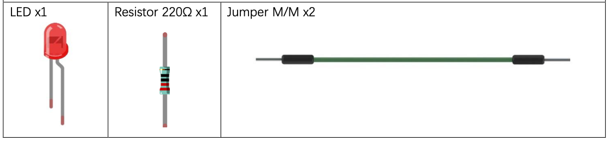
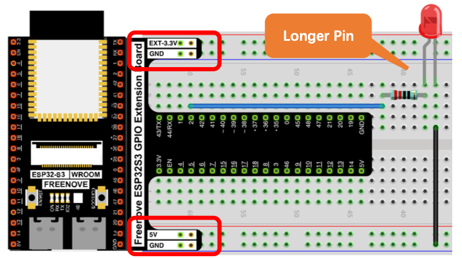
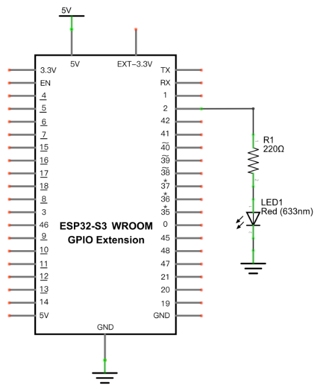

# Breathing LED

Fade an LED smoothly from off to on and back again, like breathing, instead of just switching it fully on or off. Introduces PWM (Pulse-Width Modulation) — the technique used to make a digital pin behave like an analog output.

## New Concepts
- Analog vs. digital signals
- PWM (Pulse-Width Modulation)
- For loops


### Concept: Analog & Digital

An analog signal is continuous in both time and value — like temperature changing smoothly throughout the day. A digital signal only ever holds discrete values (1s and 0s), and can change instantly between them. Both can be converted into the other.



### Concept: PWM

Microcontroller pins can only output fully HIGH or fully LOW — they can't output a true analog voltage. PWM fakes an analog output by switching a pin HIGH and LOW very quickly. The **duty cycle** is the percentage of each cycle (period) spent HIGH. A longer duty cycle behaves like a higher average voltage; a shorter one behaves like a lower voltage.



The longer the duty cycle, the higher the effective brightness of an LED driven by that pin.

On the ESP32-S3, the PWM (LEDC) controller has 8 channels, each independently configurable for frequency, duty cycle, and resolution.

---

## Component List

*Same components as [02_blink_external_led.md](./01_02_blink_external_led.md).*



---

## Circuit

> NOTE: If you have the circuit setup for [03 Button and LED](./03_button_and_led.md) you can leave the button connected for this project.

### Wiring Diagram



### Schematic Diagram



**Connections:**
- LED anode → 220Ω resistor → GPIO2
- LED cathode → GND

> Disconnect all power before building the circuit. Reconnect once verified.

---

## Code

**File:** [`01_first_examples/code/BreatheLight.py`](./code/BreatheLight.py)

```python
from machine import Pin,PWM
import time

pwm =PWM(Pin(2),10000)
try:
    while True:
        for i in range(0,1023):
            pwm.duty(i)
            time.sleep_ms(1)
            
        for i in range(0,1023):
            pwm.duty(1023-i)
            time.sleep_ms(1)  
except:
    pwm.deinit()
```

---

## How to Run

### Online
1. Open Thonny → `01_first_examples/code/`.
2. Double-click `BreatheLight.py`.
3. Click **Run current script** — the LED fades from off to on, then back to off, like breathing.

---

## Code Explanation

### Initialize PWM

Creates a PWM object on GPIO2 with a frequency of 10,000Hz.

```python
pwm = PWM(Pin(2), 10000)
```

### Fade up, then fade down

Duty cycle ranges from 0–1023. The first loop ramps the duty cycle up (0% → 100% brightness); the second ramps it back down (100% → 0%).

```python
for i in range(0, 1023):
    pwm.duty(i)          # increase brightness
    time.sleep_ms(1)

for i in range(0, 1023):
    pwm.duty(1023 - i)    # decrease brightness
    time.sleep_ms(1)
```

### Deinitialize PWM

Using PWM turns on a hardware timer behind the scenes. `deinit()` turns that timer off — skipping it can cause PWM to fail on the next run.

```python
except:
    pwm.deinit()
```

---

## Key Concepts

- **PWM (Pulse-Width Modulation)**: simulates an analog output by rapidly switching a digital pin HIGH/LOW
- **Duty cycle**: percentage of each cycle spent HIGH; controls effective brightness/voltage (range 0–1023 on ESP32-S3)
- **`pwm.duty(value)`**: sets the duty cycle
- **`pwm.deinit()`**: releases the hardware timer used by PWM — always call this when done

## Further Exploration

- Modify the code so the LED takes longer to get get brighter than it takes to dim.
- Change the PWM frequency (10000) — can slow it down enough to be visible?
- If you left the button connected from project 3 does the button work?  Why or why not?

> Adapted from [Python_Tutorial.pdf](../Python_Tutorial.pdf) Project 4.1
