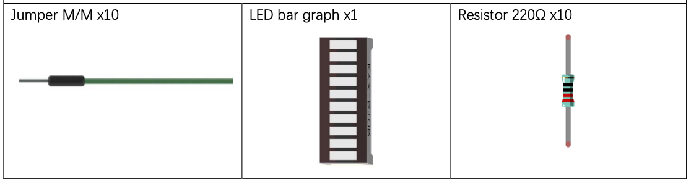
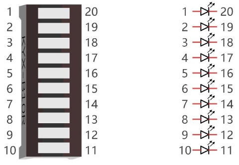
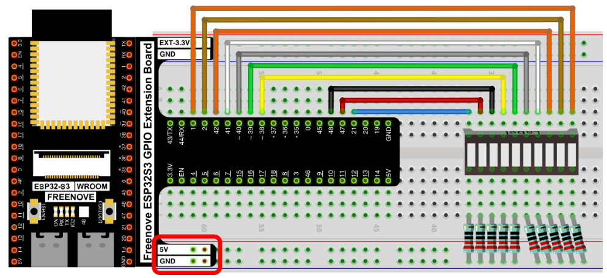
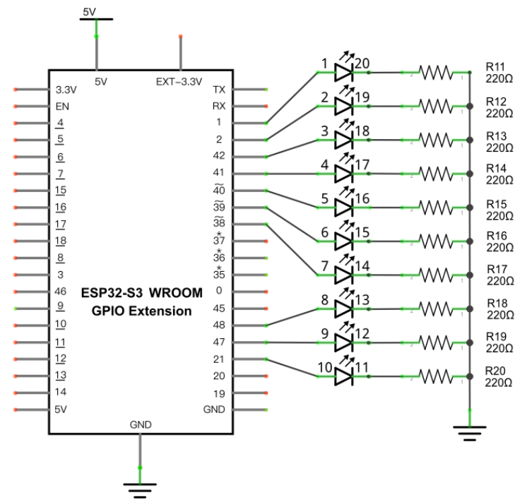

# Flowing Light

Control a 10-LED bar graph to create a flowing light animation — LEDs light up one at a time from left to right, then right to left, repeating in a loop.

New Concepts
- Arrays
- For loops

## Component List



## Component Knowledge

### LED Bar Graph
A LED bar graph integrates 10 individual LEDs into a single compact component. Each LED has its own pair of pins at the bottom — one anode and one cathode — just like a standalone LED.




## Circuit

### Wiring Diagram

> Disconnect all power before building the circuit. Reconnect once verified.



> If the LED bar does not light up, try rotating it 180°. The label orientation is not standardized across all units.

### Schematic Diagram



Each LED anode connects to its GPIO pin. Each cathode connects to GND through a 220Ω resistor.

---

## Code

**File:** [`01_first_examples/code/FlowingLight.py](./code/FlowingLight.py)

```python
import time
from machine import Pin

pins = [21, 47, 48, 38, 39, 40, 41, 42, 2, 1]

def showled():
    length = len(pins)
    # Left to right
    for i in range(0, length):
        led = Pin(pins[i], Pin.OUT)
        led.value(1)
        time.sleep_ms(100)
        led.value(0)
    # Right to left
    for i in range(0, length):
        led = Pin(pins[(length - i - 1)], Pin.OUT)
        led.value(1)
        time.sleep_ms(100)
        led.value(0)

while True:
    showled()
```

---

## How to Run

### Online
1. Open Thonny → `01_first_examples/code/`.
2. Double-click `FlowingLight.py`.
3. Click **Run current script** — LEDs sweep left to right, then right to left.


## Code Explanation

### Pin list
```python
pins = [21, 47, 48, 38, 39, 40, 41, 42, 2, 1]
```
Stores the 10 GPIO pin numbers in order from left to right. Using a list makes it easy to iterate over all LEDs.

### Left-to-right sweep
```python
for i in range(0, length):
    led = Pin(pins[i], Pin.OUT)
    led.value(1)
    time.sleep_ms(100)
    led.value(0)
```
Turns each LED on for 100ms then off, moving forward through the list.

### Right-to-left sweep
```python
for i in range(0, length):
    led = Pin(pins[(length - i - 1)], Pin.OUT)
    led.value(1)
    time.sleep_ms(100)
    led.value(0)
```
Iterates forward through `i` but accesses the list in reverse using `length - i - 1`.

---

## Key Concepts

- **Lists**: store multiple GPIO pin numbers for easy iteration
- **`len(list)`**: returns the number of items in a list
- **`range(start, end)`**: generates a sequence of integers for the `for` loop
- **Reverse indexing**: `pins[length - i - 1]` accesses list items in reverse order without reversing the list itself

---

## Reference

### `for i in range(start, end, step=1)`
Iterates from `start` up to (but not including) `end`, incrementing by `step` each time.

```python
range(0, 5)      # → 0, 1, 2, 3, 4
range(0, 10, 2)  # → 0, 2, 4, 6, 8
```

> Adapted from [Python_Tutorial.pdf](../Python_Tutorial.pdf) Project 3.1