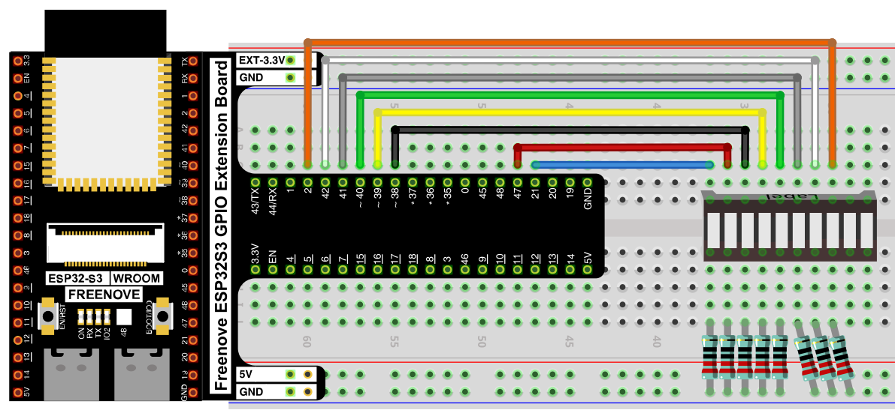
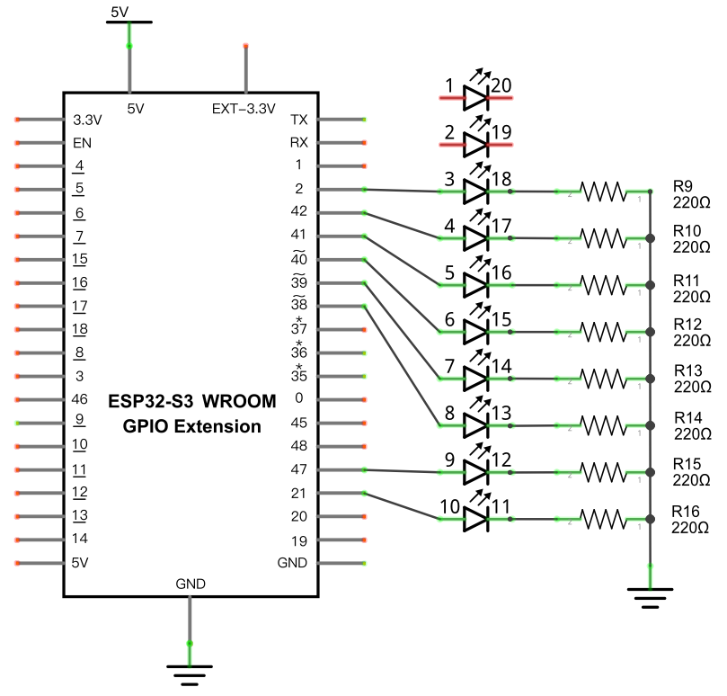

# Flowing Light with PWM (Meteor Effect)

Recreate the flowing light animation from [Flowing Light](./02_01_flowing_light.md), but use PWM instead of simple on/off switching, so each LED fades in and trails off like a meteor instead of snapping on and off.

## New Concepts
- PWM duty-cycle arrays
- Custom Python modules
- Nested `for` loops

### Concept: PWM Channels

The ESP32-S3's PWM (LEDC) controller only has 8 independent channels. The original Flowing Light project drives all 10 LEDs with plain digital on/off, but a PWM version can only fade 8 of them at once — so this project wires up 8 LEDs instead of 10.

### Concept: Custom Modules

Any `.py` file saved onto the ESP32-S3 can be imported as a module, as long as it lives alongside the script that imports it (or on the MicroPython module search path). This project defines a small PWM helper class in `pwm.py` and imports it with `from pwm import myPWM` — so `pwm.py` has to be uploaded to the device too, not just the main script.

### Concept: Nested `for` loops


---

## Component List

*Same board and LED bar graph as [Flowing Light](./02_01_flowing_light.md), but only 8 of the 10 LEDs are wired — one fewer jumper/resistor pair than the GPIO count, since only 8 PWM channels are available.*


---

## Circuit

### Wiring Diagram



### Schematic Diagram



Each of the 8 wired LED anodes connects to its GPIO pin; each cathode connects to GND through a 220Ω resistor. LEDs 1 and 2 on the bar graph are left unconnected.

> Disconnect all power before building the circuit. Reconnect once verified.

---

## Code

**File:** [`02_input_and_output/code/FlowingLight_PWM.py`](./code/FlowingLight_PWM.py)
**Module:** [`02_input_and_output/code/pwm.py`](./code/pwm.py)

```python
from machine import Pin,PWM
from pwm import myPWM
import time

mypwm = myPWM(21,47,38,39,40,41,42,2)
chns=[0,1,2,3,4,5,6,7];
dutys=[0,0,0,0,0,0,0,0,1023,512,256,128,64,32,16,8,0,0,0,0,0,0,0,0];
delayTimes=50

try:
    while True:
        for i in range(0,16):
            for j in range(0,8):
                mypwm.ledcWrite(chns[j],dutys[i+j])
            time.sleep_ms(delayTimes)
            
        for i in range(0,16):
            for j in range(0,8):
                mypwm.ledcWrite(chns[7-j],dutys[i+j])
            time.sleep_ms(delayTimes)
except:
    mypwm.deinit()
```

> [`pwm.py`](./code/pwm.py) defines the `myPWM` helper class used above

---

## How to Run

### Online
1. Open Thonny → `02_input_and_output/code/`.
2. Right-click `pwm.py` → **Upload to /** — wait for it to finish uploading to the ESP32-S3.
3. Double-click `FlowingLight_PWM.py`.
4. Click **Run current script** — the LED bar graph lights up and fades out left to right, then right to left, like a meteor trail.

---

## Code Explanation

### Import the custom module

```python
from pwm import myPWM
```
Imports the `myPWM` class defined in `pwm.py`. This only works because `pwm.py` was uploaded to the same directory on the device.

### Set up 8 PWM channels

```python
mypwm = myPWM(21,47,38,39,40,41,42,2)
chns=[0,1,2,3,4,5,6,7]
dutys=[0,0,0,0,0,0,0,0,1023,512,256,128,64,32,16,8,0,0,0,0,0,0,0,0]
```
Creates a PWM output on each of the 8 wired GPIO pins, numbers each one as a "channel" (0–7), and defines a 24-value array of duty-cycle levels — the bright "head" and fading "tail" of the meteor.

### Sweep the meteor across the bar

```python
for i in range(0,16):
    for j in range(0,8):
        mypwm.ledcWrite(chns[j],dutys[i+j])
    time.sleep_ms(delayTimes)
```
For each step `i`, every channel `j` is set to `dutys[i+j]` — as `i` increases, the window into the `dutys` array slides forward, so the bright duty values move across the LEDs one position at a time. The second loop does the same thing in reverse (`chns[7-j]`) to sweep back from right to left.

### Release the PWM channels

```python
except:
    mypwm.deinit()
```
Turns off all 8 PWM timers when the script stops, so PWM is free to be reinitialized next run.

---

## Key Concepts

- **PWM channels**: ESP32-S3 has 8 independent LEDC channels — one project can drive at most 8 LEDs with PWM at once
- **Custom modules**: any `.py` file on the device can be `import`ed, but it must be uploaded alongside the script that uses it
- **Sliding-window array indexing**: `dutys[i+j]` reads a moving "slice" of the array to create animation, instead of modifying the array itself
- **Nested `for` loops**: the outer loop steps through time; the inner loop updates every LED for that step

## Further Exploration

- Change `dutys` to make the meteor's tail longer or shorter.
- Lower `delayTimes` to speed up the sweep.

> Adapted from [Python_Tutorial.pdf](../Python_Tutorial.pdf) Project 4.2
