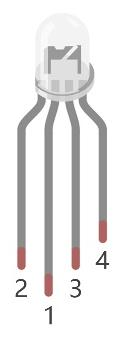
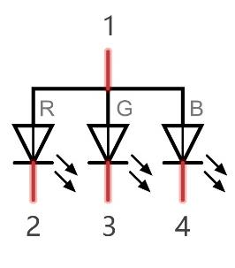
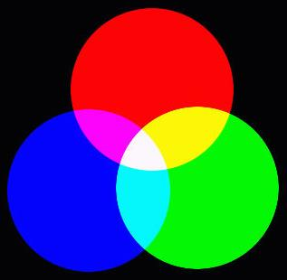
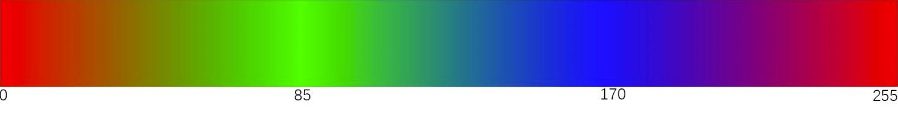
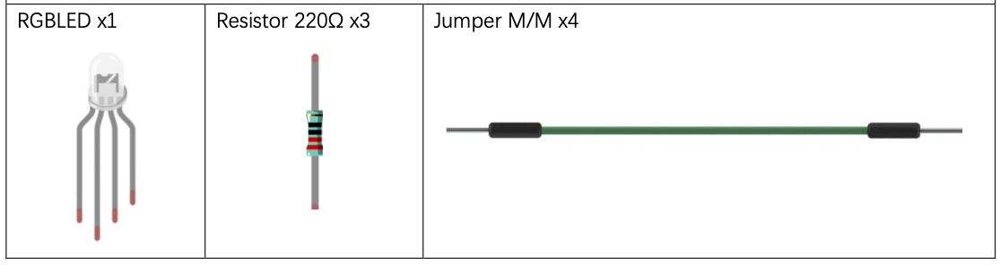
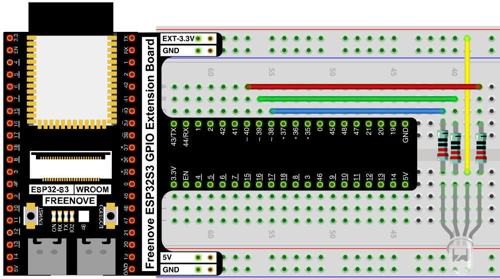
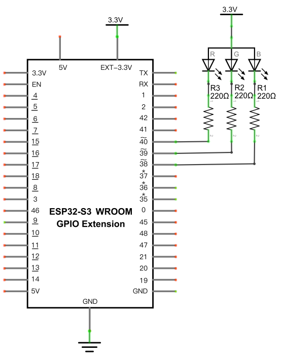

# Gradient Color Light

Make an RGB LED glide smoothly through the full color spectrum, instead of jumping between random colors — a soft, continuous "color wheel" effect.

## New Concepts
- RGB LEDs & color mixing
- The `wheel()` color-model function

### Component Knowledge: RGB LED

An RGB LED packs 3 individual LEDs (red, green, blue) into one 4-pin package. The long pin is the shared common pin — wired here to 3.3V (common anode) — and the other 3 pins each control one color's brightness through its own resistor.




Red, green, and blue are the additive primary colors of light. Mixing them at different brightness levels produces almost any visible color — the same principle used by screens and camera sensors.



Driving each LED with its own PWM channel gives 8-bit control per color, so in theory: 256 × 256 × 256 = 16,777,216 possible colors.

### Concept: The Color Wheel

Instead of picking 3 random duty-cycle values (like Random Color Light does), this project steps a single position value (0–1023) around a "wheel," computing red/green/blue from which third of the wheel that position falls in. Stepping through every position in order produces a smooth gradient instead of abrupt jumps.



---

## Component List



---

## Circuit

### Wiring Diagram



### Schematic Diagram



**Connections:**
- RGB LED common pin (1) → 3.3V
- R, G, B legs → 220Ω resistors → GPIO pins (one PWM channel per color)

> Disconnect all power before building the circuit. Reconnect once verified.

---

## Code

**File:** [`02_input_and_output/code/GradientColorLight.py`](./code/GradientColorLight.py)

```python
from machine import Pin,PWM
import time

pins=[15,2,0];

pwm0=PWM(Pin(pins[0]),1000)
pwm1=PWM(Pin(pins[1]),1000)
pwm2=PWM(Pin(pins[2]),1000)

red=0                  #red
green=0                #green
blue=0                 #blue

def setColor():
    pwm0.duty(red)
    pwm1.duty(green)
    pwm2.duty(blue)

def wheel(pos):
    global red,green,blue
    WheelPos=pos%1023
    print(WheelPos)
    if WheelPos<341:
        red=1023-WheelPos*3
        green=WheelPos*3
        blue=0
        
    elif WheelPos>=341 and WheelPos<682:
        WheelPos -= 341;
        red=0
        green=1023-WheelPos*3
        blue=WheelPos*3
    else :
        WheelPos -= 682;
        red=WheelPos*3
        green=0
        blue=1023-WheelPos*3

try:
    while True:
        for i in range(0,1023):
            wheel(i)
            setColor()
            time.sleep_ms(15)
except:
    pwm0.deinit()
    pwm1.deinit()
    pwm2.deinit()
```

> The GPIO pin numbers here (`15, 2, 0`) match this board's wiring. The original Freenove example uses `40, 39, 38` — wire to whichever pins your code uses.

---

## How to Run

### Online
1. Open Thonny → `02_input_and_output/code/`.
2. Double-click `GradientColorLight.py`.
3. Click **Run current script** — the RGB LED fades smoothly through the rainbow.

---

## Code Explanation

### Set up 3 PWM channels

```python
pins=[15,2,0]
pwm0=PWM(Pin(pins[0]),1000)
pwm1=PWM(Pin(pins[1]),1000)
pwm2=PWM(Pin(pins[2]),1000)
```
One PWM channel per color, each at 1000Hz.

### Apply the current color

```python
def setColor():
    pwm0.duty(red)
    pwm1.duty(green)
    pwm2.duty(blue)
```
Writes the global `red`, `green`, `blue` duty values to their respective PWM pins.

### Compute a color from a wheel position

```python
def wheel(pos):
    global red,green,blue
    WheelPos=pos%1023
    if WheelPos<341:
        red=1023-WheelPos*3
        green=WheelPos*3
        blue=0
    elif WheelPos>=341 and WheelPos<682:
        WheelPos -= 341
        red=0
        green=1023-WheelPos*3
        blue=WheelPos*3
    else:
        WheelPos -= 682
        red=WheelPos*3
        green=0
        blue=1023-WheelPos*3
```
Splits the 0–1023 range into 3 equal thirds (red→green, green→blue, blue→red). Within each third, one color ramps down linearly while the next ramps up — producing a continuous gradient with no hard jumps between colors.

### Sweep through every position

```python
for i in range(0,1023):
    wheel(i)
    setColor()
    time.sleep_ms(15)
```
Steps `i` through the entire wheel, recalculating and applying the color at each step.

### Release the PWM channels

```python
except:
    pwm0.deinit()
    pwm1.deinit()
    pwm2.deinit()
```

---

## Key Concepts

- **RGB color mixing**: any visible color can be approximated by mixing red, green, and blue light at different brightness levels
- **Color wheel function**: maps a single position value to a smooth RGB color, avoiding the abrupt jumps of picking 3 independent random values
- **Piecewise linear interpolation**: each third of the wheel ramps one color down while ramping the next color up

## Further Exploration

- Slow down or speed up the gradient by changing `time.sleep_ms(15)`.
- Try stepping `i` by more than 1 each loop to see coarser color transitions.

> Adapted from [Python_Tutorial.pdf](../Python_Tutorial.pdf) Project 5.2
