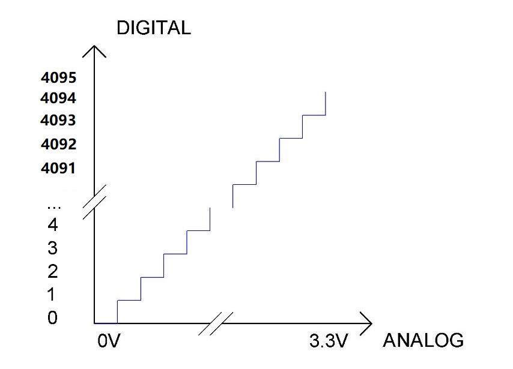
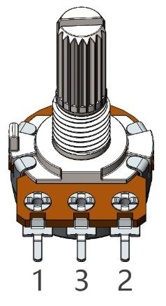
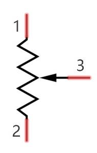
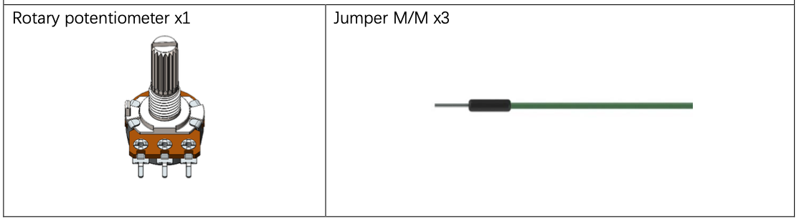
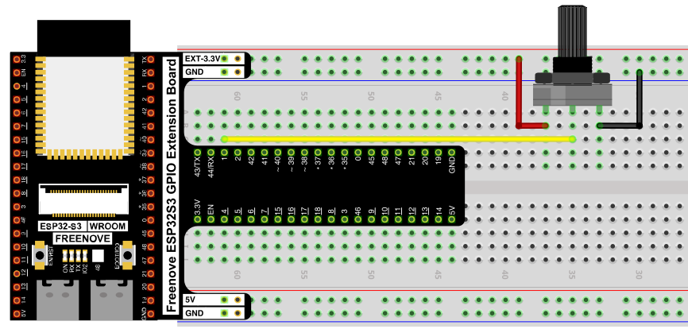
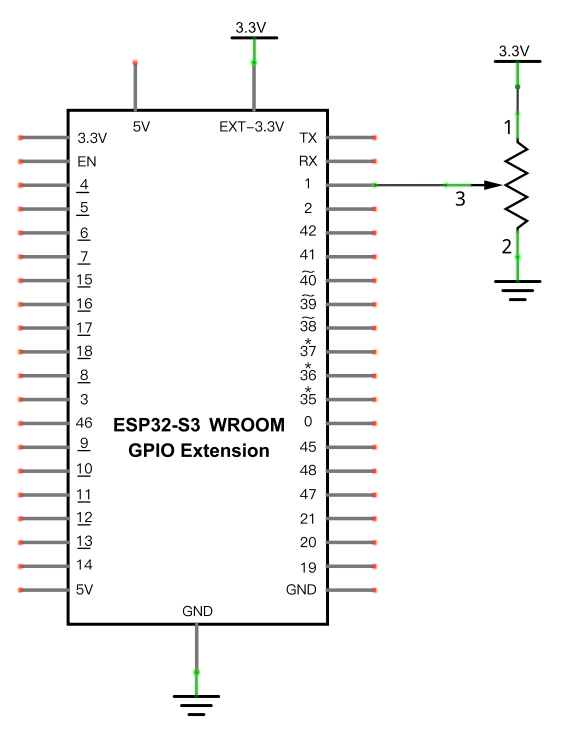

# Read the Voltage of a Potentiometer

Use the ESP32-S3's ADC (Analog-to-Digital Converter) to read the voltage from a potentiometer and print it to the Shell — the first project that reads an analog signal instead of just a digital HIGH/LOW.

## New Concepts
- Analog-to-digital conversion (ADC)
- Potentiometers

### Concept: ADC

An ADC converts a continuous analog signal (like a voltage) into a digital number. The ESP32-S3's ADC has 12-bit resolution — it divides the 0–3.3V range into 4096 (2¹²) discrete steps. The more bits an ADC has, the finer (denser) that division is, and the more precise the conversion.



The conversion formula is:

```
ADC Value = (Analog Voltage / 3.3) * 4095
```

ESP32-S3 has two 12-bit successive-approximation ADCs, covering 18 pins total (GPIO 1–18, split across `ADC1_CH0–8` and `ADC2_CH0–7`).

### Component Knowledge: Potentiometer

A potentiometer is a 3-terminal *variable* resistor — unlike the fixed 220Ω resistors used in earlier projects. A resistive element runs between pins 1 and 2, with a movable contact (the wiper, pin 3) sliding along it. As the wiper moves from pin 1 toward pin 2, the resistance between pin 1 and pin 3 rises linearly toward the full resistance, while the resistance between pin 2 and pin 3 falls linearly toward 0.




With pins 1 and 2 connected across a power supply, the wiper (pin 3) outputs a voltage somewhere between the two supply rails, depending on its position. A **rotary** potentiometer works the same way, but the wiper is moved by turning a knob instead of sliding a lever.

---

## Component List



---

## Circuit

### Wiring Diagram



**Connections:**
- Potentiometer pin 1 → 3.3V
- Potentiometer pin 2 → GND
- Potentiometer pin 3 (wiper) → GPIO1

### Schematic Diagram



> Disconnect all power before building the circuit. Reconnect once verified.

---

## Code

**File:** [`02_input_and_output/code/AnalogRead.py`](./code/AnalogRead.py)

```python
from machine import ADC,Pin
import time

adc=ADC(Pin(1))
adc.atten(ADC.ATTN_11DB)
adc.width(ADC.WIDTH_12BIT)

try:
    while True:
        adcVal=adc.read()
        voltage = adcVal / 4095.0 * 3.3
        print("ADC Val:",adcVal,"\tVoltage:",voltage,"V")
        time.sleep_ms(100)
except:
    adc.deinit()
```

---

## How to Run

### Online
1. Open Thonny → `02_input_and_output/code/`.
2. Double-click `AnalogRead.py`.
3. Click **Run current script** and watch the Shell — turning the potentiometer's knob changes the printed ADC value and voltage.

---

## Code Explanation

### Configure the ADC

```python
adc=ADC(Pin(1))
adc.atten(ADC.ATTN_11DB)
adc.width(ADC.WIDTH_12BIT)
```
Creates an ADC on GPIO1, sets its attenuation so the full input range is 0–3.3V, and sets 12-bit resolution (0–4095).

### Read and convert

```python
while True:
    adcVal=adc.read()
    voltage = adcVal / 4095.0 * 3.3
    print("ADC Val:",adcVal,"\tVoltage:",voltage,"V")
    time.sleep_ms(100)
```
Reads the raw 0–4095 ADC value, converts it to a 0–3.3V voltage using the formula above, and prints both every 100ms.

### Release the ADC

```python
except:
    adc.deinit()
```

---

## Key Concepts

- **ADC resolution**: a 12-bit ADC divides its voltage range into 4096 discrete steps — more bits means finer precision
- **Potentiometer as a voltage divider**: the wiper pin outputs a voltage between the two end pins, set by its physical position
- **Attenuation (`atten`)**: sets the maximum voltage the ADC can measure, by scaling the input range

See [Class ADC](../reference/Class_ADC.md) for the full API reference.

## Further Exploration

- Try a different `atten` setting (e.g. `ADC.ATTN_6DB`) and see how the maximum readable voltage changes.
- Print the voltage with fewer decimal places using `round(voltage, 2)`.

> Adapted from [Python_Tutorial.pdf](../Python_Tutorial.pdf) Project 9.1
