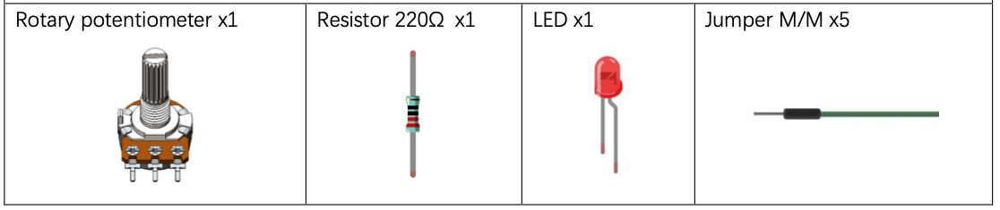
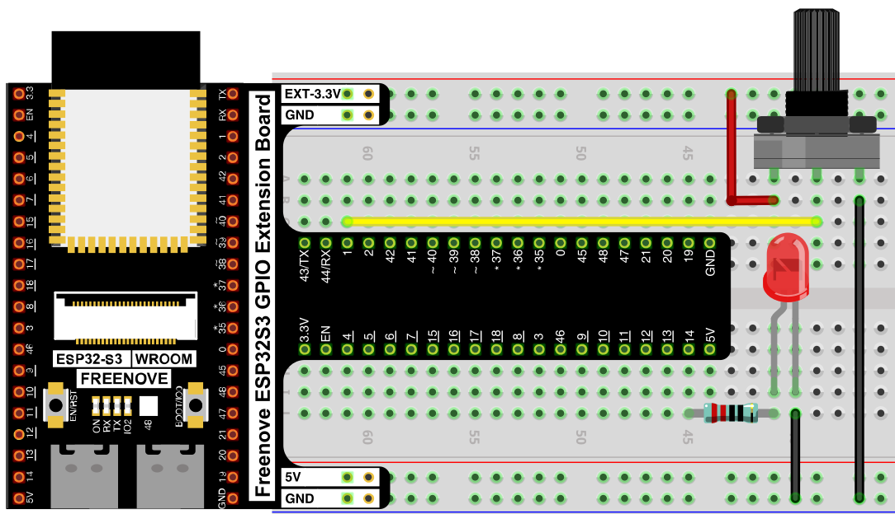
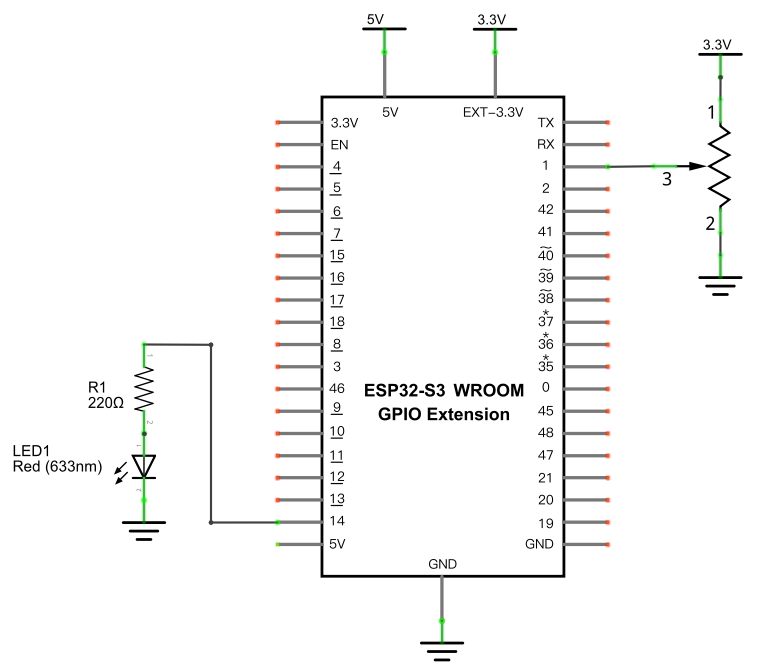

# Soft Light

Combine ADC and PWM: read a potentiometer's position and use it to control an LED's brightness, so turning the knob smoothly dims or brightens the light.

---

## Component List



---

## Circuit

### Wiring Diagram



**Connections:**
- Potentiometer pin 1 → 3.3V, pin 2 → GND, pin 3 (wiper) → GPIO1
- LED anode → 220Ω resistor → GPIO14
- LED cathode → GND

### Schematic Diagram



> Disconnect all power before building the circuit. Reconnect once verified.

---

## Code

**File:** [`02_input_and_output/code/Soft_LED.py`](./code/Soft_LED.py)

```python
from machine import Pin,PWM,ADC
import time

pwm =PWM(Pin(14,Pin.OUT),1000)
adc=ADC(Pin(1))
adc.atten(ADC.ATTN_11DB)
adc.width(ADC.WIDTH_12BIT)

def remap(value,oldMin,oldMax,newMin,newMax):
    return int((value)*(newMax-newMin)/(oldMax-oldMin))

try:
    while True:
        adcValue=adc.read()
        pwmValue=remap(adcValue,0,4095,0,1023)
        pwm.duty(pwmValue)
        print(adcValue,pwmValue)
        time.sleep_ms(100)
except:
    adc.deinit()
    pwm.deinit()
```

---

## How to Run

### Online
1. Open Thonny → `02_input_and_output/code/`.
2. Double-click `Soft_LED.py`.
3. Click **Run current script**. Rotate the potentiometer's knob — the LED's brightness changes to match.

---

## Code Explanation

### Set up PWM output and ADC input

```python
pwm =PWM(Pin(14,Pin.OUT),1000)
adc=ADC(Pin(1))
adc.atten(ADC.ATTN_11DB)
adc.width(ADC.WIDTH_12BIT)
```
PWM on GPIO14 drives the LED; the ADC on GPIO1 reads the potentiometer, same as in [Read the Voltage of a Potentiometer](./02_06_read_voltage_potentiometer.md).

### Remap one range onto another

```python
def remap(value,oldMin,oldMax,newMin,newMax):
    return int((value)*(newMax-newMin)/(oldMax-oldMin))
```
The ADC produces values from 0–4095, but `pwm.duty()` only accepts 0–1023. `remap()` rescales a value from one range (`oldMin`–`oldMax`) proportionally into another (`newMin`–`newMax`).

### Apply the potentiometer position to LED brightness

```python
while True:
    adcValue=adc.read()
    pwmValue=remap(adcValue,0,4095,0,1023)
    pwm.duty(pwmValue)
    print(adcValue,pwmValue)
    time.sleep_ms(100)
```
Reads the raw ADC value, remaps it from the ADC's 0–4095 range into PWM's 0–1023 range, and writes it straight to the LED's duty cycle.

---

## Key Concepts

- **Range remapping**: `remap()` is a general-purpose pattern for converting any value from one numeric scale to another — useful whenever an input range doesn't match an output range
- **ADC → PWM pipeline**: reading a sensor and feeding its (rescaled) value directly into an output is the basic shape of most analog control projects

See [Class ADC](../reference/Class_ADC.md) and [Class PWM(pin, freq)](../reference/Class_PWM(pin,freq).md) for the full API reference.

## Further Exploration

- Write a generic `remap()`-based brightness curve that feels more linear to the eye (human brightness perception isn't linear).
- Replace the LED with a buzzer's `freq()` to make a "Theremin"-style pitch control.

> Adapted from [Python_Tutorial.pdf](../Python_Tutorial.pdf) Project 10.1
