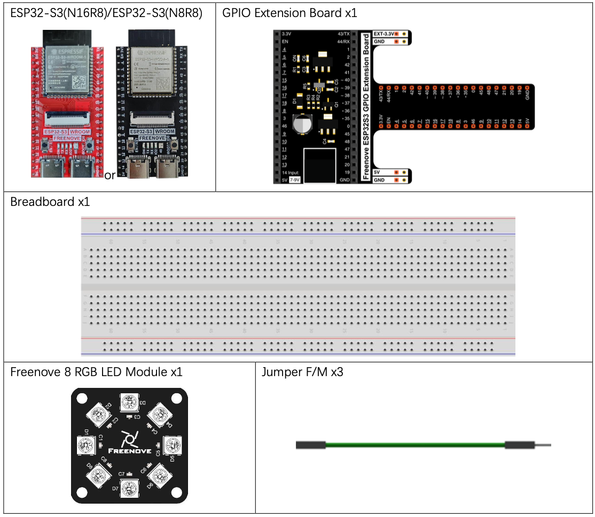
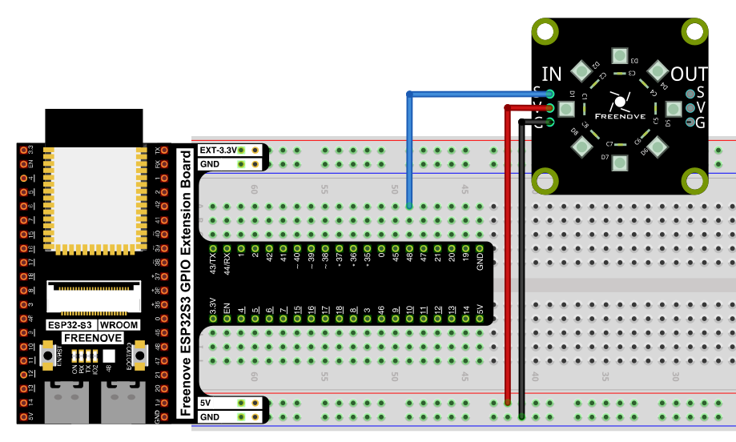
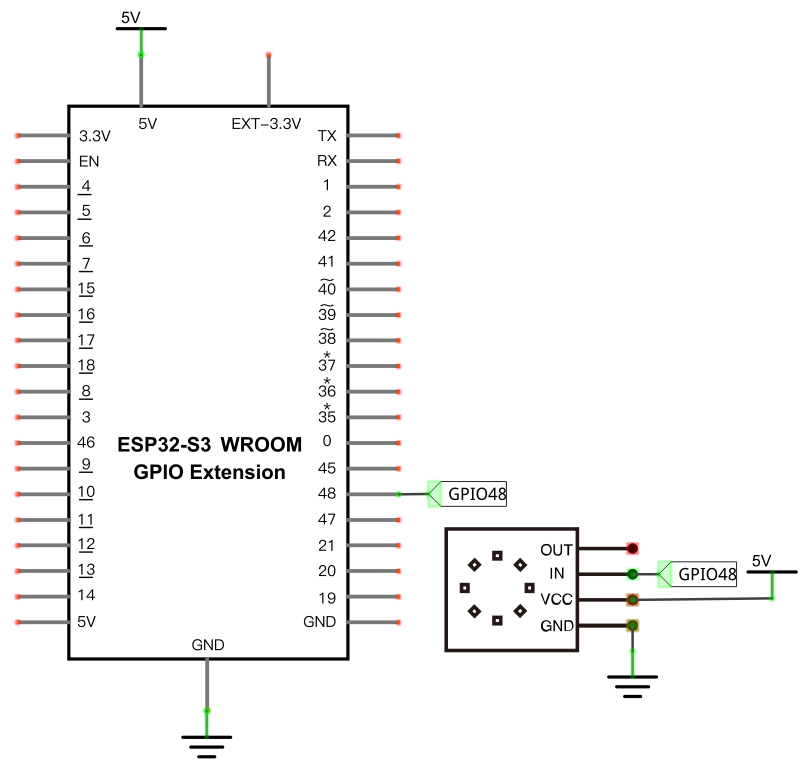

# LED Pixel

Control a Freenove 8 RGB LED Module (WS2812 "NeoPixel" LEDs) using only a single GPIO pin, cycling each of the 8 LEDs through red, green, blue, white, and off.

## New Concepts
- Addressable RGB LEDs (WS2812 / NeoPixel)
- The `neopixel` module

### Component Knowledge: Freenove 8 RGB LED Module

The module packs 8 WS2812 LEDs, each with its own red, green, and blue element (256 brightness levels per color — 16,777,216 possible colors per LED). Unlike a standard RGB LED, each WS2812 only needs a single data pin: it reads its own color data from the signal, then passes the rest down the line to the next LED. This lets multiple modules be chained by connecting one module's `OUT` to the next module's `IN`, controlling 8, 16, 24… LEDs from a single GPIO pin.

---

## Component List


---

## Circuit

### Wiring Diagram



**Connections:**
- Module `IN` side: `S` → GPIO48, `V` → 5V, `G` → GND

### Schematic Diagram



> Disconnect all power before building the circuit. Reconnect once verified.

---

## Code

**File:** [`02_input_and_output/code/Neopixel.py`](./code/Neopixel.py)

```python
from machine import Pin
import neopixel
import time
pin = Pin(48, Pin.OUT)
np = neopixel.NeoPixel(pin, 8)

#brightness :0-255
brightness=10                                
colors=[[brightness,0,0],                    #red
        [0,brightness,0],                    #green
        [0,0,brightness],                    #blue
        [brightness,brightness,brightness],  #white
        [0,0,0]]                             #close
    
while True:
    for i in range(0,5):
        for j in range(0,8):
            np[j]=colors[i]
            np.write()
            time.sleep_ms(50)
        time.sleep_ms(500)
    time.sleep_ms(500)
```

---

## How to Run

### Online
1. Open Thonny → `02_input_and_output/code/`.
2. Double-click `Neopixel.py`.
3. Click **Run current script** — all 8 LEDs cycle through red, green, blue, white, then off.

---

## Code Explanation

### Set up the module

```python
pin = Pin(48, Pin.OUT)
np = neopixel.NeoPixel(pin, 8)
```
Associates GPIO48 with a `NeoPixel` object controlling 8 LEDs.

### Define brightness and colors

```python
brightness=10
colors=[[brightness,0,0],
        [0,brightness,0],
        [0,0,brightness],
        [brightness,brightness,brightness],
        [0,0,0]]
```
Each entry in `colors` is an `[R, G, B]` triple. `brightness` (0–255) scales how bright each color appears.

### Apply a color to every LED

```python
for i in range(0,5):
    for j in range(0,8):
        np[j]=colors[i]
        np.write()
        time.sleep_ms(50)
    time.sleep_ms(500)
```
The outer loop steps through the 5 colors. The inner loop assigns that color to each of the 8 LEDs in the `np` array — but nothing happens on the physical module until `np.write()` sends the array data down the line.

---

## Key Concepts

- **Addressable LEDs**: each WS2812 LED stores and forwards its own color data, so a whole chain can be driven from one GPIO pin
- **`np[j] = [r,g,b]`**: stages a color for LED `j` without sending it yet
- **`np.write()`**: sends the staged color data to the physical LEDs

See [Class neopixel](../reference/Class_neopixel.md) for the full API reference.

## Further Exploration

- Change `brightness` to make the cycle dimmer or brighter.
- Add more colors to the `colors` list (e.g. purple, orange).

> Adapted from [Python_Tutorial.pdf](../Python_Tutorial.pdf) Project 6.1
