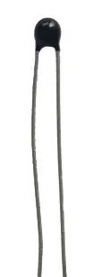
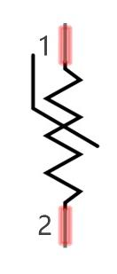
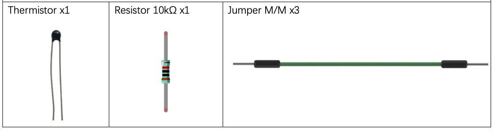
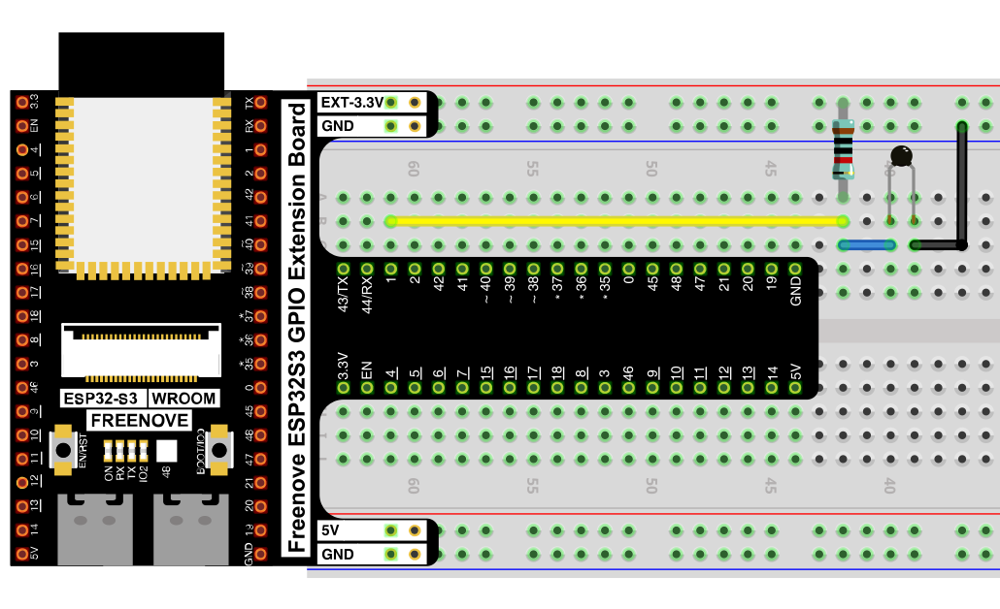
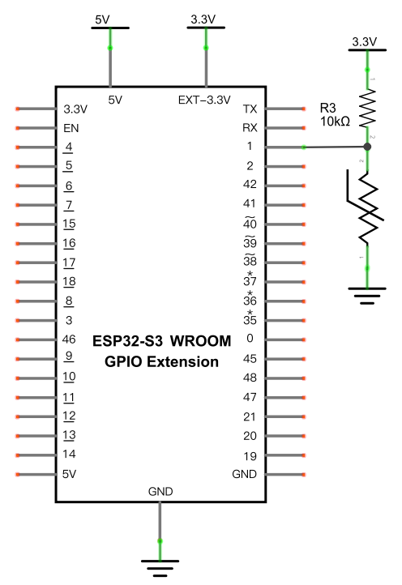

# Thermometer

Build a digital thermometer using a thermistor — a resistor whose resistance changes with temperature — converting its ADC reading into a real temperature in °C.

## New Concepts
- Thermistors
- Deriving a physical quantity (temperature) from a resistance formula

### Component Knowledge: Thermistor

A thermistor is a temperature-sensitive resistor: its resistance changes as temperature changes, wired into a voltage divider exactly like the [photoresistor in Night Lamp](./03_01_night_lamp.md).




The relationship between a thermistor's resistance and temperature is:

```
Rt = R * EXP[ B * (1/T2 - 1/T1) ]
```

- `Rt`: thermistor resistance at temperature `T2`
- `R`: nominal resistance at reference temperature `T1`
- `B`: the thermistor's thermal index (a constant specific to the part)
- `T1`, `T2`: absolute (Kelvin) temperatures — Kelvin = 273.15 + Celsius

For this thermistor: `B = 3950`, `R = 10kΩ`, `T1 = 25°C`.

Solving that formula for temperature instead of resistance gives:

```
T2 = 1 / ( 1/T1 + ln(Rt/R)/B )
```

So the process is: read the ADC → calculate voltage → calculate `Rt` from the voltage divider → calculate temperature from `Rt`.

---

## Component List


---

## Circuit

### Wiring Diagram



**Connections:**
- 5V → 10kΩ resistor → GPIO1 → thermistor → GND

### Schematic Diagram



> Disconnect all power before building the circuit. Reconnect once verified.

---

## Code

**File:** [`03_sensors/code/Thermometer.py`](./code/Thermometer.py)

```python
from machine import Pin,ADC
import time
import math

adc=ADC(Pin(1))
adc.atten(ADC.ATTN_11DB)
adc.width(ADC.WIDTH_12BIT)
try:
    while True:
        adcValue=adc.read()
        voltage=adcValue/4095*3.3
        Rt=10*voltage/(3.3-voltage)
        tempK=(1/(1/(273.15+25)+(math.log(Rt/10))/3950))
        tempC=tempK-273.15
        print("ADC value:",adcValue,"\tVoltage :",voltage,"\tTemperature :",tempC);
        time.sleep_ms(1000)
except:
    pass
```

---

## How to Run

### Online
1. Open Thonny → `03_sensors/code/`.
2. Double-click `Thermometer.py`.
3. Click **Run current script**. The Shell prints ADC value, voltage, and temperature once per second. Pinch the thermistor body (not the leads) between two fingers to warm it and watch the temperature rise.

---

## Code Explanation

### Read voltage from the ADC

```python
adcValue=adc.read()
voltage=adcValue/4095*3.3
```
Converts the raw 0–4095 ADC reading into a 0–3.3V voltage.

### Calculate the thermistor's resistance

```python
Rt=10*voltage/(3.3-voltage)
```
Since the thermistor (`Rt`) and the fixed 10kΩ resistor form a voltage divider across 3.3V, the voltage at their junction lets us solve for `Rt` algebraically.

### Convert resistance to temperature

```python
tempK=(1/(1/(273.15+25)+(math.log(Rt/10))/3950))
tempC=tempK-273.15
```
Applies the rearranged thermistor formula (`B=3950`, `R=10kΩ`, `T1=25°C`) to get the temperature in Kelvin, then converts to Celsius.

---

## Key Concepts

- **Thermistor**: a resistor whose resistance varies predictably with temperature, following an exponential (not linear) relationship
- **Deriving resistance from a voltage divider**: knowing the supply voltage, the fixed resistor, and the measured voltage is enough to algebraically solve for the unknown resistance
- **`math.log()`**: natural logarithm, used here to invert the exponential thermistor formula

See [Class ADC](../reference/Class_ADC.md) for the full API reference.

## Further Exploration

- Print the temperature in Fahrenheit as well: `tempF = tempC * 9/5 + 32`.
- Average several readings together to smooth out noise before printing.

> Adapted from [Python_Tutorial.pdf](../Python_Tutorial.pdf) Project 12.1
