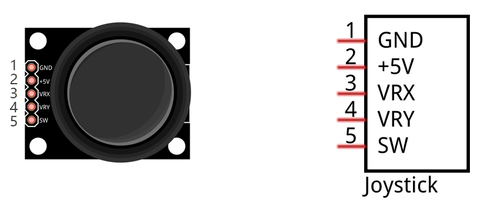
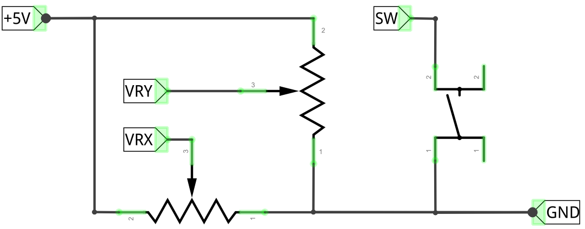
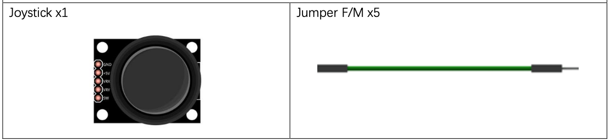
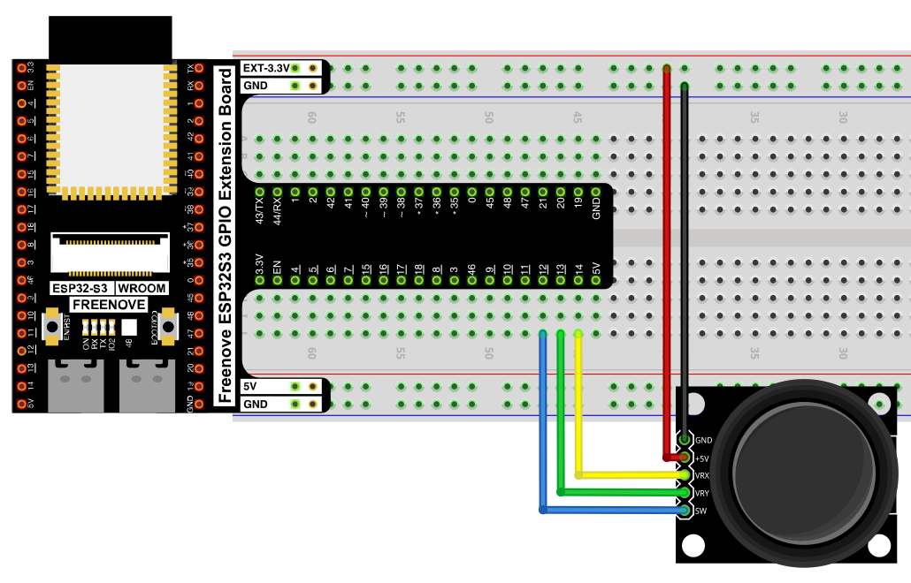
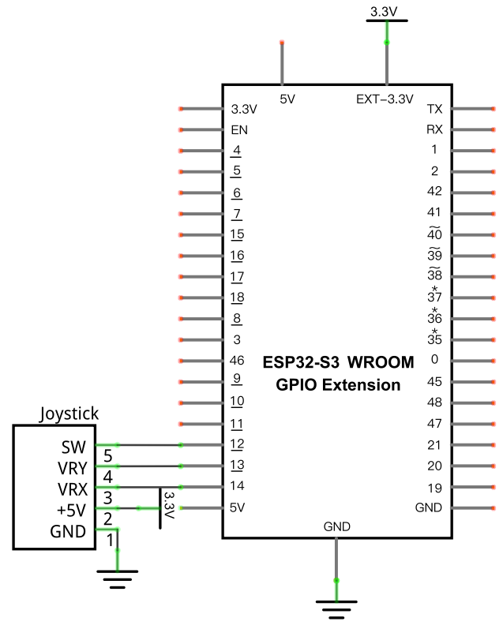

# Joystick

Read a 2-axis analog joystick's X position, Y position, and button press, and print all three to the Shell.

## New Concepts
- Combining analog (ADC) and digital (GPIO) inputs from one module

### Component Knowledge: Joystick

A joystick module is really two rotary potentiometers mounted at 90° to each other, plus a push button underneath, all on one PCB.



| Pin | Function |
|-----|----------|
| GND | Ground |
| +5V | Power |
| VRX | X-axis analog output |
| VRY | Y-axis analog output |
| SW | Push-button digital output (Z axis) |

Moving the stick along the X or Y axis turns one of the internal potentiometers, producing an analog voltage on `VRX` or `VRY` — so reading position requires the ADC, just like [Read the Voltage of a Potentiometer](../02_input_and_output/02_06_read_voltage_potentiometer.md). Pressing the stick down (the Z axis) closes a simple switch, which is a digital signal — read with a plain GPIO pin, the same as a [push button](../01_first_examples/01_03_button_and_led.md).



## Component List



## Circuit

### Wiring Diagram

> Disconnect all power before building the circuit. Reconnect once verified.



**Connections:**
- Joystick GND → GND
- Joystick +5V → 5V
- Joystick VRX → GPIO14
- Joystick VRY → GPIO13
- Joystick SW → GPIO12

### Schematic Diagram



## Code

**File:** [`03_sensors/code/Joystick.py`](./code/Joystick.py)

```python
from machine import ADC,Pin
import time

xVal=ADC(Pin(14))
yVal=ADC(Pin(13))
zVal=Pin(12,Pin.IN,Pin.PULL_UP)

xVal.atten(ADC.ATTN_11DB)
yVal.atten(ADC.ATTN_11DB)
xVal.width(ADC.WIDTH_12BIT)
yVal.width(ADC.WIDTH_12BIT)

try:
    while True:
      print("X,Y,Z:",xVal.read(),",",yVal.read(),",",zVal.value())
      time.sleep(1)
except:
    xVal.deinit()
    yVal.deinit()
```

---

## How to Run

### Online
1. Open Thonny → `03_sensors/code/`.
2. Double-click `Joystick.py`.
3. Click **Run current script**. Move the stick or press it down — the printed X, Y, Z values in the Shell change.

---

## Code Explanation

### Set up two ADC inputs and one digital input

```python
xVal=ADC(Pin(14))
yVal=ADC(Pin(13))
zVal=Pin(12,Pin.IN,Pin.PULL_UP)
```
X and Y are analog (`ADC`), since they come from potentiometers. Z is a plain digital input with the internal pull-up enabled, since it's just a button — pressing it pulls GPIO12 LOW, same logic as [Button & LED](../01_first_examples/01_03_button_and_led.md).

### Read and print all three axes

```python
print("X,Y,Z:",xVal.read(),",",yVal.read(),",",zVal.value())
```
`xVal.read()` and `yVal.read()` return 0–4095 ADC values; `zVal.value()` returns `0` (pressed) or `1` (released).

---

## Key Concepts

- **Mixed analog/digital sensing**: one module can combine ADC and GPIO inputs — read each according to its own signal type
- **Potentiometer-based joysticks**: the X/Y axes work exactly like the rotary potentiometer from Chapter 9, just packaged two-at-once

See [Class ADC](../reference/Class_ADC.md) for the full API reference.

## Further Exploration

- Map the raw 0–4095 X/Y values to a -100 to 100 range centered on the joystick's resting position.
- Use the Z button press to reset a counter or toggle a mode.

> Adapted from [Python_Tutorial.pdf](../Python_Tutorial.pdf) Project 13.1
