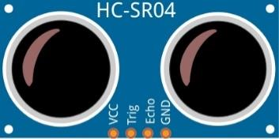
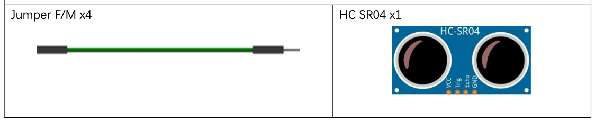
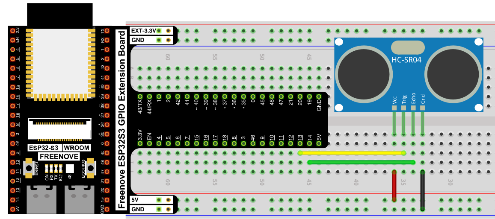
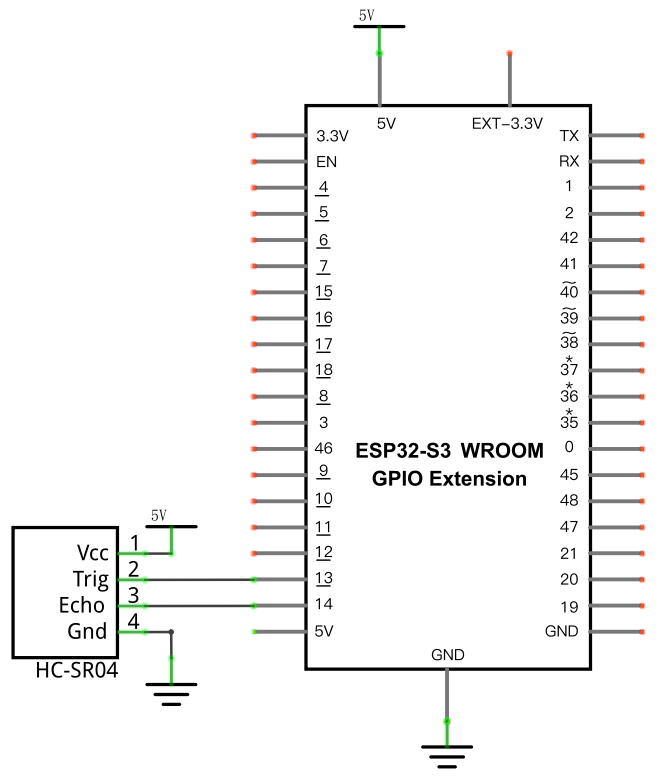

# Ultrasonic Ranging

Measure distance to an object using an HC-SR04 ultrasonic sensor, by manually timing how long a sound pulse takes to bounce back.

## New Concepts
- Ultrasonic distance sensing
- Precise pulse timing with `time.ticks_us()`

### Ultrasonic sensor - HC-SR04

The HC-SR04 integrates both an ultrasonic transmitter and receiver. The transmitter turns an electrical pulse into a high-frequency sound wave (above human hearing); the receiver listens for that wave bouncing back off an obstacle.



| Pin | Description |
|-----|-------------|
| VCC | Power supply (5V) |
| Trig | Trigger pin — sends the pulse |
| Echo | Echo pin — outputs how long the pulse took to return |
| GND | Ground |

To take a reading: hold `Trig` HIGH for at least 10µs to fire a pulse. `Echo` then goes HIGH for as long as the sound is in flight, and goes LOW the instant the echo is received. Since sound travels at a constant ~340m/s, timing that HIGH duration gives the round-trip distance: `distance = speed × time / 2` (divided by 2 because the sound travels to the object *and back*).

- Working voltage: 5V, working current: 12mA
- Measurable range: 2cm–200cm

## Component List



## Circuit

> The HC-SR04 runs on 5V, not 3.3V — make sure VCC is wired to the 5V rail.

### Wiring Diagram

> Disconnect all power before building the circuit. Reconnect once verified.



**Connections:**
- HC-SR04 Vcc → 5V
- HC-SR04 Trig → GPIO13
- HC-SR04 Echo → GPIO14
- HC-SR04 Gnd → GND

### Schematic Diagram




## Code

**File:** [`03_sensors/code/Ultrasonic_Ranging.py`](./code/Ultrasonic_Ranging.py)

```python
from machine import Pin
import time

trigPin=Pin(13,Pin.OUT,0)
echoPin=Pin(14,Pin.IN,0)

soundVelocity=340
distance=0

def getSonar():
    trigPin.value(1)
    time.sleep_us(10)
    trigPin.value(0)
    while not echoPin.value():
        pass
    pingStart=time.ticks_us()
    while echoPin.value():
        pass
    pingStop=time.ticks_us()
    pingTime=time.ticks_diff(pingStop,pingStart)
    distance=pingTime*soundVelocity//2//10000
    return int(distance)

time.sleep_ms(2000)
while True:
    time.sleep_ms(500)
    print('Distance: ',getSonar(),'cm' )
```

---

## How to Run

### Online
1. Open Thonny → `03_sensors/code/`.
2. Double-click `Ultrasonic_Ranging.py`.
3. Click **Run current script**. After a 2-second warm-up, the Shell prints the measured distance every 500ms — move an object closer or further away and watch it change.

---

## Code Explanation

### Fire a trigger pulse

```python
trigPin.value(1)
time.sleep_us(10)
trigPin.value(0)
```
Holds `Trig` HIGH for 10 microseconds, telling the HC-SR04 to send an ultrasonic pulse.

### Time the echo

```python
while not echoPin.value():
    pass
pingStart=time.ticks_us()
while echoPin.value():
    pass
pingStop=time.ticks_us()
pingTime=time.ticks_diff(pingStop,pingStart)
```
Waits for `Echo` to go HIGH (the pulse has been sent), records the start time, then waits for it to go LOW again (the echo was received) and records the stop time. `time.ticks_diff()` safely computes the elapsed microseconds even if the internal tick counter has wrapped around.

### Convert time to distance

```python
distance=pingTime*soundVelocity//2//10000
```
`soundVelocity` is in m/s; dividing by 2 accounts for the round trip, and `//10000` converts the units down to centimeters (since `pingTime` is in microseconds and velocity is in m/s).

---

## Key Concepts

- **Time-of-flight sensing**: distance is calculated from how long a signal takes to travel there and back, not measured directly
- **`time.ticks_us()` / `time.ticks_diff()`**: MicroPython's safe way to measure short, precise time intervals (handles counter rollover, unlike subtracting raw values)
- **Busy-wait loops** (`while not echoPin.value(): pass`): block execution until a pin changes state — simple, but ties up the CPU while waiting

## Further Exploration

- Add a check that returns an error/`None` if `getSonar()` waits too long (the object may be out of range).
- Trigger an LED or buzzer when the distance falls below a threshold (e.g. a proximity alarm).

> Adapted from [Python_Tutorial.pdf](../Python_Tutorial.pdf) Project 21.1
