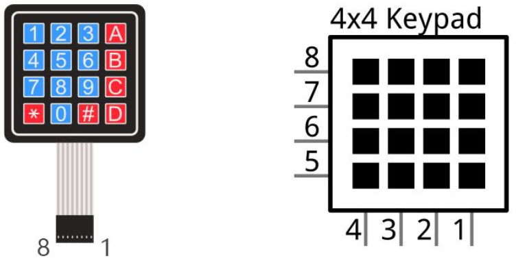
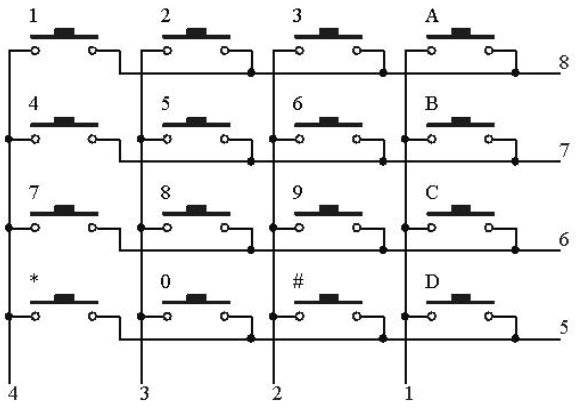
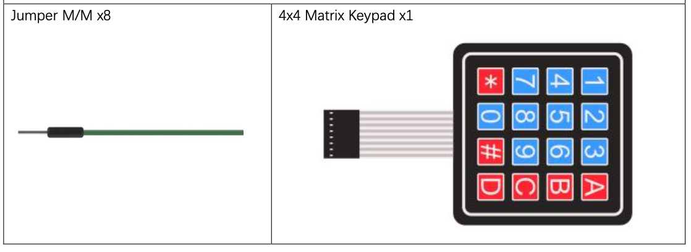
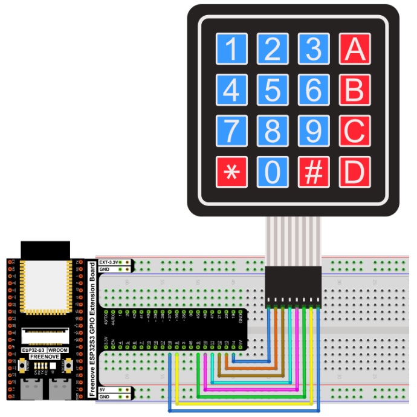
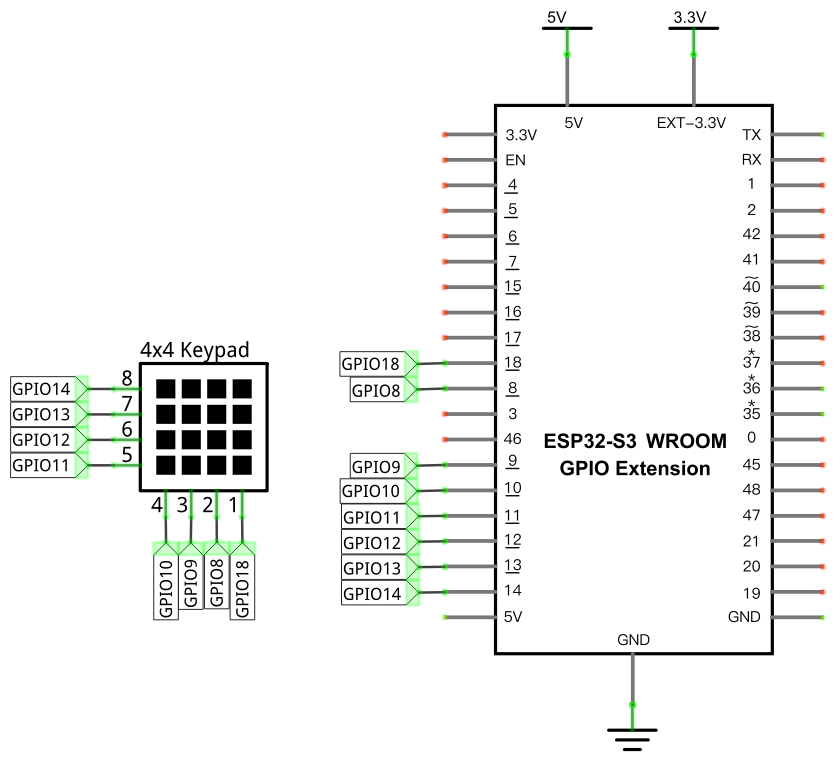

# Matrix Keypad

Read key presses from a 4×4 matrix keypad and print each key's value to the Shell.

## New Concepts
- Matrix keypad scanning (row/column multiplexing)

### 4×4 Matrix Keypad

A keypad matrix is a device that integrates a number of keys in one package. As is shown below, a 4x4 keypad
matrix integrates 16 keys:



The 4x4 keypad matrix has each row of keys connected with one pin and this is the same for the columns. Such efficient connections reduce the number of processor ports required. The internal circuit of the Keypad Matrix is shown below



Use a row or column scanning method to detect the state of each key’s position by column and row. Take column scanning method as an example, send low level to the first 1 column (Pin1), detect level state of row 5, 6, 7, 8 to judge whether the key A, B, C, D are pressed. Then send low level to column 2, 3, 4 in turn to detect whether other keys are pressed. Therefore, you can get the state of 16 keys with only 8 wires.

The `keypad.py` module handles all scanning logic automatically — you just call `.scan()` in a loop and it returns the key character (or `None` if nothing is pressed).


## Component List



## Circuit

### Wiring Diagram

> Disconnect all power before building the circuit. Reconnect once verified.



**Connections:**

| Keypad Pin | ESP32-S3 GPIO |
|------------|---------------|
| Row 1      | GPIO14        |
| Row 2      | GPIO13        |
| Row 3      | GPIO12        |
| Row 4      | GPIO11        |
| Col 1      | GPIO10        |
| Col 2      | GPIO9         |
| Col 3      | GPIO8         |
| Col 4      | GPIO18        |

### Schematic Diagram



## Code

Upload `keypad.py` to the ESP32-S3 before running: in Thonny, right-click `keypad.py` → **Upload to /**.

**File:** [`03_sensors/code/Matrix_Keypad.py`](./code/Matrix_Keypad.py)

```python
from keypad import KeyPad
import time

keyPad=KeyPad(14,13,12,11,10,9,8,18)

def key():
    keyvalue=keyPad.scan()
    if keyvalue!= None:
        print(keyvalue)
        time.sleep_ms(300)
    return keyvalue
        
while True:
    key()
```

---

## How to Run

### Online
1. Open Thonny → `03_sensors/code/`.
2. Right-click `keypad.py` → **Upload to /** — wait for the upload to complete.
3. Double-click `Matrix_Keypad.py`.
4. Click **Run current script**. Press any key on the keypad — the key's character appears in the Shell.

---

## Code Explanation

### Import and initialize the keypad

```python
from keypad import KeyPad

keyPad=KeyPad(14,13,12,11,10,9,8,18)
```

`KeyPad` takes 8 pin numbers: rows 1–4 first, then columns 1–4. These map to the keypad's 8 signal pins in order.

### Scan and print

```python
def key():
    keyvalue=keyPad.scan()
    if keyvalue!= None:
        print(keyvalue)
        time.sleep_ms(300)
    return keyvalue
```

`keyPad.scan()` is non-blocking — it returns immediately with the pressed key's character (`'1'`–`'9'`, `'0'`, `'A'`–`'D'`, `'*'`, `'#'`) or `None` if no key is held. The 300ms delay debounces the key so a single press registers only once.

---

## Key Concepts

- **Matrix scanning**: 16 keys on only 8 pins, by asserting each row in turn and reading the columns — the `keypad.py` module handles this automatically
- **Non-blocking scan**: `.scan()` returns immediately rather than waiting, so it can be polled inside a loop without freezing other logic
- **Module upload requirement**: `keypad.py` must be uploaded to the ESP32-S3's root (`/`) before running the main script

See [Class keypad](../reference/Class_keypad.md) for the full API reference.

## Further Exploration

- Build a PIN-entry system: accumulate digits until `'#'` is pressed, then compare the sequence against a stored code.
- Use the keypad to navigate a menu displayed on the [LCD1602](../04_output/21_lcd1602.md).

> Adapted from [Python_Tutorial.pdf](../Python_Tutorial.pdf) Project 22.1
