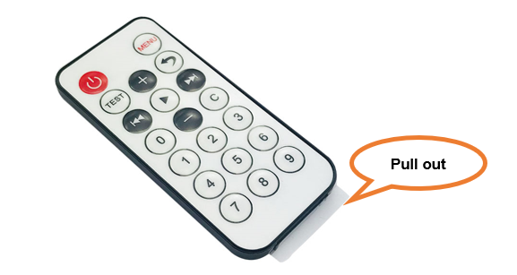
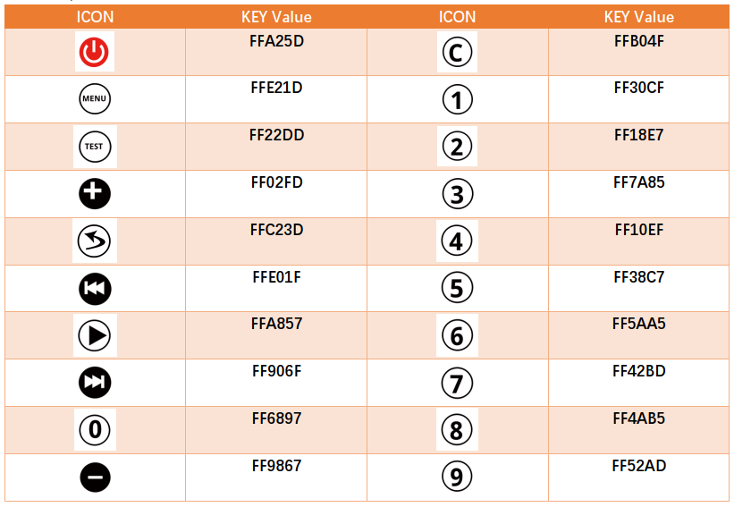
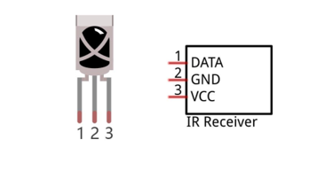
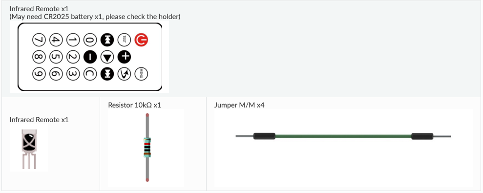
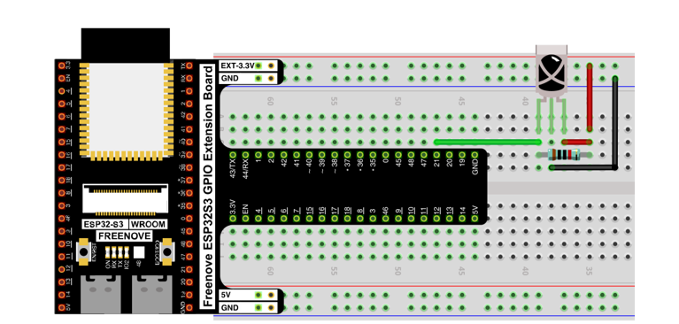
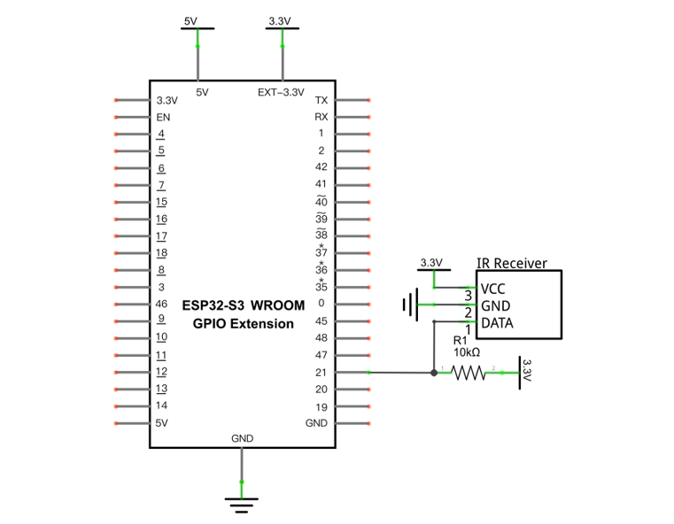

# Infrared Remote Control

An infrared(IR) remote control is a device with buttons and an IR emitter. Pressing down different buttons will make the infrared emitter send infrared pulses unique for each button. Infrared remote control technology is widely used in electronic products such as TV, air conditioning, etc. The receiver decodes those pulses into a binary code so the receiving device knows which button was pressed on the remote. 



> NOTE: pull out the plastic tab before you use the remote.  If the plastic tab is not present the remote might have run down the battery while sitting.  

>Save the tab and put it back after you are done with the remote.


## New Concepts

- IR Remote
- IR Receiver

### IR Remote

An IR Remote sends a unique value to the IR Receiver for each key pressed.  This particular IR Remote sends the following values for each key.



### IR Receiver

An infrared(IR) receiver is a component which can receive the infrared light and convert it into a data signal.  That data signal returns the key or code value sent by the IR Remote when a button is pressed. 



## Component List



## Circuit

### Wiring Diagram

> Disconnect all power before building the circuit. Reconnect once verified.



### Schematic Diagram



## Code

```python
from irrecvdata import irGetCMD

def commandHandler(hexValue):
    print(hex(hexValue))

recvPin = irGetCMD(21, commandHandler)
```

The `irGetCMD` class listens to the pin specified in the constructor and calls the `commandHandler` callback when it decodes a button press.

## Key Concepts

- **Key Codes**: Each button value is encoded as a hex value or code.  

## Further Exploration

- Add code to turn a light on and off when the power button is pressed.