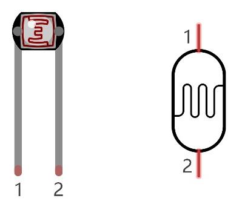
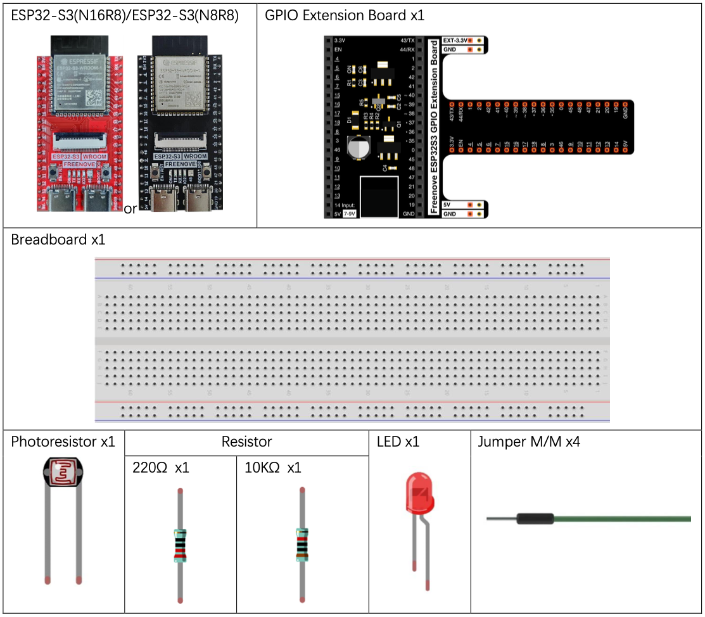
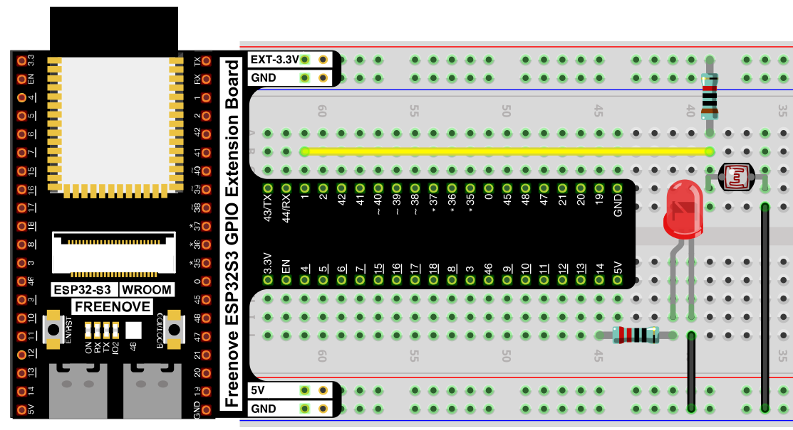
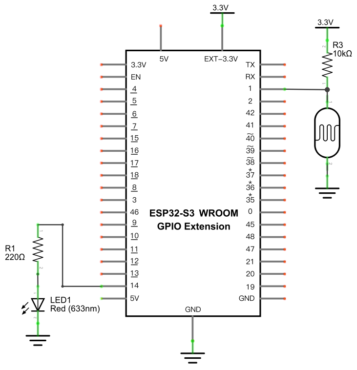

# Night Lamp

Make an LED automatically brighten in the dark and dim in bright light, using a photoresistor to sense ambient light — an automatic night lamp.

## New Concepts
- Photoresistors (LDRs)
- Voltage dividers as a sensing technique

### Component Knowledge: Photoresistor

A photoresistor (LDR) is a light-sensitive resistor — its resistance drops as more light hits its surface, and rises in the dark.



Pairing it with a fixed resistor in a voltage divider turns that resistance change into a voltage change, which the ADC can read: as ambient light changes, the photoresistor's resistance changes, which shifts the voltage measured between it and the fixed resistor.

---

## Component List


---

## Circuit

### Wiring Diagram



**Connections:**
- 3.3V → 10kΩ resistor → GPIO1 → photoresistor → GND
- LED anode → 220Ω resistor → GPIO14
- LED cathode → GND

### Schematic Diagram



> Disconnect all power before building the circuit. Reconnect once verified.

---

## Code

**File:** [`03_sensors/code/NightLamp.py`](./code/NightLamp.py)

```python
from machine import Pin,PWM,ADC
import time

pwm =PWM(Pin(14,Pin.OUT),1000)
adc=ADC(Pin(1))
adc.atten(ADC.ATTN_11DB)
adc.width(ADC.WIDTH_12BIT)

def remap(value,oldMin,oldMax,newMin,newMax):
    return int((value)*(newMax-newMin)/(oldMax-oldMin))

try:
    while True:
        adcValue=adc.read()
        pwmValue=remap(adcValue,0,4095,0,1023)
        pwm.duty(pwmValue)
        print(adcValue,pwmValue)
        time.sleep_ms(100)
except:
    adc.deinit()
    pwm.deinit()
```

This is the exact same code as [Soft Light](../02_input_and_output/11_soft_light.md) — only the sensor wired to GPIO1 has changed.

---

## How to Run

### Online
1. Open Thonny → `03_sensors/code/`.
2. Double-click `NightLamp.py`.
3. Click **Run current script**. Cover the photoresistor with your hand, or shine a light on it — the LED's brightness changes in response.

---

## Code Explanation

Since the circuit and code are logically identical to Soft Light, see [Soft Light's Code Explanation](../02_input_and_output/11_soft_light.md#code-explanation) for a full walkthrough of `remap()` and the ADC → PWM pipeline. The only conceptual difference: the ADC value now reflects ambient light level instead of a knob's position, and because the photoresistor's resistance *drops* in bright light, more light produces a lower voltage on GPIO1 — which remaps to a lower PWM duty, dimming the LED in bright conditions and brightening it in the dark.

---

## Key Concepts

- **Photoresistor (LDR)**: a resistor whose resistance changes with light intensity
- **Voltage divider sensing**: pairing a variable resistor with a fixed one converts a resistance change into a readable voltage change
- **Reusing a pipeline**: the same ADC → `remap()` → PWM code from Soft Light works unchanged with a different sensor, because both produce a 0–4095 ADC reading

See [Class ADC](../reference/Class_ADC.md) and [Class PWM(pin, freq)](../reference/Class_PWM(pin,freq).md) for the full API reference.

## Further Exploration

- Invert the brightness response (LED dims in the dark instead) by changing `remap(adcValue,0,4095,0,1023)` to `remap(adcValue,0,4095,1023,0)`.
- Add a threshold so the LED only turns on below a certain light level, instead of dimming continuously.

> Adapted from [Python_Tutorial.pdf](../Python_Tutorial.pdf) Project 11.1
