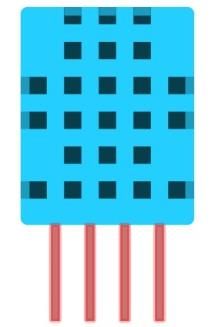
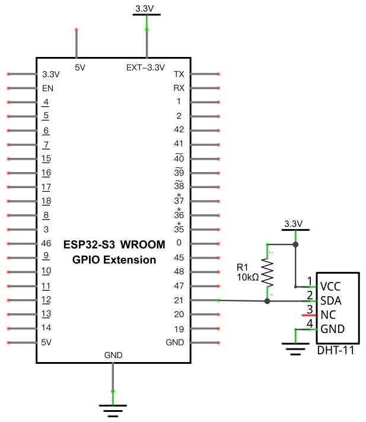
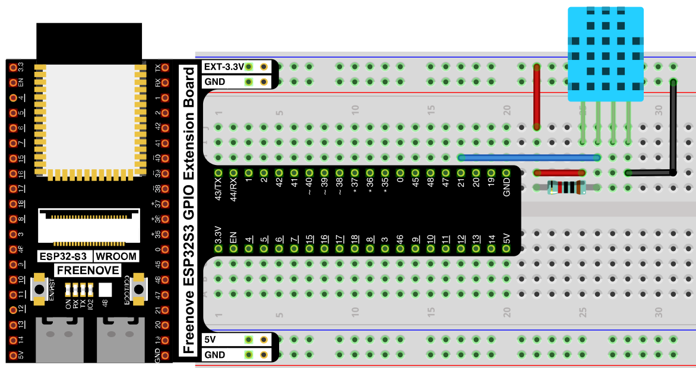

# Hygrothermograph (DHT11)

Read temperature and humidity from a DHT11 sensor and print both to the Shell.

## New Concepts
- Single-wire digital sensor communication
- Pre-calibrated sensor modules

### Component Knowledge: DHT11

The DHT11 is a combined temperature and humidity sensor whose output is already calibrated by the manufacturer — no formulas or lookup tables needed, unlike the [Thermistor](./13_thermometer.md). It uses a custom single-wire protocol to send data, so reading it relies on the `dht` driver module rather than a plain GPIO read.



| Pin | Description |
|-----|-------------|
| VCC | Power, 3.3V–5.5V |
| SDA | Data pin — single-wire communication |
| NC | Not connected — has no function and should be left unwired |
| GND | Ground |

The sensor takes about 1 second to initialize after power-up.

---

## Component List


---

## Circuit

### Schematic Diagram



### Wiring Diagram



**Connections:**
- DHT11 VCC → 3.3V (through a 10kΩ pull-up to the SDA line)
- DHT11 SDA → GPIO21
- DHT11 NC → not connected
- DHT11 GND → GND

> Disconnect all power before building the circuit. Reconnect once verified.

---

## Code

**File:** [`03_sensors/code/Hygrothermograph.py`](./code/Hygrothermograph.py)

```python
import machine
import time
import dht

DHT = dht.DHT11(machine.Pin(21))

while True:
    try:
        DHT.measure()
        print('temperature:',DHT.temperature(),'humidity:',DHT.humidity())
        time.sleep_ms(2000)
    except:
        pass
```

---

## How to Run

### Online
1. Open Thonny → `03_sensors/code/`.
2. Double-click `Hygrothermograph.py`.
3. Click **Run current script** — temperature and humidity print to the Shell every 2 seconds.

---

## Code Explanation

### Associate the sensor with a pin

```python
DHT = dht.DHT11(machine.Pin(21))
```
Creates a `DHT11` object on GPIO21, the pin wired to the sensor's SDA line.

### Take a reading

```python
DHT.measure()
print('temperature:',DHT.temperature(),'humidity:',DHT.humidity())
```
`measure()` triggers a fresh reading over the single-wire protocol; `temperature()` and `humidity()` then return the two values from that reading.

### Wrap in try/except

```python
while True:
    try:
        DHT.measure()
        ...
    except:
        pass
```
DHT11 reads occasionally fail (the single-wire timing is sensitive to interference). Wrapping each attempt in `try`/`except` means one failed read is silently skipped instead of crashing the loop.

---

## Key Concepts

- **Single-wire protocols**: some sensors send all their data over one data pin with precise timing, rather than a standard bus like I2C or UART — these require a dedicated driver module instead of plain GPIO reads
- **Calibrated sensors**: the DHT11 returns ready-to-use temperature/humidity values directly, unlike the [Thermistor](./13_thermometer.md), which needs a manual formula to convert resistance into temperature

See [Class dht](../reference/Class_dht.md) for the full API reference.

## Further Exploration

- Average several readings to smooth out occasional bad samples.
- Combine this with [Soft Light](../02_input_and_output/11_soft_light.md)'s PWM technique to drive a fan or heater indicator based on temperature.

> Adapted from [Python_Tutorial.pdf](../Python_Tutorial.pdf) Project 24.1
