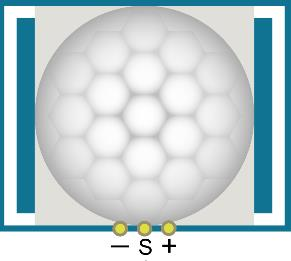
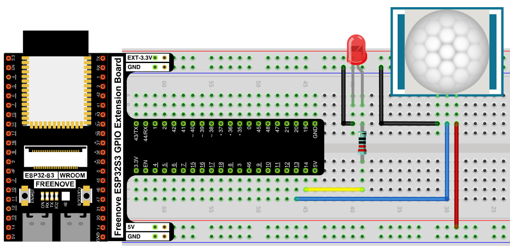
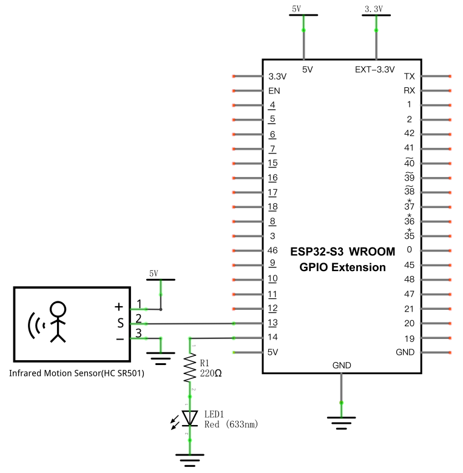

# Infrared Motion Detector with LED Indicator

Build a motion-activated light: an HC-SR501 PIR (passive infrared) sensor detects nearby movement and switches an LED on automatically, then back off once nobody's there.

## New Concepts
- Passive infrared (PIR) motion sensing
- Treating a sensor as a digital switch

### Component Knowledge: HC-SR501

The HC-SR501 detects the infrared heat signature given off by humans and animals. When a warm body enters its detection zone, it outputs a HIGH signal (3.3V); once the body leaves, it keeps outputting HIGH for an adjustable delay time, then drops back to LOW.



- **Working voltage:** 5V–20V DC. **Static current:** 65µA.
- **Delay time** (how long it stays HIGH after the body leaves) is adjustable via an onboard potentiometer.
- **Trigger mode jumper:** `L` (non-repeatable) stops re-triggering until the delay period ends; `H` (repeatable) keeps extending the HIGH period as long as motion continues.
- The sensor needs about a minute to initialize after power-up, during which it may output HIGH/LOW unpredictably.
- It's most sensitive to motion crossing its field of view horizontally — movement directly toward or away from the sensor (vertically through its dome) is harder for it to detect.

In short: treat it as a motion-activated digital switch, just like a [push button](../01_first_examples/03_button_and_led.md) — except triggered by a person instead of a finger.

---

## Component List


---

## Circuit

### Wiring Diagram



**Connections:**
- HC-SR501 `+` → 5V
- HC-SR501 `S` (signal) → GPIO13
- HC-SR501 `−` → GND
- LED anode → 220Ω resistor → GPIO14
- LED cathode → GND

### Schematic Diagram



> Disconnect all power before building the circuit. Reconnect once verified.

---

## Code

**File:** [`03_sensors/code/Infrared_Motion_Detector.py`](./code/Infrared_Motion_Detector.py)

```python
from machine import Pin
import time

sensorPin=Pin(13,Pin.IN)
ledPin=Pin(14,Pin.OUT)

try:
    while True:
      if not sensorPin.value():     
        ledPin.value(1)  #Set led turn on
      else:
        ledPin.value(0)  #Set led turn off
except:
    pass
```

---

## How to Run

### Online
1. Open Thonny → `03_sensors/code/`.
2. Double-click `Infrared_Motion_Detector.py`.
3. Click **Run current script**. Place the sensor on a stationary surface and wait about a minute for it to settle, then move toward or away from it and watch the LED turn ON/OFF.

---

## Code Explanation

This code is almost identical to [Button & LED](../01_first_examples/03_button_and_led.md) — both read a digital input and mirror it to an LED. The only real difference is the source of the signal: here it's a PIR sensor instead of a mechanical switch.

```python
if not sensorPin.value():     
    ledPin.value(1)  #Set led turn on
else:
    ledPin.value(0)  #Set led turn off
```
`sensorPin.value()` reads HIGH (`1`) when motion is detected and LOW (`0`) otherwise — so `not sensorPin.value()` is `True` exactly when *no* motion is present. As written, this turns the LED **on** when no motion is detected and **off** when motion is detected — the reverse of the chapter's stated goal ("light up when someone is in close proximity"). This is how the code appears verbatim in the source material; if you want the LED to light up *on* motion, flip the condition to `if sensorPin.value():`.

---

## Key Concepts

- **PIR sensors as digital switches**: despite detecting something as complex as a heat signature, the HC-SR501 ultimately just outputs a HIGH/LOW signal — exactly like a button
- **Adjustable sensitivity and delay**: many sensor modules expose physical trim potentiometers and jumpers for tuning behavior without changing code
- **Sensor warm-up time**: some sensors (like this PIR) need an initialization period after power-up before their output is reliable

## Further Exploration

- Rotate the onboard potentiometer to change the delay time, and observe how long the LED stays on after you leave.
- Swap the `L`/`H` trigger-mode jumper and see how continuous motion behaves differently.
- Replace the LED with a buzzer or relay to build a simple motion alarm.

> Adapted from [Python_Tutorial.pdf](../Python_Tutorial.pdf) Project 25.1
