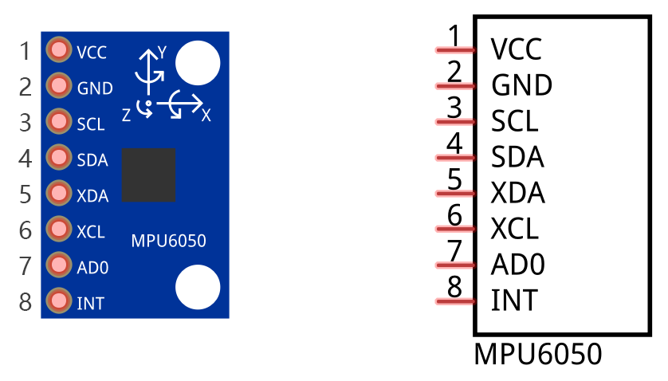
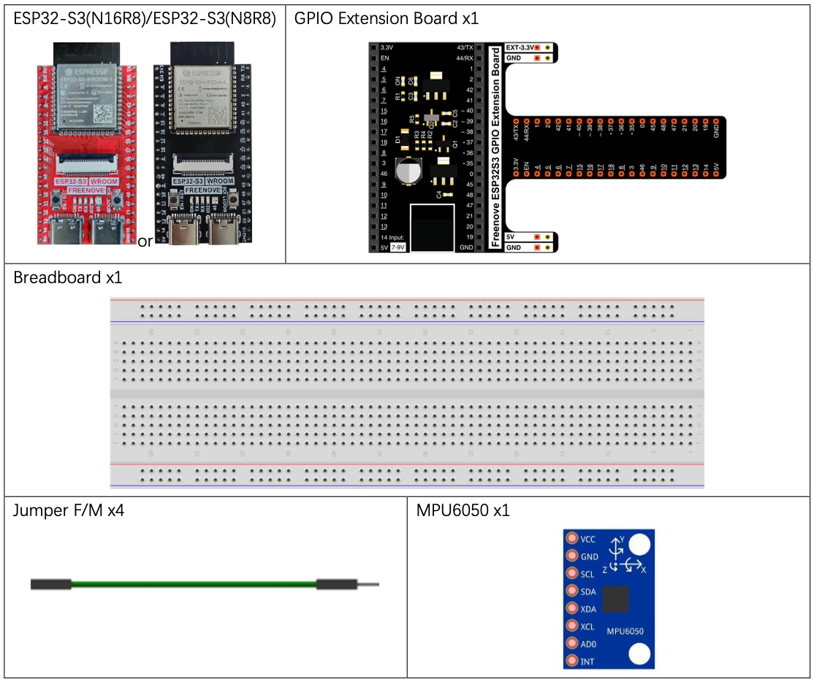
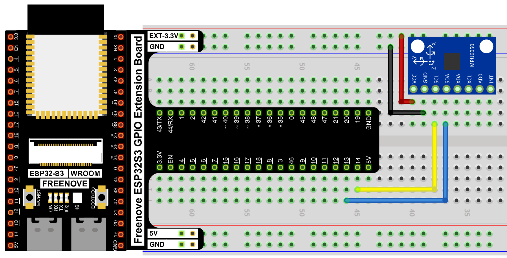
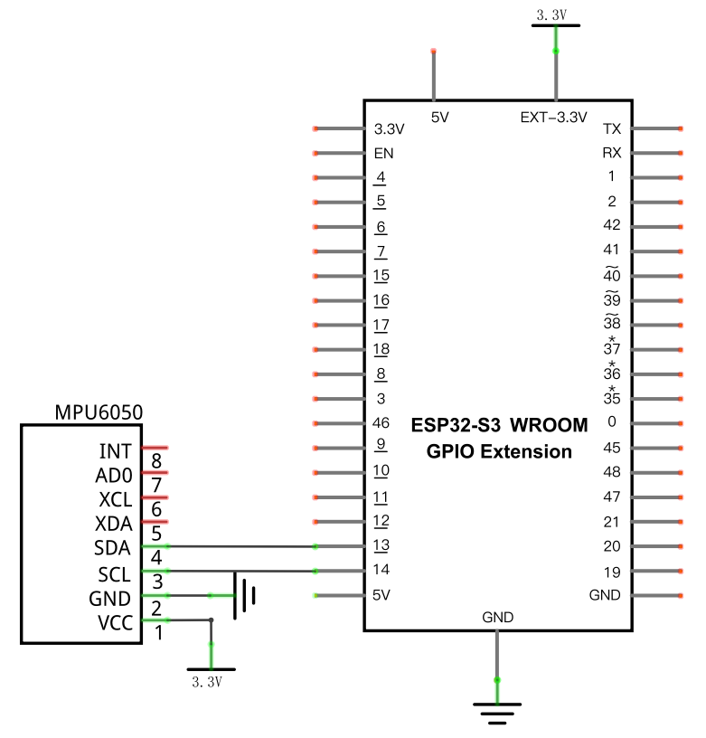

# MPU6050 Attitude Sensor

Read raw acceleration and rotation (gyroscope) data from an MPU6050 6-axis motion sensor over I2C.

## New Concepts
- 6-axis motion sensing (accelerometer + gyroscope)
- I2C communication

### Component Knowledge: MPU6050

The MPU6050 combines a 3-axis gyroscope and a 3-axis accelerometer (plus an internal temperature sensor) in one package, communicating over I2C at the default address `0x68`. It's the kind of sensor used to keep drones, self-balancing robots, and phones aware of their orientation and movement.



| Pin | Description |
|-----|-------------|
| VCC | Power, 5V |
| GND | Ground |
| SCL | I2C clock |
| SDA | I2C data |
| XDA | Auxiliary I2C data (for chaining other I2C devices through the MPU6050) |
| XCL | Auxiliary I2C clock |
| AD0 | I2C address select — LOW = `0x68`, HIGH = `0x69` |
| INT | Interrupt output |

> The MPU6050's I2C signal is sensitive to connection quality — make sure jumper wires are seated firmly, or readings may fail intermittently.

---

## Component List



---

## Circuit

> The MPU6050 runs on 5V in this circuit, not 3.3V.

### Wiring Diagram



**Connections:**
- MPU6050 VCC → 5V
- MPU6050 GND → GND
- MPU6050 SCL → GPIO14
- MPU6050 SDA → GPIO13

### Schematic Diagram



> Disconnect all power before building the circuit. Reconnect once verified.

---

## Code

**File:** [`03_sensors/code/Acceleration.py`](./code/Acceleration.py)
**Module:** [`03_sensors/code/mpu6050.py`](./code/mpu6050.py)

```python
from mpu6050 import MPU6050
import time
 
mpu=MPU6050(14,13) #attach the IIC pin(sclpin,sdapin)
mpu.MPU_Init()     #initialize the MPU6050
G = 9.8
time.sleep_ms(1000)#waiting for MPU6050 to work steadily

try:
    while True:
        accel=mpu.MPU_Get_Accelerometer()#gain the values of Acceleration
        gyro=mpu.MPU_Get_Gyroscope()     #gain the values of Gyroscope
        print("\na/g:\t")
        print(accel[0],"\t",accel[1],"\t",accel[2],"\t",
              gyro[0],"\t",gyro[1],"\t",gyro[2])
        print("a/g:\t")
        print(accel[0]/16384,"g",accel[1]/16384,"g",accel[2]/16384,"g",
              gyro[0]/131,"d/s",gyro[1]/131,"d/s",gyro[2]/131,"d/s")
        time.sleep_ms(1000)
except:
    pass
```

---

## How to Run

### Online
1. Open Thonny → `03_sensors/code/`.
2. Right-click `mpu6050.py` → **Upload to /** — wait for it to finish uploading to the ESP32-S3.
3. Double-click `Acceleration.py`.
4. Click **Run current script** — raw and scaled acceleration/gyroscope data prints to the Shell once per second.

---

## Code Explanation

### Initialize the sensor

```python
mpu=MPU6050(14,13) #attach the IIC pin(sclpin,sdapin)
mpu.MPU_Init()     #initialize the MPU6050
time.sleep_ms(1000)#waiting for MPU6050 to work steadily
```
Associates GPIO14 (SCL) and GPIO13 (SDA) with the MPU6050 over I2C, initializes its internal registers, then waits a second for readings to stabilize.

### Read raw motion data

```python
accel=mpu.MPU_Get_Accelerometer()#gain the values of Acceleration
gyro=mpu.MPU_Get_Gyroscope()     #gain the values of Gyroscope
```
Both return a 3-element list — one raw value per axis (X, Y, Z).

### Scale raw values into real units

```python
print(accel[0]/16384,"g",accel[1]/16384,"g",accel[2]/16384,"g",
      gyro[0]/131,"d/s",gyro[1]/131,"d/s",gyro[2]/131,"d/s")
```
The sensor outputs raw 16-bit numbers, not physical units. At the MPU6050's default sensitivity settings, dividing the accelerometer's raw value by `16384` converts it to **g** (multiples of gravity), and dividing the gyroscope's raw value by `131` converts it to **degrees/second**. These divisors come from the sensor's datasheet and depend on its configured sensitivity range.

---

## Key Concepts

- **I2C communication**: a 2-wire bus (SCL clock + SDA data) that lets multiple devices share the same two pins, addressed individually (here, `0x68`)
- **Raw sensor values vs. physical units**: most digital sensors return integer register values that must be scaled by a sensitivity constant to get meaningful units — accelerometer and gyroscope axes often use different scale factors
- **Sensitivity/scale factors**: `16384` LSB/g and `131` LSB/(°/s) are specific to the MPU6050's default range settings; changing the sensor's configured range would change these divisors

See [Class mpu6050](../reference/Class_mpu6050.md) for the full API reference.

## Further Exploration

- Use the accelerometer's Z-axis value to detect whether the board is lying flat or tilted.
- Combine X/Y accelerometer readings to estimate a tilt angle.

> Adapted from [Python_Tutorial.pdf](../Python_Tutorial.pdf) Project 26.1
