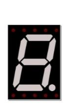
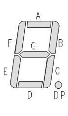
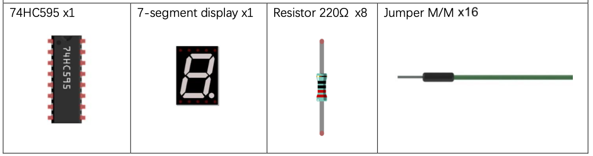
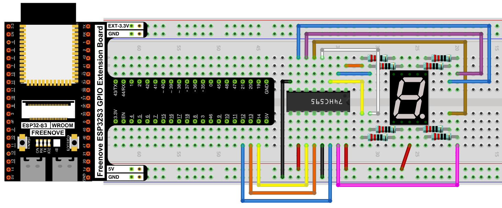
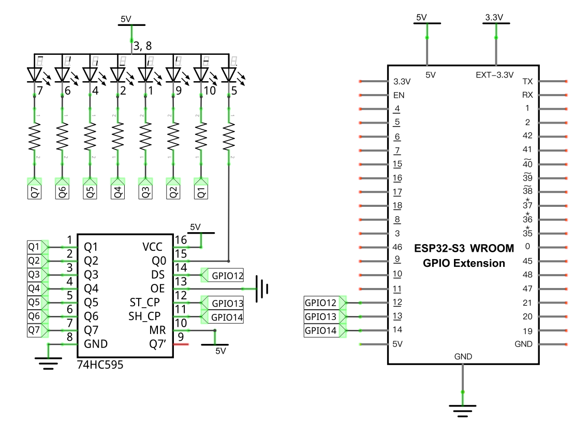

# 7-Segment Display

Drive a single-digit 7-segment display through a 74HC595 shift register, cycling through hexadecimal characters `0`–`F`.

## New Concepts
- 7-segment displays
- Encoding characters as bit patterns
- Shift registers

### 7-Segment Display

A 7-segment display is 8 LEDs (segments A–G, plus a decimal point DP) arranged to form digits and some letters, sharing one common anode.




Turning specific segments ON (and leaving others OFF) draws a character — for example, "0" lights segments A–F and leaves G and DP off. Since this display is **common anode**, a segment turns ON when its pin is driven LOW, not HIGH.

### Encoding characters as bit patterns

Treating segment A as the lowest bit and DP as the highest, each character maps to one byte, written as `DP G F E D C B A`. For example, "0" is segments A–F on, G and DP off → `1100 0000` → `0xC0`.

| CHAR | Hex | CHAR | Hex | CHAR | Hex | CHAR | Hex |
|------|-----|------|-----|------|-----|------|-----|
| 0 | 0xc0 | 4 | 0x99 | 8 | 0x80 | C | 0xc6 |
| 1 | 0xf9 | 5 | 0x92 | 9 | 0x90 | D | 0xa1 |
| 2 | 0xa4 | 6 | 0x82 | A | 0x88 | E | 0x86 |
| 3 | 0xb0 | 7 | 0xf8 | B | 0x83 | F | 0x8e |

This is the same [74HC595 shift register](../reference/Class_Chip74HC595.md) used to drive [LED bar graphs](../02_input_and_output/02_02_flowing_light_pwm.md)-style projects — only the meaning of the bits changes, from "which LED" to "which segment."

### Shift registers


---

## Component List



---

## Circuit

### Wiring Diagram



**Connections:**
- 74HC595 DS → GPIO12, ST_CP → GPIO13, SH_CP → GPIO14
- Each 74HC595 output (Q0–Q7) → its own 220Ω resistor → one segment of the display

### Schematic Diagram



> Disconnect all power before building the circuit. Reconnect once verified.

---

## Code

**File:** [`04_output/code/74HC595_and_7_segment_display.py`](./code/74HC595_and_7_segment_display.py)
**Module:** [`04_output/code/my74HC595.py`](./code/my74HC595.py)

```python
import time
from my74HC595 import Chip74HC595

lists =[0xc0, 0xf9, 0xa4, 0xb0, 0x99, 0x92, 0x82, 0xf8,
        0x80, 0x90, 0x88, 0x83, 0xc6, 0xa1, 0x86, 0x8e]

chip = Chip74HC595(12,13,14)
try:
    while True:
        for count in range(16):
            chip.shiftOut(0,lists[count])
            time.sleep_ms(500)
except:
    pass
```

---

## How to Run

### Online
1. Open Thonny → `04_output/code/`.
2. Right-click `my74HC595.py` → **Upload to /** — wait for it to finish uploading to the ESP32-S3.
3. Double-click `74HC595_and_7_segment_display.py`.
4. Click **Run current script** — the display cycles through `0123456789ABCDEF`, half a second per character.

---

## Code Explanation

### Encode every character

```python
lists =[0xc0, 0xf9, 0xa4, 0xb0, 0x99, 0x92, 0x82, 0xf8,
        0x80, 0x90, 0x88, 0x83, 0xc6, 0xa1, 0x86, 0x8e]
```
Each entry is the segment bit-pattern for one hex digit, looked up from the table above.

### Send a character to the display

```python
chip = Chip74HC595(12,13,14)
...
chip.shiftOut(0,lists[count])
```
`shiftOut()` pushes one byte's worth of bits out through the shift register, which then holds all 8 outputs steady until the next call — lighting whichever segments correspond to that byte's 0 bits (since the display is common-anode).

---

## Key Concepts

- **Common anode displays**: segments light up on LOW, the opposite of common-cathode parts
- **Bit-pattern encoding**: representing a visual character as a single byte, where each bit controls one segment
- **Reusing a driver across projects**: the same `Chip74HC595` class that drives LED arrays works unchanged here — only the data being shifted out has new meaning

See [Class Chip74HC595](../reference/Class_Chip74HC595.md) for the full API reference.

## Further Exploration

- Modify the list to have it start with all segments off and light up one segment at a time until they are all lit.
- Come up with your own animation by changing the entries in the list.
- Modify the loop to turn on every combination of segments.

> Adapted from [Python_Tutorial.pdf](../Python_Tutorial.pdf) Project 15.1
