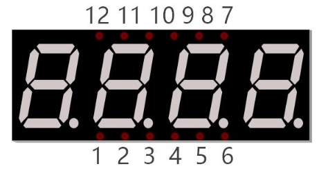
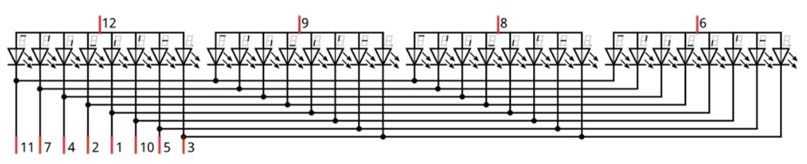

# Four Digit Seven Segment Display

One 7-segment display is great, but how about 4 7-segment displays?  

How many more pins will we need to drive this display vs a single digit 7-segment display?

## New Concepts

- 4 Digit 7-Segment Display

### 4 Digit 7-Segment Display

A 4 Digit 7-segment display integrates four 7-segment displays into one module, therefore it can display more characters. All of the LEDs contained have a common anode and individual cathodes. Its internal structure and pin designation diagram is shown below:



The internal electronic circuit is shown below, and all 8 LED cathode pins of each 7-segment display are connected together.  



Display method of 4 digit 7-segment display is similar to 1 digit 7-segment display. The difference between them is that the 4-digit displays each Digit is visible in turn, one by one and not together. We need to first send high level to the common end of the first digit display, and send low level to the remaining three common ends, and then send content to 8 LED cathode pins of the first Digit Display. At this time, the first 7-
segment display will show visible content and the remaining three will be OFF.  

Similarly, the second, third and fourth 7-segment displays will show visible content in turn by scanning the display. Although the four number characters are displayed in turn separately, this process is so fast that it is imperceptible to the naked eye. This is due to the principle of optical afterglow effect and the vision persistence effect in human sight. This is how we can see all 4 number characters at the same time. However, if each number character is displayed for a longer period, you will be able to see that the number characters are displayed separately.

## Component List


## Circuit

### Wiring Diagram

> Disconnect all power before building the circuit. Reconnect once verified.


### Schematic Diagram


## Code

**File:** [`04_output/code/4_digit_7_segment_display.py`](./code/4_digit_7_segment_display.py)

```python
import time
from my74HC595 import Chip74HC595
from machine import Pin

comPin=[47,35,36,21]
num =[0xc0, 0xf9, 0xa4, 0xb0, 0x99, 0x92, 0x82, 0xf8,
      0x80, 0x90, 0x88, 0x83, 0xc6, 0xa1, 0x86, 0x8e]

def led_display():
    for i in range(0,4):
        chns=Pin(comPin[i],Pin.OUT)
        chns.value(1)
        chip.shiftOut(0,num[i])
        time.sleep_ms(1)
        chns.value(0)
        chip.shiftOut(0,0xff)
       
  
#Pin(38)-74hc595.ds, Pin(39)-74hc595.st_cp, Pin(40)-74hc595.sh_cp
chip = Chip74HC595(38,39,40)
try:
    while True:
        led_display()
except:
    pass
```

This code sends one character to the display at a time but it does it so quickly your mind sees all 4 digits lit at once.

> **Debugging Tip** You may have wires connected to the wrong pins if one segment is not lit across all characters or if the wrong segments are lit.  Look at the wiring schematics to see which pin(s) control the missing or mixed upsegments, then focus on those wires when inspecting your wiring.

---

## How to Run

### Online
1. Open Thonny → `04_output/code/`.
2. Right-click `my74HC595.py` → **Upload to /** — wait for it to finish uploading to the ESP32-S3.
3. Double-click `74HC595_and_7_segment_display.py`.
4. Click **Run current script** — the display cycles through `0123456789ABCDEF`, half a second per character.

---

## Code Explanation

Import time, my74HC595 and Pin modules.

```python
import time
from my74HC595 import Chip74HC595
from machine import Pin
```

Define common anode pins for digital tubes and request a list to put character encodings in it.

```python
comPin = [47,35,36,21]
num = [0xc0, 0xf9, 0xa4, 0xb0, 0x99, 0x92, 0x82, 0xf8,
0x80, 0x90, 0x88, 0x83, 0xc6, 0xa1, 0x86, 0x8e]
```

Request an object to drive 74HC595 and associate pins with it.
```python
chip = Chip74HC595(38,39,40)
```

Make the digital tube display `0123`.

```python
def led_display():
    for i in range(0,4):
        chns=Pin(comPin[i],Pin.OUT)
        chip.shiftOut(0,num[i])
        chns.value(1)
        time.sleep_ms(1)
        chns.value(0)
        chip.shiftOut(0,0xff)
```

## Key Concepts

- Using persistence of vision to drive displays with fewer pins.

## Further Exploration

- Slow down the refresh rate (increase the sleep time in the for loop) from 1 to 100 ms.  What does this do?  Why?
- Change the code to display the characters of your choosing.  Could you make it scroll a message longer than 4 characters across the display?


> Adapted from [Python_Tutorial.pdf](../Python_Tutorial.pdf) Project 15.2
