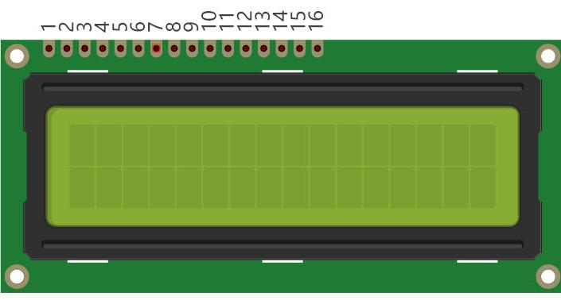
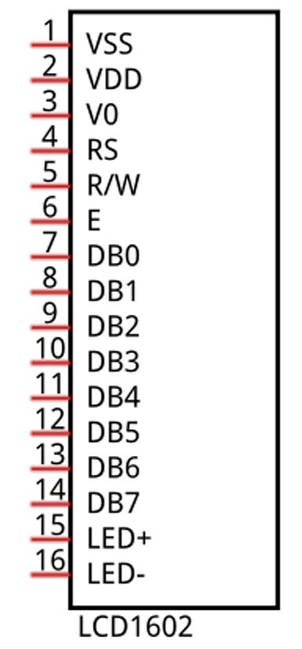
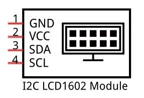
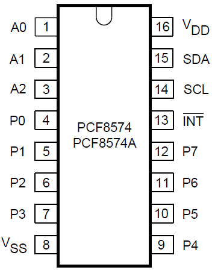
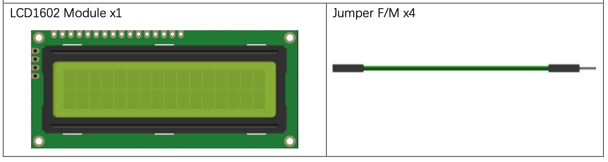
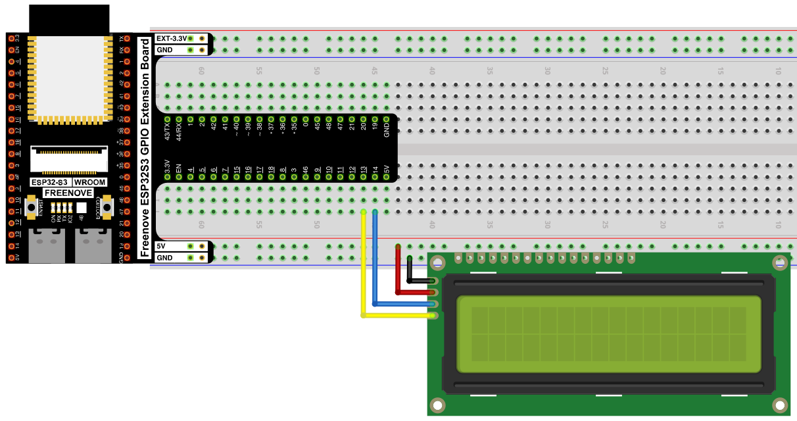
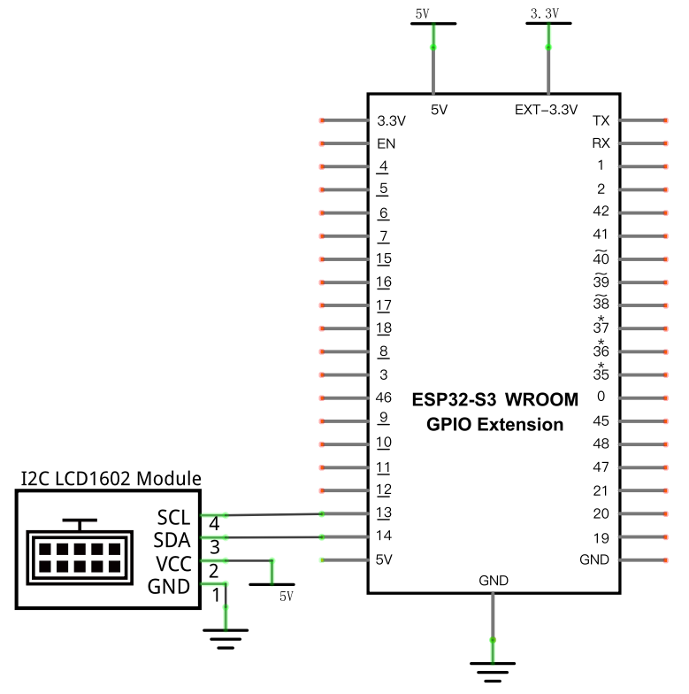

# LCD1602

Display static text and a live-updating counter on an LCD1602 character display, controlled over I2C.

## New Concepts
- I2C communication
- Character LCD displays

### Component Knowledge: I2C Communication

I2C (Inter-Integrated Circuit) is a 2-wire serial bus — SDA (data) and SCL (clock) — that lets a microcontroller talk to one or many peripheral chips over just those two shared lines. Each device on the bus has its own address, so the controller can address them individually.

### Component Knowledge: LCD1602

The LCD1602 displays 2 rows of 16 characters — letters, numbers, symbols, and ASCII text.




Driven directly, the LCD1602 needs many pins. This kit's module adds a **PCF8574** I2C-to-parallel backpack, converting those many parallel pins down to just SDA/SCL — its default address is `0x27` (or `0x3F` on the PCF8574A variant).




---

## Component List



---

## Circuit

### Wiring Diagram



**Connections:**
- LCD1602 SCL → GPIO13
- LCD1602 SDA → GPIO14
- LCD1602 VCC → 5V
- LCD1602 GND → GND

### Schematic Diagram



> Disconnect all power before building the circuit. Reconnect once verified.

---

## Code

**File:** [`04_output/code/IIC_LCD1602.py`](./code/IIC_LCD1602.py)
**Modules:** [`04_output/code/I2C_LCD.py`](./code/I2C_LCD.py), [`04_output/code/LCD_API.py`](./code/LCD_API.py)

```python
import time
from machine import I2C, Pin
from I2C_LCD import I2cLcd

i2c = I2C(scl=Pin(13), sda=Pin(14), freq=400000)
devices = i2c.scan()
if len(devices) == 0:
    print("No i2c device !")
else:
    for device in devices:
        print("I2C addr: "+hex(device))
        lcd = I2cLcd(i2c, device, 2, 16)

try:
    lcd.move_to(0, 0)
    lcd.putstr("Hello,world!")
    count = 0
    while True:
        lcd.move_to(0, 1)
        lcd.putstr("Counter:%d" %(count))
        time.sleep_ms(1000)
        count += 1
except:
    pass
```

---

## How to Run

### Online
1. Open Thonny → `04_output/code/`.
2. Right-click `I2C_LCD.py` and `LCD_API.py` → **Upload to /** — wait for both to finish uploading.
3. Double-click `IIC_LCD1602.py`.
4. Click **Run current script** — "Hello,world!" appears on row 1, and a counter increments on row 2 once per second.

---

## Code Explanation

### Scan the I2C bus

```python
i2c = I2C(scl=Pin(13), sda=Pin(14), freq=400000)
devices = i2c.scan()
```
`scan()` checks every possible address and returns a list of devices that respond — useful since the LCD's I2C address depends on which backpack chip variant it uses (`0x27` vs `0x3F`).

### Create the LCD object

```python
for device in devices:
    print("I2C addr: "+hex(device))
    lcd = I2cLcd(i2c, device, 2, 16)
```
Builds an `I2cLcd` for whichever address was found, configured for 2 rows × 16 columns.

### Position the cursor and write text

```python
lcd.move_to(0, 0)
lcd.putstr("Hello,world!")
```
`move_to(column, row)` positions the cursor (0-indexed); `putstr()` then writes a string starting there.

### Update one line repeatedly

```python
while True:
    lcd.move_to(0, 1)
    lcd.putstr("Counter:%d" %(count))
    time.sleep_ms(1000)
    count += 1
```
Moving back to the start of row 2 each loop and overwriting it lets the counter update in place rather than scrolling the screen.

---

## Key Concepts

- **I2C bus scanning**: `i2c.scan()` discovers devices and their addresses without hardcoding them
- **I2C-to-parallel backpacks**: chips like the PCF8574 let an otherwise pin-hungry display (LCD1602 normally needs ~16 pins) run over just 2 wires
- **Cursor-addressed displays**: `move_to()` + `putstr()` is the basic pattern for placing text anywhere on the screen

See [Class I2cLcd](../reference/Class_I2cLcd.md) for the full API reference.

## Further Exploration

- Display your own text on the screen
- Make scrolling text

> Adapted from [Python_Tutorial.pdf](../Python_Tutorial.pdf) Project 20.1
