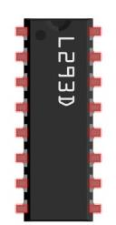
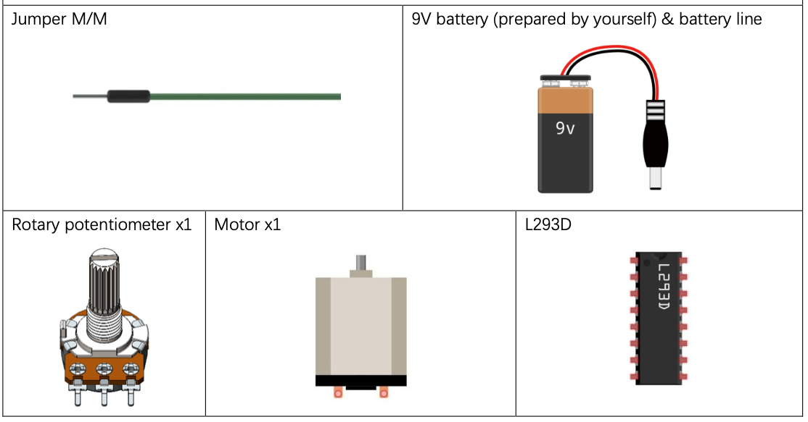
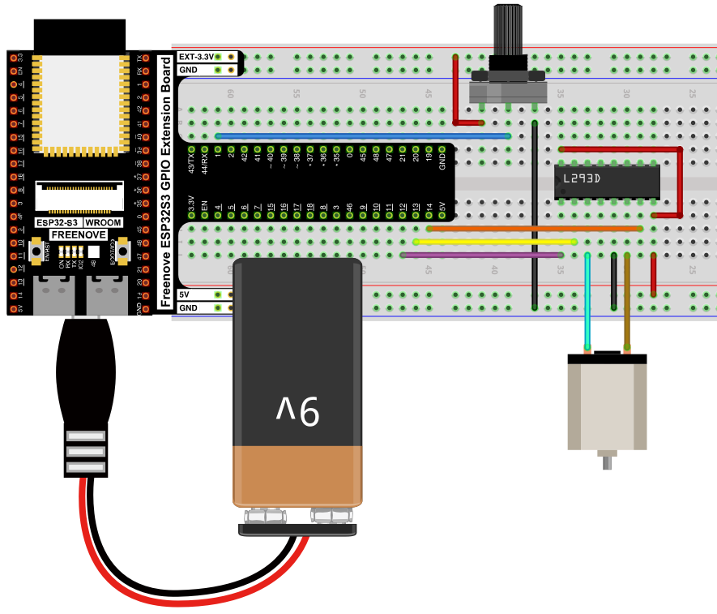
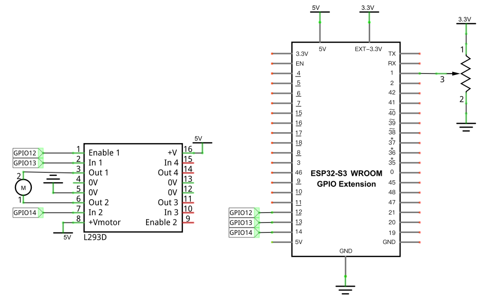

# Motor & Driver: Control Motor with Potentiometer

Control both the speed and direction of a DC motor from a single potentiometer, using an L293D motor driver chip.

## New Concepts
- H-bridge motor drivers
- Bidirectional speed control from one analog input

### Component Knowledge: L293D

The [relay](./04_03_relay_and_motor.md) could only switch a motor on/off. The **L293D** is a 4-channel motor driver chip that can additionally control *speed* (via PWM) and *direction* (by swapping which output is HIGH and which is LOW) — without ever exposing the ESP32-S3 to the motor's higher-power circuit.



| Pin | Description |
|-----|-------------|
| In x (2, 7, 10, 15) | Digital signal input for channel x |
| Out x (3, 6, 11, 14) | Output for channel x — mirrors its `In` pin's level, connected to `+Vmotor` or 0V |
| Enable1 (1) | Enables channels 1 & 2 — HIGH to enable |
| Enable2 (9) | Enables channels 3 & 4 — HIGH to enable |
| 0V (4, 5, 12, 13) | Ground |
| +V (16) | Logic supply, 3.0–36V |
| +Vmotor (8) | Motor power supply, up to 36V |

Wiring a motor to channels 1 & 2: feeding opposite levels to `In1`/`In2` sets the rotation direction, and a PWM signal on `Enable1` controls the speed. (Channels 3 & 4 work the same way via `In3`/`In4`/`Enable2`.)

---

## Component List



---

## Circuit

> Never power the motor directly from the ESP32-S3 — use a separate (or 9V battery) supply for the L293D's `+Vmotor`, sharing ground with the ESP32-S3.

### Wiring Diagram

> Disconnect all power before building the circuit. Reconnect once verified.



**Connections:**
- L293D In1 → GPIO13, In2 → GPIO14, Enable1 → GPIO12 (PWM)
- L293D Out1/Out2 → motor
- Potentiometer wiper → GPIO1 (ADC)

### Schematic Diagram



## Code

**File:** [`04_output/code/Motor_And_Driver.py`](./code/Motor_And_Driver.py)

```python
from machine import ADC,Pin,PWM
import time
import math

in1Pin=Pin(13, Pin.OUT)
in2Pin=Pin(14, Pin.OUT)

enablePin=Pin(12, Pin.OUT)
pwm=PWM(enablePin,10000)

adc=ADC(Pin(1))
adc.atten(ADC.ATTN_11DB)
adc.width(ADC.WIDTH_12BIT)

def driveMotor(dir,spd):
    if dir:
        in1Pin.value(1)
        in2Pin.value(0)
    else :
        in1Pin.value(0)
        in2Pin.value(1)
    pwm.duty(spd)
    
try:
    while True:
        potenVal = adc.read()
        rotationSpeed = potenVal - 2048
        if (potenVal > 2048):
            rotationDir = 1;
        else:
            rotationDir = 0;
        rotationSpeed=int(math.fabs((potenVal-2047)//2)-1)
        driveMotor(rotationDir,rotationSpeed)
        time.sleep_ms(10)
except:
    adc.deinit()
    pwm.deinit()
```

---

## How to Run

### Online
1. Open Thonny → `04_output/code/`.
2. Double-click `Motor_And_Driver.py`.
3. Click **Run current script**. Turn the potentiometer one way and the motor speeds up in one direction; turn it the other way and it slows, stops, then speeds up in reverse.

---

## Code Explanation

### Set up direction pins, a PWM-enabled speed pin, and the ADC

```python
in1Pin=Pin(13, Pin.OUT)
in2Pin=Pin(14, Pin.OUT)
enablePin=Pin(12, Pin.OUT)
pwm=PWM(enablePin,10000)
adc=ADC(Pin(1))
```
`in1Pin`/`in2Pin` set direction; PWM on `enablePin` sets speed; the ADC reads the potentiometer, exactly as in [Read the Voltage of a Potentiometer](../02_input_and_output/02_06_read_voltage_potentiometer.md).

### Drive the motor at a given direction and speed

```python
def driveMotor(dir,spd):
    if dir:
        in1Pin.value(1)
        in2Pin.value(0)
    else :
        in1Pin.value(0)
        in2Pin.value(1)
    pwm.duty(spd)
```
Setting `In1`/`In2` to opposite levels picks the direction; the PWM duty cycle on `Enable1` controls how fast it spins.

### Map the potentiometer's midpoint to "stopped"

```python
potenVal = adc.read()
if (potenVal > 2048):
    rotationDir = 1
else:
    rotationDir = 0
rotationSpeed=int(math.fabs((potenVal-2047)//2)-1)
driveMotor(rotationDir,rotationSpeed)
```
The ADC's range (0–4095) is split at its midpoint (2048): values above it mean one direction, values below mean the other. Subtracting 2047, taking the absolute value, and halving it converts "distance from center" into a speed — so the motor is stopped when the knob is centered and speeds up as it's turned further toward either end.

---

## Key Concepts

- **H-bridge drivers**: chips like the L293D let a motor be driven in either direction from low-power digital signals, isolating the motor's higher-power circuit from the microcontroller
- **Direction from digital pins, speed from PWM**: a common motor-control pattern — toggle two pins to pick direction, vary one PWM duty cycle to pick speed
- **Centering a control range**: treating mid-scale as "neutral" and mapping distance-from-center to magnitude is a common pattern for bidirectional analog controls (similar logic appears in joysticks)

## Further Exploration

- Add a small dead zone around the center (e.g. ±50) so the motor stays fully stopped near the middle instead of creeping at very low speed.
- Swap to channels 3/4 (`In3`/`In4`/`Enable2`) to drive a second motor independently.

> Adapted from [Python_Tutorial.pdf](../Python_Tutorial.pdf) Project 17.2
