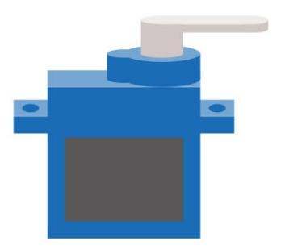
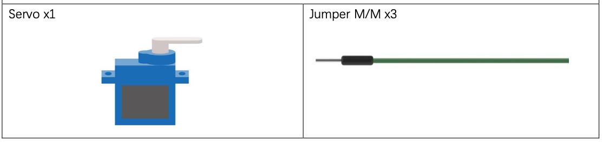
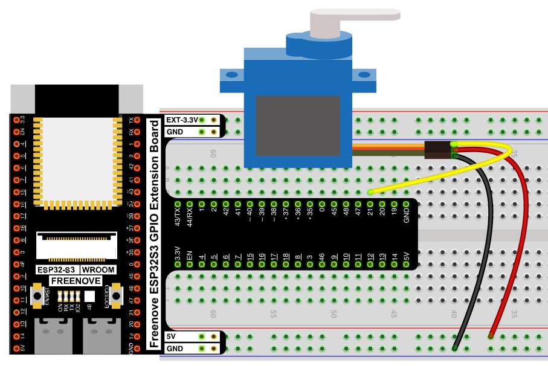
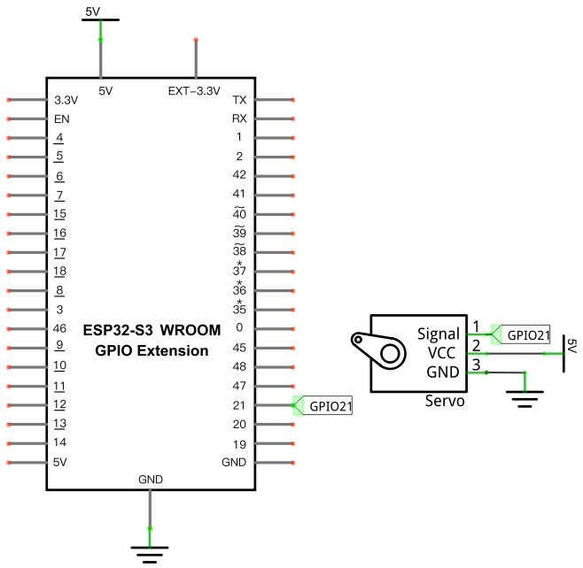

# Servo Sweep

Make a servo motor sweep continuously from 0° to 180° and back.

## New Concepts
- Servo motors
- Driving a servo with PWM angle control

### Component Knowledge: Servo

A servo packages a small DC motor, reduction gears, a position sensor, and control circuitry together, letting you command it to a specific angle (rather than just spinning continuously like the [DC motor](./22_relay_and_motor.md)). Most hobby servos sweep a 180° range via their output "horn," and can output far more torque than a bare DC motor of similar size.



A servo has 3 wires: power (red, VCC), ground (brown, GND), and signal (orange). It's positioned with a 50Hz PWM signal, where the *pulse width* (not the duty cycle percentage) determines the angle:

| Pulse width | Servo angle |
|-------------|-------------|
| 0.5ms | 0° |
| 1.0ms | 45° |
| 1.5ms | 90° |
| 2.0ms | 135° |
| 2.5ms | 180° |

---

## Component List



---

## Circuit

> Servos need a clean 5V supply — double-check polarity before connecting power.

### Wiring Diagram

> Disconnect all power before building the circuit. Reconnect once verified.



**Connections:**
- Servo Signal → GPIO21
- Servo VCC → 5V
- Servo GND → GND


### Schematic Diagram



## Code

**File:** [`04_output/code/Servo_Sweep.py`](./code/Servo_Sweep.py)
**Module:** [`04_output/code/myservo.py`](./code/myservo.py)

```python
from myservo import myServo
import time

servo=myServo(21)#set servo pin
servo.myServoWriteAngle(0)#Set Servo Angle
time.sleep_ms(1000)

try:
    while True:       
        for i in range(0,180,1):
            servo.myServoWriteAngle(i)
            time.sleep_ms(15)
        for i in range(180,0,-1):
            servo.myServoWriteAngle(i)
            time.sleep_ms(15)        
except:
    servo.deinit()
```

---

## How to Run

### Online
1. Open Thonny → `04_output/code/`.
2. Right-click `myservo.py` → **Upload to /** — wait for it to finish uploading to the ESP32-S3.
3. Double-click `Servo_Sweep.py`.
4. Click **Run current script** — the servo sweeps from 0° to 180° and back, repeatedly.

---

## Code Explanation

### Create the servo object and set a starting angle

```python
servo=myServo(21)
servo.myServoWriteAngle(0)
time.sleep_ms(1000)
```
`myServo(21)` configures PWM on GPIO21 at the servo's expected 50Hz. Setting it to 0° first and waiting a second gives the servo time to physically reach that position before the sweep starts.

### Sweep up, then down

```python
for i in range(0,180,1):
    servo.myServoWriteAngle(i)
    time.sleep_ms(15)
for i in range(180,0,-1):
    servo.myServoWriteAngle(i)
    time.sleep_ms(15)
```
Each loop steps the angle one degree at a time with a short pause, producing a smooth sweep rather than an instant jump (the same "ramp gradually" idea as [Breathing LED](../01_first_examples/01_04_breathing_LED.md)'s PWM fade, just applied to angle instead of brightness).

### Release the servo

```python
except:
    servo.deinit()
```

---

## Key Concepts

- **PWM pulse width vs. duty cycle**: most PWM uses described so far (LED brightness, motor speed) care about duty cycle *percentage*; servos instead care about the absolute *pulse width* in milliseconds, at a fixed 50Hz frequency
- **`myServoWriteAngle(pos)`**: converts a 0–180° angle into the correct underlying duty cycle, so application code never has to do that pulse-width math directly
- **Smooth motion via small steps**: sweeping one degree at a time with a short delay, rather than jumping straight to the target angle, is the same incremental-change pattern used throughout this kit (breathing LEDs, gradient colors, motor speed ramps)

See [class myServo](../reference/class_myServo/Servo.md) for the full API reference.

## Further Exploration

- Change the step size (e.g. `range(0,180,5)`) for a faster, choppier sweep.

> Adapted from [Python_Tutorial.pdf](../Python_Tutorial.pdf) Project 18.1
