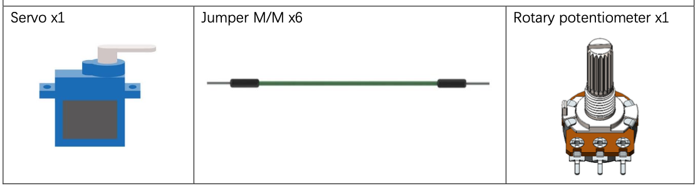
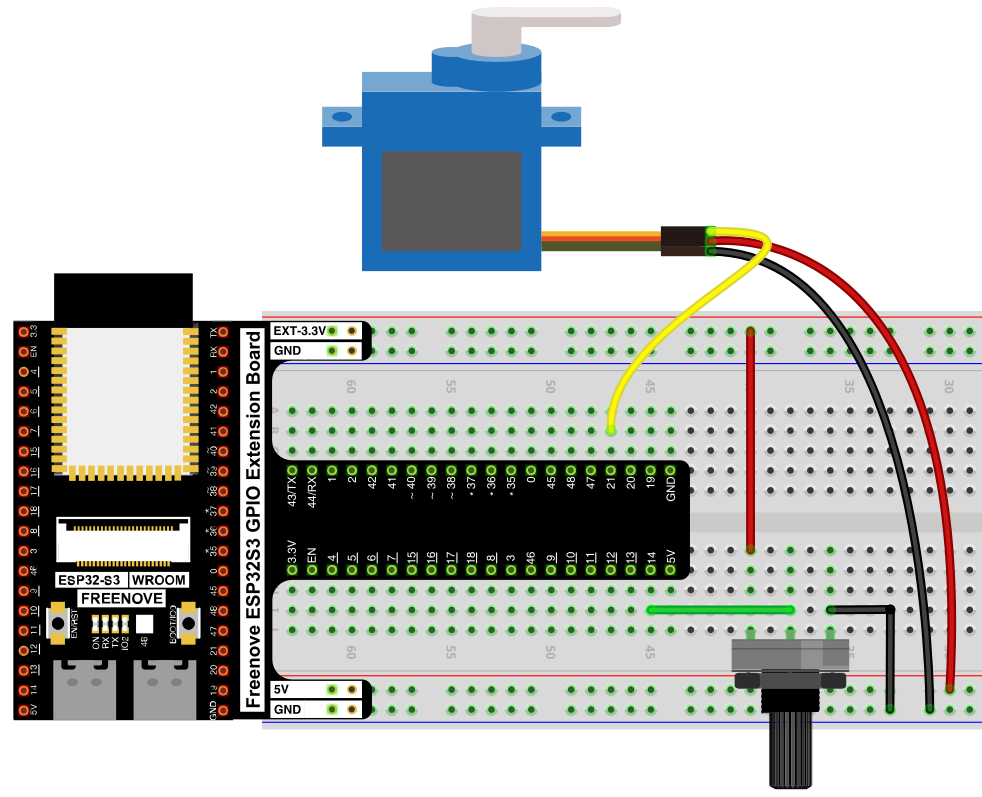
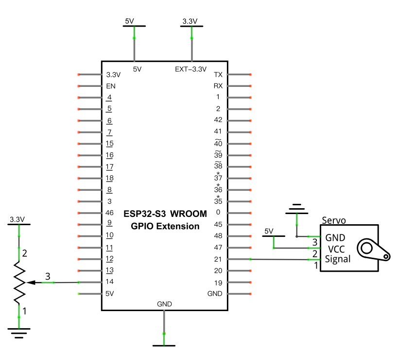

# Servo Knob

Control a servo's angle directly with a potentiometer — turn the knob, the servo follows.

## New Concepts
- Mapping a sensor reading directly onto a physical position

## Component List



## Circuit

> Servos need a clean 5V supply — double-check polarity before connecting power.

### Wiring Diagram

> Disconnect all power before building the circuit. Reconnect once verified.



**Connections:**
- Servo Signal → GPIO21, VCC → 5V, GND → GND
- Potentiometer wiper → GPIO14 (ADC)

### Schematic Diagram



## Code

**File:** [`04_output/code/Servo_Knop.py`](./code/Servo_Knop.py)
**Module:** [`04_output/code/myservo.py`](./code/myservo.py)

```python
from myservo import myServo
from machine import ADC,Pin
import time

servo=myServo(21)

adc=ADC(Pin(14))
adc.atten(ADC.ATTN_11DB)
adc.width(ADC.WIDTH_12BIT)

try:
    while True:
        adcValue=adc.read()
        angle=(adcValue*180)/4096
        servo.myServoWriteAngle(int(angle))
        time.sleep_ms(50)
except:
    adc.deinit()
    servo.deinit()
```

---

## How to Run

### Online
1. Open Thonny → `04_output/code/`.
2. Right-click `myservo.py` → **Upload to /** if it isn't already on the device.
3. Double-click `Servo_Knop.py`.
4. Click **Run current script**. Turn the potentiometer — the servo rotates to match its position.

---

## Code Explanation

### Scale the ADC range onto the servo's angle range

```python
adcValue=adc.read()
angle=(adcValue*180)/4096
servo.myServoWriteAngle(int(angle))
```
The ADC returns 0–4095 (12-bit); multiplying by 180 and dividing by 4096 rescales that range onto 0–180°, the servo's full range of motion — the same range-remapping idea as [Soft Light](../02_input_and_output/02_07_soft_light.md)'s `remap()`, just written inline as one expression instead of a separate function.

---

## Key Concepts

- **Direct sensor-to-actuator mapping**: reading an analog input and immediately driving an output proportionally is one of the most common patterns across this whole kit — same shape as [Soft Light](../02_input_and_output/02_07_soft_light.md) and [Night Lamp](../03_sensors/03_01_night_lamp.md), just with a servo angle instead of LED brightness
- **Inline range scaling**: `(value * newRange) / oldRange` is a quick way to rescale a number without writing a full `remap()` function, when one of the ranges starts at 0

See [class myServo](../reference/class_myServo/Servo.md) for the full API reference.

## Further Exploration

- Add smoothing (e.g. only update the servo if the angle changed by more than 2°) to reduce jitter from ADC noise.
- Swap the potentiometer for the [Joystick](../03_sensors/03_03_joystick.md)'s X or Y axis to control the servo with a stick instead of a knob.

> Adapted from [Python_Tutorial.pdf](../Python_Tutorial.pdf) Project 18.2
