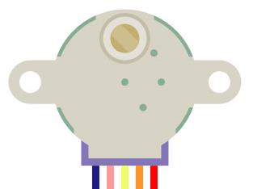
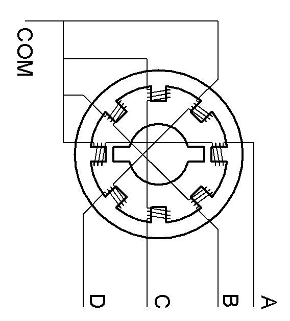
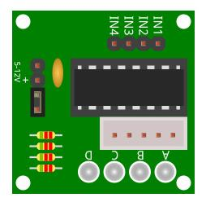
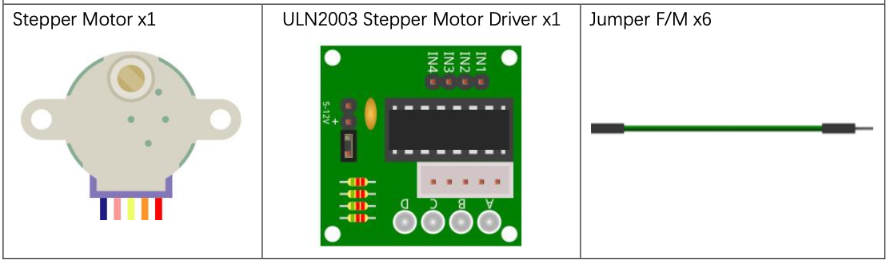
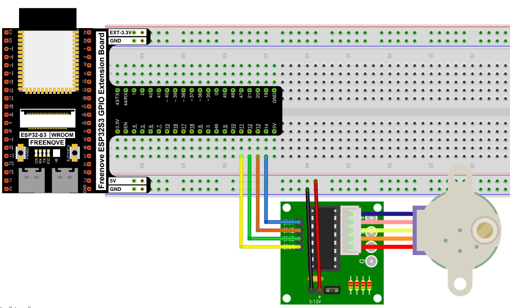
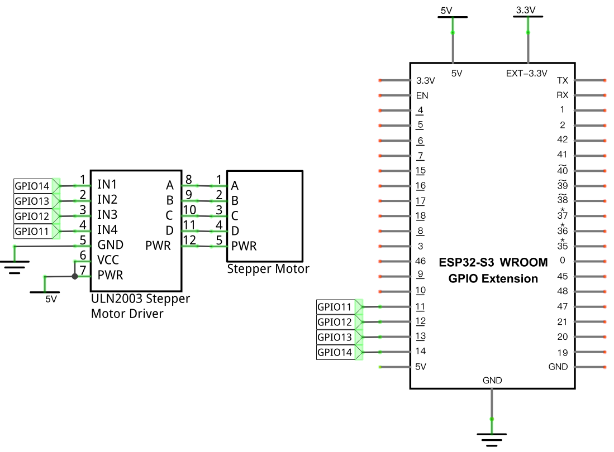

# Stepper Motor

Drive a 4-phase stepper motor through a ULN2003 driver board, rotating it one full turn clockwise, then one full turn counter-clockwise, on a continuous loop.

## New Concepts
- Stepper motors
- Open-loop position control

### Component Knowledge: Stepper Motor

Unlike a [DC motor](./22_relay_and_motor.md), which just spins as fast as its voltage allows, a stepper motor moves in discrete, precise increments ("steps") — and its position depends only on how many pulses it's been sent, not on load (within its torque limits).




Inside, the stator has coils arranged in 4 phases (A, B, C, D). Energizing them in sequence — `A→B→C→D→A→…` — pulls the rotor around one step at a time; reversing the sequence reverses the direction. This kit's motor has 32 magnetic poles (32 steps per revolution at the rotor), geared down 1:64 — so the output shaft needs `32 × 64 = 2048` steps for one full revolution.

### Component Knowledge: ULN2003 Driver

A stepper motor's coils need more current than a GPIO pin can supply directly. The ULN2003 board sits between the ESP32-S3 and the motor, amplifying 4 weak digital signals (`IN1`–`IN4`) into the stronger signals (`A`–`D`) needed to energize each coil — with 4 onboard LEDs showing which phase is currently active.



---

## Component List



## Circuit

> The stepper motor runs on 5V — power the breadboard independently and share ground with the ESP32-S3.

### Wiring Diagram



**Connections:**
- ULN2003 IN1–IN4 → GPIO14, GPIO13, GPIO12, GPIO11
- ULN2003 A–D → Stepper Motor A–D
- ULN2003 PWR/VCC → 5V, GND → GND

### Schematic Diagram



> Disconnect all power before building the circuit. Reconnect once verified.

---

## Code

**File:** [`04_output/code/Stepping_Motor.py`](./code/Stepping_Motor.py)
**Module:** [`04_output/code/stepmotor.py`](./code/stepmotor.py)

```python
from stepmotor import mystepmotor
import time

myStepMotor=mystepmotor(14,13,12,11)

try:
    while True:  
        myStepMotor.moveSteps(1,32*64,2000)
        myStepMotor.stop()
        time.sleep_ms(1000)
        myStepMotor.moveSteps(0,32*64,2000)
        myStepMotor.stop()
        time.sleep_ms(1000)
except:
    pass
```

---

## How to Run

### Online
1. Open Thonny → `04_output/code/`.
2. Right-click `stepmotor.py` → **Upload to /** — wait for it to finish uploading to the ESP32-S3.
3. Double-click `Stepping_Motor.py`.
4. Click **Run current script** — the motor rotates one full turn clockwise, pauses, then one full turn counter-clockwise, repeatedly.

---

## Code Explanation

### Create the stepper object

```python
myStepMotor=mystepmotor(14,13,12,11)
```
Associates the 4 phase-control pins (A, B, C, D) with GPIO14, 13, 12, and 11.

### Rotate a fixed number of steps

```python
myStepMotor.moveSteps(1,32*64,2000)
myStepMotor.stop()
```
`moveSteps(direction, steps, us)` energizes the coils in sequence for the given number of steps, pausing `us` microseconds between each — `32*64` steps is exactly one full revolution of the output shaft. `stop()` de-energizes all coils afterward so the motor doesn't keep drawing current while idle.

### Reverse and repeat

```python
myStepMotor.moveSteps(0,32*64,2000)
```
Calling `moveSteps()` with `direction=0` instead of `1` reverses the coil-energizing sequence, spinning the shaft the opposite way.

---

## Key Concepts

- **Open-loop stepping**: the motor's final position is just "how many steps, in which direction" — no sensor feedback is needed, unlike a servo
- **Phase sequencing**: rotating a motor is really just energizing electromagnets in a specific order; reversing that order reverses the direction
- **Gear reduction**: a small number of physical motor poles (32) becomes a much larger number of effective steps (2048) once gearing is factored in — useful for fine positional control

See [class myServo](../reference/class_myServo/Stepper_Motor.md) for the full API reference (the reference document for this chapter's `mystepmotor` class is filed there).

## Further Exploration

- Use `moveAngle()` to rotate to a specific angle instead of a full revolution.
- Speed up or slow down rotation by changing the `us` delay between steps — notice how too short a delay can cause the motor to skip steps or stall.

> Adapted from [Python_Tutorial.pdf](../Python_Tutorial.pdf) Project 19.1
