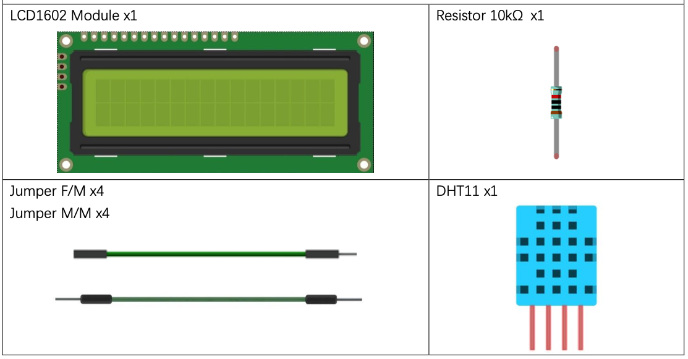
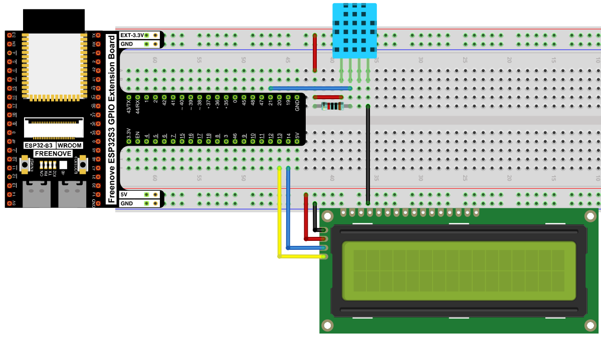
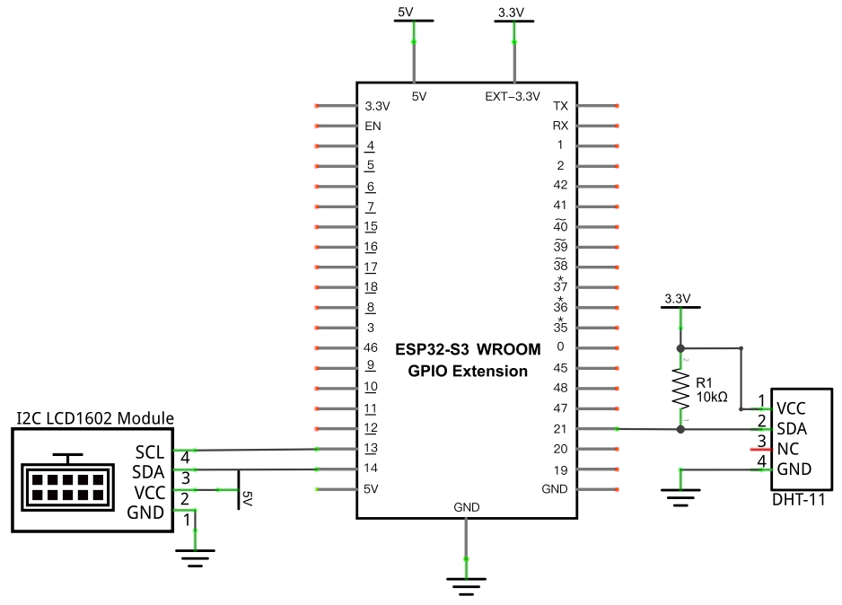
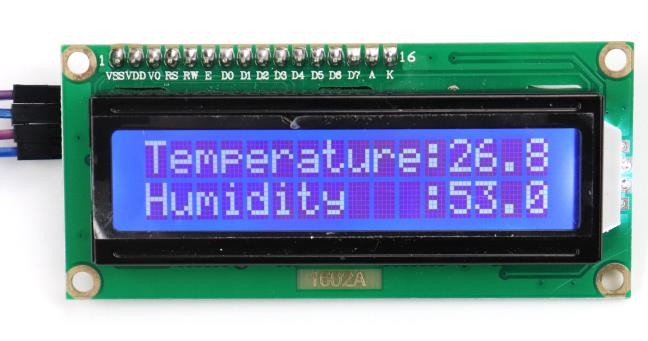

# Hygrothermograph (DHT11 + LCD1602)

Combine the [DHT11](../03_sensors/03_06_hygrothermograph_dht11.md) and [LCD1602](./04_02_lcd1602.md) projects: read temperature and humidity, and display both directly on the LCD instead of just printing to the Shell.

## New Concepts
- Combining a sensor input project with a display output project

---

## Component List



## Circuit

### Wiring Diagram

> Disconnect all power before building the circuit. Reconnect once verified.



**Connections:**
- DHT11 SDA → GPIO21 (with a 10kΩ pull-up to 3.3V)
- LCD1602 SCL → GPIO13, SDA → GPIO14

### Schematic Diagram



## Code

**File:** [`04_output/code/Hygrothermograph.py`](./code/Hygrothermograph.py)
**Modules:** [`04_output/code/I2C_LCD.py`](./code/I2C_LCD.py), [`04_output/code/LCD_API.py`](./code/LCD_API.py)

```python
from time import sleep_ms
from machine import I2C, Pin
from I2C_LCD import I2cLcd
import dht

DHT = dht.DHT11(Pin(21))
i2c = I2C(scl=Pin(13), sda=Pin(14), freq=400000)
devices = i2c.scan()
if len(devices) == 0:
    print("No i2c device !")
else:
    for device in devices:
        print("I2C addr: "+hex(device))
        lcd = I2cLcd(i2c, device, 2, 16)

try:
    while True:
        DHT.measure()
        lcd.move_to(0, 0)
        lcd.putstr("Temperature: ")
        lcd.putstr(str(DHT.temperature()))
        lcd.move_to(0, 1)
        lcd.putstr("Humidity: ")
        lcd.putstr(str(DHT.humidity()))
        sleep_ms(2000)
except:
    pass
```

---

## How to Run

### Online
1. Open Thonny → `04_output/code/`.
2. Right-click `I2C_LCD.py` and `LCD_API.py` → **Upload to /** if they aren't already on the device.
3. Double-click `Hygrothermograph.py`.
4. Click **Run current script** — temperature appears on row 1 and humidity on row 2, updating every 2 seconds.



---

## Code Explanation

This project is a direct merge of two earlier ones — nothing here is new on its own:

```python
DHT = dht.DHT11(Pin(21))
i2c = I2C(scl=Pin(13), sda=Pin(14), freq=400000)
```
Sets up the DHT11 exactly as in [Hygrothermograph](../03_sensors/03_06_hygrothermograph_dht11.md), and the I2C bus exactly as in [LCD1602](./04_02_lcd1602.md).

```python
DHT.measure()
lcd.move_to(0, 0)
lcd.putstr("Temperature: ")
lcd.putstr(str(DHT.temperature()))
lcd.move_to(0, 1)
lcd.putstr("Humidity: ")
lcd.putstr(str(DHT.humidity()))
```
Takes a fresh DHT11 reading, then writes labeled values to each LCD row. `str()` converts the numeric sensor readings into text `putstr()` can print — without it, `putstr()` would error trying to write a number directly.

---

## Key Concepts

- **Combining independent projects**: most "new" projects in this kit are really two earlier projects' code pasted together with minimal changes — recognizing the reusable pieces (sensor setup, display setup) makes new combinations fast to build
- **`str()` before `putstr()`**: display and print functions generally expect strings — numeric sensor values need explicit conversion first

See [Class dht](../reference/Class_dht.md) and [Class I2cLcd](../reference/Class_I2cLcd.md) for the full API references.

## Further Exploration

- Add a third reading (e.g. from the [Thermometer](../03_sensors/03_02_thermometer.md)'s thermistor) and cycle between display pages every few seconds.
- Use `lcd.clear()` before each update if old digits linger when a new reading has fewer characters.

> Adapted from [Python_Tutorial.pdf](../Python_Tutorial.pdf) Project 24.2
