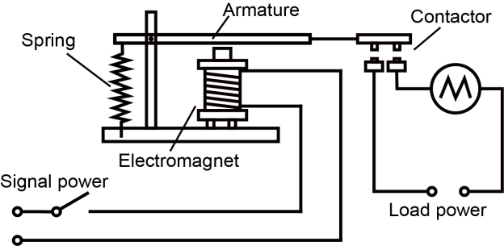
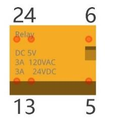
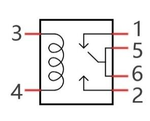
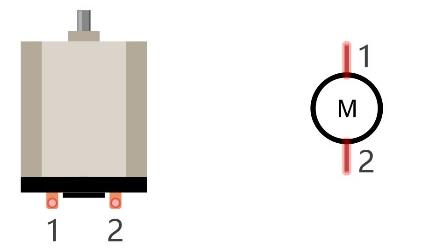
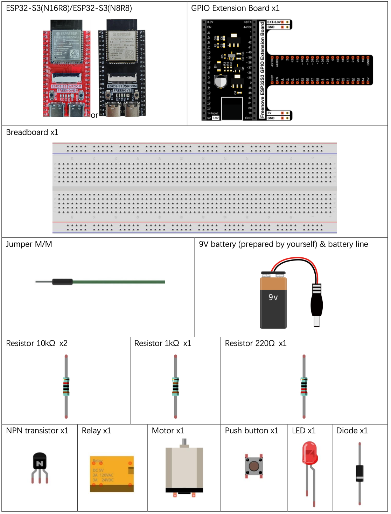
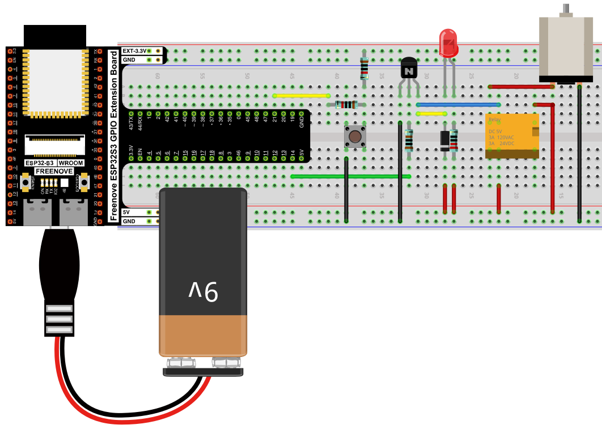
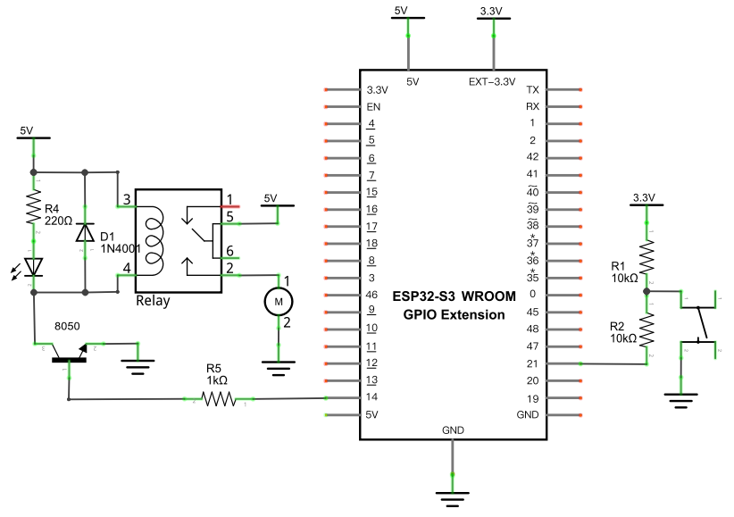

# Relay & Motor

Use a push button to toggle a relay on and off, switching power to a DC motor — controlling a high-power circuit indirectly through a low-power one.

## New Concepts
- Relays as power switches
- Driving a relay coil with a transistor
- Flyback diodes

### Component Knowledge: Relay

A relay is a switch with two separate circuits: a low-power **coil** (electromagnet) and a set of **contacts** it physically pulls open or closed. Energizing the coil with a small control current lets you switch a completely separate, much higher-power circuit — without that high-power circuit ever touching the microcontroller.





In this relay, pins 5 and 6 are connected together internally. With no power on the coil (pins 3, 4), pin 1 (the "close" end) connects to 5/6; once the coil is energized, pin 1 disconnects and pin 2 (the "open" end) connects to 5/6 instead.

### Concept: Flyback Diode

A relay's coil is an inductor — and inductors resist sudden changes in current. When the transistor driving the coil suddenly switches off, the coil's collapsing magnetic field tries to keep current flowing, producing a voltage spike that can damage nearby components. Wiring a diode backwards across the coil gives that current a safe path to dissipate instead of spiking — this is the "flyback diode," D1 in the schematic.

### Component Knowledge: DC Motor

A small DC motor has two pins; connecting them to power spins it one way, and reversing the polarity spins it the other way.



---

## Component List



---

## Circuit

> The motor circuit draws a relatively large current (~0.2–0.3A unloaded) — power the extension board from a 9V battery rather than relying on the ESP32-S3's own supply.

### Wiring Diagram



**Connections:**
- GPIO14 → 1kΩ resistor → transistor base
- Transistor collector → relay coil (pin 4); coil pin 3 → 5V, with the LED+220Ω indicator and flyback diode across the coil
- Relay contacts (1/5/6 side) → motor and 9V supply
- Push button → GPIO21 (internal pull-up enabled in software)

### Schematic Diagram



> Disconnect all power before building the circuit. Reconnect once verified.

---

## Code

**File:** [`04_output/code/Relay_And_Motor.py`](./code/Relay_And_Motor.py)

```python
import time
from machine import Pin

relay = Pin(14, Pin.OUT)        
button = Pin(21, Pin.IN,Pin.PULL_UP) 

def reverseRelay():
    if relay.value():
        relay.value(0)
    else:
        relay.value(1)

while True:
  if not button.value():
      time.sleep_ms(20)
      if not button.value():
          reverseRelay()
          while not button.value():
              time.sleep_ms(20)
```

This is the exact same toggle-and-debounce pattern as [Button and LED On/Off Switch](../01_first_examples/03a_button_and_led_on_off.md)'s `reverseGPIO()` — only the pin being toggled has changed, from an LED to a relay coil.

---

## How to Run

### Online
1. Open Thonny → `04_output/code/`.
2. Double-click `Relay_And_Motor.py`.
3. Click **Run current script**. Press the button — the relay clicks and the motor starts; press again to stop it.

---

## Code Explanation

See [Button and LED On/Off Switch](../01_first_examples/03a_button_and_led_on_off.md#code-explanation) for a full walkthrough of the debounce-and-toggle logic — `reverseRelay()` here is identical to that project's `reverseGPIO()`, just renamed. The only new idea is what's on the other end of the pin: instead of directly driving an LED, GPIO14 drives a transistor, which drives the relay coil, which switches the motor's much higher-power circuit.

---

## Key Concepts

- **Relays**: let a low-power digital signal switch a completely separate high-power circuit
- **Transistor as a digital switch**: a GPIO pin alone usually can't supply enough current to drive a relay coil directly — a transistor amplifies that small control current into enough to energize the coil
- **Flyback diodes**: protect driving circuitry from voltage spikes generated when current through an inductive load (like a relay coil) is suddenly cut off
- **Reusable toggle pattern**: the debounce/toggle code from [Button and LED On/Off Switch](../01_first_examples/03a_button_and_led_on_off.md) works unchanged for any digital output, not just LEDs

## Further Exploration

- Reverse the motor's wiring at the relay's open/close contacts to make the button reverse its direction instead of just stopping it.
- Replace the motor with a lamp or other AC/DC load (within the relay's rated voltage/current).

> Adapted from [Python_Tutorial.pdf](../Python_Tutorial.pdf) Project 17.1
