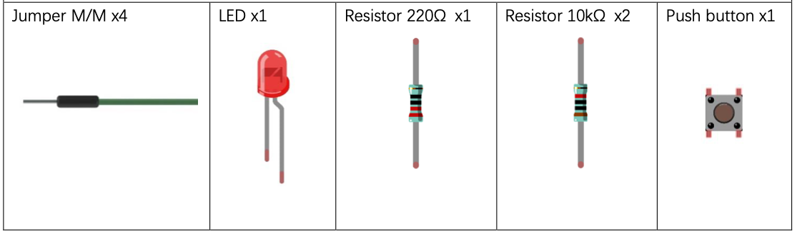
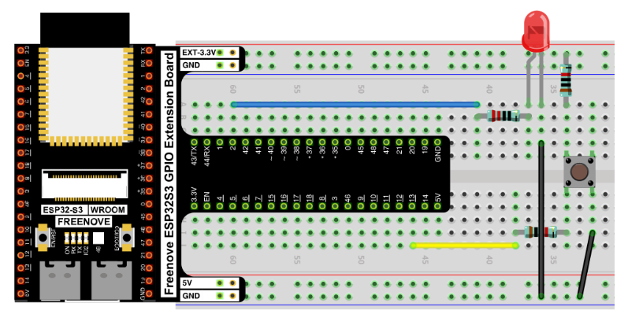
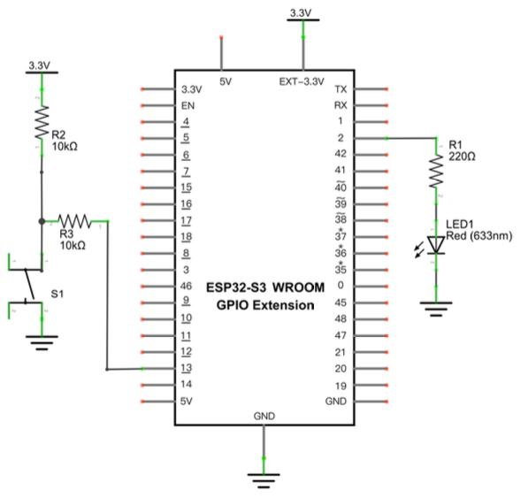

# Button On and Off Switch with Interrupts

[Button and LED On and Off Switch](../01_first_examples/01_03a_button_and_led_on_off.md)  created a circuit and code to turn an LED on and off.  It works well but has a flaw when working with more complex projects?

The flaw is that the program constantly 'poll' the input line for the button press or risk missing a button press.  This is easy if the program ONLY listens for button presses but is difficult if the program is doing many other things.

The ideal solution would be to trigger the button press logic any time the pin for the button changes it's value.  This is possible using interrupts!

## New Concepts

- Interrupts
- callback functions serving as an interrupt handler

### Interrupts

An interrupt is a request for the microcontroller to interrupt the currently executing code so that an event can be processed as soon as possible.  In the case of an interrupt driven by an input pin a 'interrupt handler function' is called when the input pin changes from low to hi, hi to low or both.

See [Hardware Interrupts](https://en.wikipedia.org/wiki/Interrupt#Hardware_interrupts) on wikipedia for more details.

### Callback functions / Interrupt Handler

A function that is passed in as a parameter to a function or class constructor.  In this case the callback function is run (called) when an interrupt is triggered.

*Circuit and component are identical to Project 1.3*

## Component List



## Circuit

### Wiring Diagram

> Disconnect all power before building the circuit. Reconnect once verified.



**Connections:**
- LED anode → 220Ω resistor → GPIO2
- LED cathode → GND
- Push button one side → GPIO13
- Push button other side → GND
- GPIO13 also connected via 10kΩ pull-up resistor to 3.3V

### Schematic Diagram



The internal pull-up (`Pin.PULL_UP`) in software replaces the need for an external pull-up resistor in this case, but the schematic uses external resistors for clarity.

## Code

**File:** [05_interrupts_and_timers/code/ButtonAndLed_OnOff_Interrupt.py](./code/ButtonAndLed_OnOff_Interrupt.py)

```python
from machine import Pin
import time

led = Pin(2, Pin.OUT)
button = Pin(13, Pin.IN, Pin.PULL_UP)

counter = 0
last_press_time = time.ticks_ms()

def reverseGPIO():
    if led.value():
        led.value(0)
    else:
        led.value(1)

def button_handler(pin):
    global counter
    global last_press_time
    current_time = time.ticks_ms()
    delta_time = time.ticks_diff(current_time, last_press_time)
    if delta_time > 200:
        counter += 1
        print("Button pressed", counter, "times")
        reverseGPIO()
        last_press_time = current_time
    else:
        print("Skipped bounce")
    
button.irq(trigger=Pin.IRQ_RISING, handler=button_handler)
```

> NOTE: There is NO while loop!

## Code Explanation

There are two new things to understand in this code.

### Registering the interrupt handler

`handler` is the function called when the interrupt triggers.  In this case the `button_handler` function is called.

`trigger` controls when the interrupt is triggered.  In this case it will trigger when the signal rises.  The other options are to pass in `Pin.IRQ_FALLING` to trigger when the signal falls or pass in the two options ORed together to trigger on both: `Pin.IRQ_RISING | Pin.IRQ_FALLING`.

```python
button.irq(trigger=Pin.IRQ_RISING, handler=button_handler)
```

### The interrupt handler

This handler function does not use sleep for debounce handling like [Project 1.3a](../01_first_examples/01_03a_button_and_led_on_off.md).  It uses a time guard to ensure it only toggles the LED once in 200ms.

> NOTE: This version of the code also includes print statements to help you see any bounces that were debounced.  Not every button press will trigger a bounce but some will trigger man.

```python
def button_handler(pin):
    global counter
    global last_press_time
    current_time = time.ticks_ms()
    delta_time = time.ticks_diff(current_time, last_press_time)
    if delta_time > 200:
        counter += 1
        print("Button pressed", counter, "times")
        reverseGPIO()
        last_press_time = current_time
    else:
        print("Skipped bounce")
```

## Key Concepts

- **Interrupt**: An asynchronous event that interrupts the currently running code and runs predefined handler code before resuming the original code.
- **Interrupt Handler**: The function run when an interrupt is triggered.
- **time based debounce**: Debounce by ignoring triggered interrupts for a fixed period of time after the first trigger.

## Further Exploration

- Modify the code to reduce the debounce time until it is unreliable.  Increase the debounce time until it ignores real button presses.