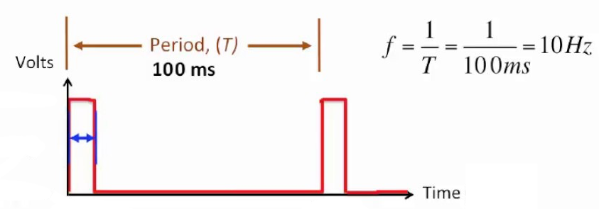
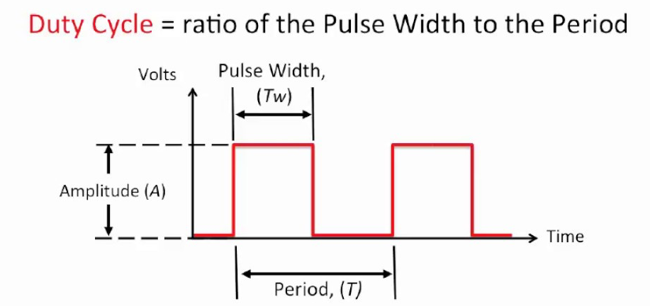
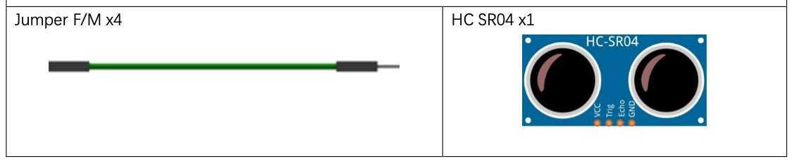
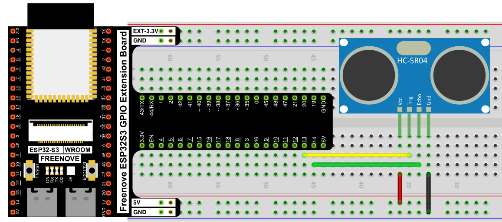
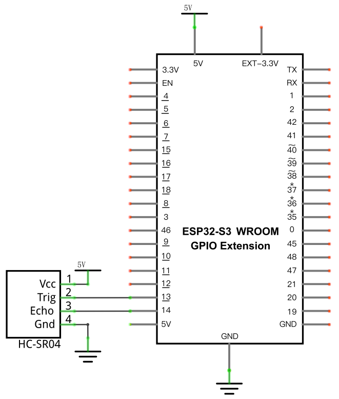

# Ultrasonic Ranging with Interrupts

We have previously measured distance using the HC-SR04 ultrasonic sensor using sleep and loops to send the pulse and measure the time it takes for the pulse to bounce back.  This works but means the microcontroller cannot do anything while getting the distance measurement.  There is another way to run the ultrasonic sensor without using up all the microcontrollers CPU time ... interrupts

## New Concepts

- PWM signal as an automated trigger.

### PWM signal as an automated trigger

The ultrasonic sensor requires a 10 us trigger pulse.  In the prior projects this pulse was created by directly setting a pin and sleeping for 10 us before shutting the pin off:

```python
    trigPin.value(1)
    time.sleep_us(10)
    trigPin.value(0)
```

This works but same as waiting for a button press the program must run this code on a regular basis and cannot do anything else while it is running.  This could lead to inconsistent triggering of the sensor or disruptions in the program while triggering.

One solution is to use a PWM signal to trigger the ultrasonic sensor.  A PWM signal is controlled by setting a frequency (f - Hz) and duty cycle (dc - %).  Those values can be used to calculate a period (T - s) and pulse width (Tw - s).


The Period is the inverse of frequency.



`f =  1 / T`

The duty cycle equals the Pulse Width divided by the Period.



`dc = Tw / T`

> NOTE: To convert dc into a percentage multiply the result by 100.

If we want the sensor to trigger 10 times a second the frequency is `10 Hz` so the period is `100ms`:

`10 = 1 / T` ==> `10 * T = 1` ==> `T = 1/10` ==> `T = 0.1 seconds` ==> `T = 100 ms`

We need the trigger to have a pulse width of `10 us` or `0.00001 seconds` so the duty cycle is `0.01 %`:

`dc = 0.00001 / 0.1` ==> `dc = 0.0001` ==> `dc = 0.01 %`


Now we have the duty cycle and frequency we need to configure the PWM, here is the constructor for PWM:

`PWM(pin, freq, duty)`

- `freq` is frequency in Hz
- `duty` is an integer from 0 to 1023.  0 is 0% duty cycle and 1023 is 100% duty cycle

Do frequency requires no conversion but we need to convert from duty cycle in percent to duty cycle as a value from 0-1023:

`0.01 % = duty / 1023` ==> `0.0001 = duty / 1023` ==> `duty = 0.0001 * 1023` ==> `duty = 0.1023`

We need an integer so we will just pick 1 as it's the smallest non-zero value we can enter.  The trigger pulse will be too long but it should still work fine.


## Component List



## Circuit

> The HC-SR04 runs on 5V, not 3.3V — make sure VCC is wired to the 5V rail.

### Wiring Diagram

> Disconnect all power before building the circuit. Reconnect once verified.




**Connections:**
- HC-SR04 Vcc → 5V
- HC-SR04 Trig → GPIO13
- HC-SR04 Echo → GPIO14
- HC-SR04 Gnd → GND

### Schematic Diagram



## Code

**File:** [`05_interrupts_and_timers/code/ultrasonic.py](./code/ultrasonic.py)

```python
from machine import Pin, PWM
import time

class Ultrasonic:
    
    def __init__(self, echoPinNum, triggerPinNum):
        self.echoPin = Pin(echoPinNum, Pin.IN, 0)
        self.trigPulse = PWM(Pin(triggerPinNum, Pin.OUT), freq=10, duty=1)
        self.startEcho = 0
        self.endEcho = 0
        self.distance = 0
        self.lastMeasure = 0
        self.soundVelocity=340
        self.echoPin.irq(trigger=Pin.IRQ_RISING | Pin.IRQ_FALLING, handler=self.measure)

    def measure(self, pin):
        if pin.value():
            self.startEcho = time.ticks_us()
        else:
            self.endEcho = time.ticks_us()
            self.distance = self.calculateCM(self.startEcho, self.endEcho)
            self.lastMeasure = self.endEcho

    def calculateCM(self, start, stop):
        ticks=time.ticks_diff(stop,start)
        return int(ticks*self.soundVelocity//2//10000)
```

**File:** [`05_interrupts_and_timers/code/Ultrasonic_Ranging_Interrupt.py`](./code/Ultrasonic_Ranging_Interrupt.py)

```python
from ultrasonic import Ultrasonic

us = Ultrasonic(14, 13)
lastMeasure = us.lastMeasure

while True:
    if lastMeasure != us.lastMeasure:
        print ("Distance:", us.distance, "CM")
        lastMeasure = us.lastMeasure
```


## How to Run

### Online
1. Open Thonny → `056_interrupts_and_timers/code/`.
2. Right-click `ultrasonic.py` → **Upload to /** if they aren't already on the device.
3. Double-click `Ultrasonic_Ranging_Interrupt.py`.
4. Click **Run current script**


---

## Code Explanation

### Fire a trigger pulse

```python
        self.trigPulse = PWM(Pin(triggerPinNum, Pin.OUT), freq=10, duty=1)
```
Holds the `Trig` pin HIGH for about 100 microseconds, telling the HC-SR04 to send an ultrasonic pulse.

### Time the echo

```python
        self.echoPin.irq(trigger=Pin.IRQ_RISING | Pin.IRQ_FALLING, handler=self.measure)
```

Constructs an interrupt that is triggered when `Echo` pin to goes from LOW to HIGH (the pulse has been sent), and when it goes from HIGH to LOW (the echo was received).  On each trigger it runs the callback function `measure`.

```python
    def measure(self, pin):
        if pin.value():
            self.startEcho = time.ticks_us()
        else:
            self.endEcho = time.ticks_us()
            self.distance = self.calculateCM(self.startEcho, self.endEcho)
            self.lastMeasure = self.endEcho

    def calculateCM(self, start, stop):
        ticks=time.ticks_diff(stop,start)
        return int(ticks*self.soundVelocity//2//10000)
```

When called on the rising edge (pin.value() == 1) the start ticks are saved.  When called on the falling edge (pin.value() == 0) the end ticks are saved and distance is calculated.

## Key Concepts

- **PWM as periodic trigger**: Use the PWM to raise a short pulse on an output pin on a regular basis
- **Auto updating distance measurement**: The periodic trigger updates the distance measurement every 100ms, the time of the last measurement is set every time the distance is measured.


## Further Exploration

- Update the Ultrasonic class so you can provide a callback function that is called every time a measurement is made.
