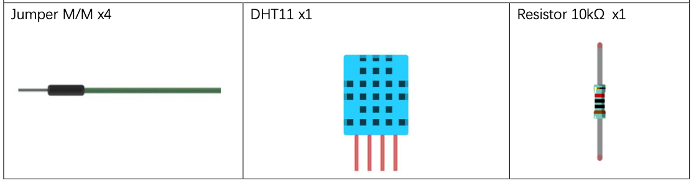
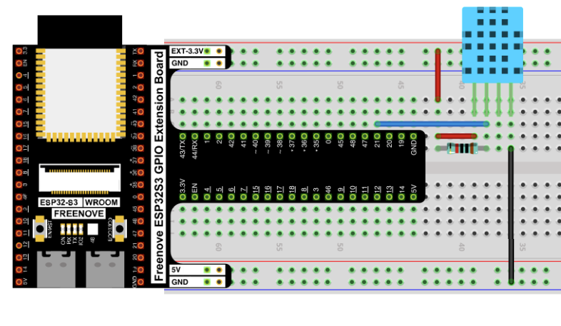
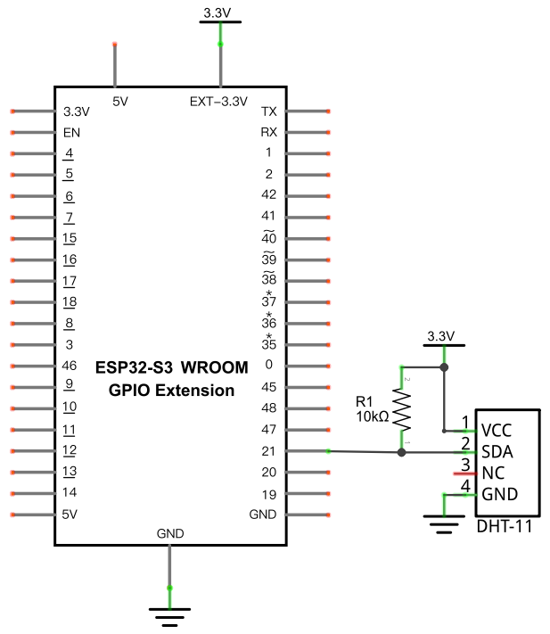

# DHT11 Temperature and Humidity sensor using a timer

In [Project 3.6](../03_sensors/03_06_hygrothermograph_dht11.md) a DHT11 is used to measure temperature and humidity every 2 seconds.  To do so the program contains an infinite loop that checks the temperature then sleeps for two seconds.  This is inconvenient when your program is doing something else, an alternative solution is to use a timer to check the temperature at a regular time interval without sleeping.

## New Concepts

- Timer

### Timer

A MicroPython class that controls the hardware timers of the microcontroller.  They can execute a callback once after a given amount of time has passed or repeatedly once every period of time.  

Use `mode=Timer.PERIODIC` to run callback multiple times and `mode=Timer.ONE_SHOT` to run the callback once.

For more info see [MicroPython Timer documentation](https://docs.micropython.org/en/latest/library/machine.Timer.html)

> NOTE: The ESP32-S3 has 4 timers, so only 4 can be active at a time.

*Circuit and components are identical to Project 3.6*

## Component List



## Circuit

> Disconnect all power before building the circuit. Reconnect once verified.

### Wiring Diagram



**Connections:**
- DHT11 VCC → 3.3V (through a 10kΩ pull-up to the SDA line)
- DHT11 SDA → GPIO21
- DHT11 NC → not connected
- DHT11 GND → GND

### Schematic Diagram



## Code

```python
from machine import Pin, Timer
import dht

DHT = dht.DHT11(Pin(21))

def getTemperature(t):
    DHT.measure()
    print('temperature:',DHT.temperature(),'humidity:',DHT.humidity())

try:
    timer = Timer(0)
    timer.init(mode=Timer.PERIODIC, period=10, callback=getTemperature)
    
    while True:
        pass
finally:
    timer.deinit()
```

## Code Explanation

This code is very similar to the code from [Project 3.6](../03_sensors/03_06_hygrothermograph_dht11.md#code-explanation).

The code to take a measurement from the DHT11 sensor is moved from the main loop in Project 3.6 to a function that can be used as a callback.

```python
def getTemperature(t):
    DHT.measure()
    print('temperature:',DHT.temperature(),'humidity:',DHT.humidity())
```

Create a timer and initialize it as a periodic timer with a period of 2000ms and `getTemperature` as the callback function.  This configures the timer to run for ever and call the `getTemperature` callback every 2000ms.

```python
timer = Timer(0)
timer.init(mode=Timer.PERIODIC, period=2000, callback=getTemperature)
```

The timer is wrapped in a try/finally block to ensure the timer is always deinitialized when the program is stopped.

```python
try:
    timer = Timer(0)
    timer.init(mode=Timer.PERIODIC, period=2000, callback=getTemperature)
    
    while True:
        pass
finally:
    timer.deninit()

```

> Notice the `while True:` loop is not necessary to read the sensor but it is necessary because the timer runs until `deinit` is called on the timer or the microcontroller is hard reset.  The `while True:` loop keeps the program from calling `timer.deinit()` before you sent a reset command by hitting the stop icon.  In a real use case your main program loop would take the place of this dummy `while True:` loop.

## Key Concepts

- **Hardware Timers**: Timers run in hardware on the microcontroller providing a small number of high precision timers that have low or no runtime overhead to other code running on the microcontroller
- **Periodic**: Something that happens over and over again at a fixed time interval.

## Further Exploration

- Adjust the period to make temperature measurements more frequent.  Can you make it so frequent that it fails or no longer runs faster?
- What happens if you remove the `timer.deinit()` then try to run the program more than once without a hard reset?
