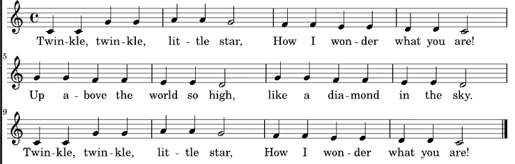

# PWM Sound Generator

The PWM channels on the ESP32-S3 microcontroller were not designed to make sounds but they generate square waves, so it can make sound.  To make music you just need to know the frequency for each note and have some way to string together multiple notes into a song.

## New Concepts

- Notes and their frequencies
- Twinkle Twinkle Little star

### Notes and their frequencies

Notes are fundamental units of music that represent specific pitches (frequencies).  Octaves are intervals between musical pitches where each note has twice the frequency of the same note in the previous octave.

| Note | Octave 0 | Octave 1 | Octave 2 | Octave 3 | Octave 4 | Octave 5 | Octave 6 | Octave 7 | Octave 8 |
|------|-----:|-----:|-----:|------:|------:|------:|-------:|-------:|-------:|
| c  | 16.35 | 32.7  | 65.41  | 130.81 | 261.63 | 523.25  | 1046.50 | 2093   | 4186   |
| C# | 17.32 | 34.65 | 69.30  | 138.59 | 277.18 | 554.37  | 1108.73 | 2217.46| 4434.92|
| d  | 18.35 | 36.71 | 73.42  | 146.83 | 293.66 | 587.33  | 1174.66 | 2349.32| 4698.64|
| D# | 19.45 | 38.89 | 77.78  | 155.56 | 311.13 | 622.25  | 1244.51 | 2489.02| 4978.03|
| e  | 20.60 | 41.20 | 82.41  | 164.81 | 329.63 | 659.25  | 1318.51 | 2637.02| 5274.04|
| f  | 21.83 | 43.65 | 87.31  | 174.61 | 349.23 | 698.46  | 1396.91 | 2793.83| 5587.65|
| F  | 23.12 | 46.25 | 92.50  | 185.00 | 369.99 | 739.99  | 1479.98 | 2959.96| 5919.91|
| g  | 24.50 | 49.00 | 98.00  | 196.00 | 392.00 | 783.99  | 1567.98 | 3135.96| 6271.93|
| G# | 25.96 | 51.91 | 103.83 | 207.65 | 415.30 | 830.61  | 1661.22 | 3322.44| 6644.88|
| a  | 27.50 | 55.00 | 110.00 | 220.00 | 440.00 | 880.00  | 1760.00 | 3520.00| 7040.00|
| A# | 29.14 | 58.27 | 116.54 | 233.08 | 466.16 | 932.33  | 1864.66 | 3729.31| 7458.62|
| b  | 30.87 | 61.74 | 123.47 | 246.94 | 493.88 | 987.77  | 1975.53 | 3951.07| 7902.13|

### Twinkle Twinkle Little Star

[Twinkle Twinkle Little Star](https://en.wikipedia.org/wiki/Twinkle,_Twinkle,_Little_Star) is a lullaby with a simple tune that is often used as the first song you play when you learn a new instrument.  So it is like the Hello World program of music.  



Here is the tune transcribed into text.  The letter is the note and the number in parenthesis is the octave:

| M1 | M2 | M3 | M4 |
|-|-|-|-|
|g(3) g(3) d(4) d(4) | e(4) e(4) d(4) (sustain) | c(4) c(4) b(3) b(3) | a(3) a(3) g(3) (sustain) |
| d(4) d(4) c(4) c(4) | b(3) b(3) a(3) (sustain) | d(4) d(4) c(4) c(4) | b(3) b(3) a(3) (sustain) |
|g(3) g(3) d(4) d(4) | e(4) e(4) d(4) (sustain) | c(4) c(4) b(3) b(3) | a(3) a(3) g(3) (sustain) |

> NOTE: sustain means hold the note for twice as long as normal

## Component List

- Speaker
- Two jumper cables

## Circuit

> Disconnect all power before building the circuit. Reconnect once verified.

### Wiring Diagram

**Connections:**
- Connect the red wire of the speaker to pin 11
- Connect the black wire of the speaker to ground

## Code

**File:** [05_interrupts_and_timers/code/pwm_sounds.py](./code/pwm_sounds.py)

```python
from machine import Pin, PWM
import time

# Note frequencies
g3 = 196
a3 = 220
b3 = 247

c4 = 262
e4 = 330
d4 = 294

rest = 0

twinkle_notes = [g3, rest, g3, rest, rest, d4, rest, d4, rest, rest, e4, rest, e4, rest, rest, d4, d4, rest, rest, rest, rest,
                 c4, rest, c4, rest, rest, b3, rest, b3, rest, rest, a3, rest, a3, rest, rest, g3, g3, rest, rest, rest, rest,
                 d4, rest, d4, rest, rest, c4, rest, c4, rest, rest, b3, rest, b3, rest, rest, a3, a3, rest, rest, rest, rest,
                 d4, rest, d4, rest, rest, c4, rest, c4, rest, rest, b3, rest, b3, rest, rest, a3, a3, rest, rest, rest, rest,
                 g3, rest, g3, rest, rest, d4, rest, d4, rest, rest, e4, rest, e4, rest, rest, d4, d4, rest, rest, rest, rest,
                 c4, rest, c4, rest, rest, b3, rest, b3, rest, rest, a3, rest, a3, rest, rest, g3, g3, rest, rest, rest, rest]

pin = Pin(11, Pin.OUT)
pwm = PWM(pin, freq = b3, duty = 0)

try:
    for note in twinkle_notes:
        if note > 0:
            pwm.freq(note)
            pwm.duty(512)
        else:
            pwm.duty(0)
        time.sleep_ms(120)
finally:
    pwm.deinit()
```

## Code Explanation

This code stores the song as an array of frequencies then uses a loop to play each one for a fixed period of time.  A frequency is interpreted as a rest.

Notes used in Twinkle Twinle Little Star.  Notice that the frequencies are not the same as those shown in the table above.  They are integers calculated by rounding the exact frequency to the closest whole number.

```python
g3 = 196
a3 = 220
b3 = 247

c4 = 262
e4 = 330
d4 = 294

rest = 0
```

The song encoded as a list of frequencies.

```python
twinkle_notes = [g3, rest, g3, rest, rest, d4, rest, d4, rest, rest, e4, rest, e4, rest, rest, d4, d4, rest, rest, rest, rest,
                 c4, rest, c4, rest, rest, b3, rest, b3, rest, rest, a3, rest, a3, rest, rest, g3, g3, rest, rest, rest, rest,
                 d4, rest, d4, rest, rest, c4, rest, c4, rest, rest, b3, rest, b3, rest, rest, a3, a3, rest, rest, rest, rest,
                 d4, rest, d4, rest, rest, c4, rest, c4, rest, rest, b3, rest, b3, rest, rest, a3, a3, rest, rest, rest, rest,
                 g3, rest, g3, rest, rest, d4, rest, d4, rest, rest, e4, rest, e4, rest, rest, d4, d4, rest, rest, rest, rest,
                 c4, rest, c4, rest, rest, b3, rest, b3, rest, rest, a3, rest, a3, rest, rest, g3, g3, rest, rest, rest, rest]
```

Create the `Pin` object and construct a `PWM` object that uses that pin.

```python
pin = Pin(11, Pin.OUT)
pwm = PWM(pin, freq = b3, duty = 0)
```

Loop over the notes and set the frequency and duty cycle if the note frequency is greater than zero.  If zero this is a rest so set duty cycle to 0.  Then sleep for 120 ms before beginning to play the next note.

```python
try:
    for note in twinkle_notes:
        if note > 0:
            pwm.freq(note)
            pwm.duty(512)
        else:
            pwm.duty(0)
        time.sleep_ms(120)
finally:
    pwm.deinit()
```

> NOTE: duty cycle is the ratio between the time the signal is high vs low.  For example if the duty cycle is 40% means the signal is high for 40% of the time and low for 60% of the time.  It is encoded as a value between 0 and 1023, 0 is 100% off and 1023 is 100% on.

> Note `pwm.deinit()` is in a `finally:` block to ensure it is always called.  Failing to call deinit can force multiple soft resets or a hard reset before you can run the code again.

## Key Concepts

- **Notes and Octaves**: Notes are a set of frequencies grouped into octaves where each octaves notes are twice the frequency of the previous octave.
- **Duty Cycle**: The ratio between the time a signal is high vs low.

## Further Exploration

- Modify the duty cycle between 0 and 1023 and see how it impacts the sound produced.
- Adjust the frequencies for each note.  How small of a change in frequency can you detect?  What happens if you shift the song up or down an octave?