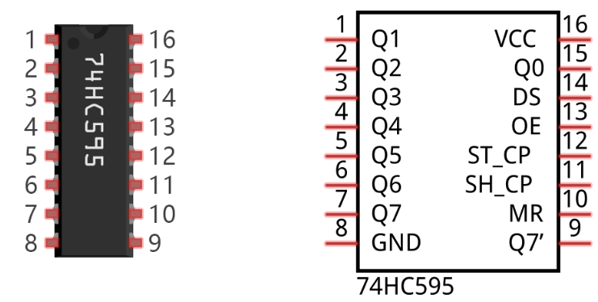

# 74HC595

A 74HC595 chip is used to convert serial data into parallel data. A 74HC595 chip can convert the serial data
of one byte into 8 bits, and send its corresponding level to each of the 8 ports correspondingly. With this
characteristic, the 74HC595 chip can be used to expand the IO ports of a ESP32S3. At least 3 ports are required
to control the 8 ports of the 74HC595 chip.

The ports of the 74HC595 chip are described as follows:

| Pin name | GPIO number | Description|
|-|-|-|
| Q0-Q7 | 15, 1-7 | Parallel data output|
| VCC | 16 | The positive electrode of power supply, the voltage is 2~6V |
| GND | 8 | The negative electrode of power supply |
| DS | 14 | Serial data Input |
| OE | 13 | Enable output, When this pin is in high level, Q0-Q7 is in high resistance state When this pin is in low level, Q0-Q7 is in output mode |
| ST_CP | 12 | Parallel Update Output: when its electrical level is rising, it will update the parallel data output. |
| SH_CP | 11 | Serial shift clock: when its electrical level is rising, serial data input register will do a shift. |
| MR | 10 | Remove shift register: When this pin is in low level, the content in shift register will be cleared. |
| Q7' | 9 | Serial data output: it can be connected to more 74HC595 in series. |

For more detail, please refer to the datasheet on the 74HC595 chip.