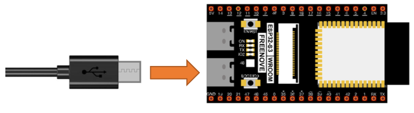

# ESP32-S3 WROOM Setup — Linux

## 1. CH343 USB Driver

On most Linux distributions, the CH343 USB-to-serial driver is included in the kernel and loads automatically when the ESP32-S3 is connected. No manual driver installation is typically required.

To verify the device is recognized after connecting via USB:
```bash
ls /dev/ttyUSB* /dev/ttyACM*
```

You should see a device such as `/dev/ttyUSB0` or `/dev/ttyACM0`.

**If you get a permission denied error when connecting Thonny**, add your user to the `dialout` group:
```bash
sudo usermod -aG dialout $USER
```
Then log out and back in for the change to take effect.

---

## 2. Install Thonny IDE

Thonny is the recommended Python IDE for programming the ESP32-S3 with MicroPython. Choose one of the following installation methods:

**Recommended installer** (installs a private Python 3.10 on x86_64):
```bash
bash <(wget -O - https://thonny.org/installer-for-linux)
```

**pip** (reuses your existing Python installation):
```bash
pip3 install thonny
```

**Flatpak:**
```bash
flatpak install org.thonny.Thonny
```

**Debian / Ubuntu / Raspbian / Mint:**
```bash
sudo apt install thonny
```

**Fedora:**
```bash
sudo dnf install thonny
```

---

## 3. Install Python 3

Python 3 is required to burn the MicroPython firmware. Most Linux distributions include it by default.

Check if it's installed:
```bash
python3 --version
```

If not, install it via your package manager, e.g.:
```bash
sudo apt install python3       # Debian/Ubuntu
sudo dnf install python3       # Fedora
```

Or download from: https://www.python.org/downloads/

---

## 4. Flash MicroPython Firmware

The ESP32-S3 needs MicroPython firmware flashed onto it before you can run Python programs.

The firmware is located in [setup/Python_Firmware/ESP32_GENERIC_S3-SPIRAM_OCT-20250809-v1.26.0.bin](./Python_Firmware/ESP32_GENERIC_S3-SPIRAM_OCT-20250809-v1.26.0.bin)



**Flash the firmware:**

1. Connect the ESP32-S3 WROOM to your computer via USB cable.
2. Open a terminal in the `Python_Firmware` folder:
   ```bash
   cd path/to/python_microcontrollers/setup/Python_Firmware
   ```
3. Run the firmware script (same script as macOS):
   ```bash
   python3 linux.py
   ```
4. Wait for the firmware to finish burning. A completion message will appear when done.

---

## 5. Configure Thonny

1. Open Thonny.
2. Go to **View** → enable **Files** and **Shell**.
3. Go to **Run** → **Configure interpreter**.
4. Set the interpreter to **MicroPython (ESP32)**.
5. Set the port to your serial device (e.g., `/dev/ttyUSB0` or `/dev/ttyACM0`).
6. Click **OK**.

---

## 6. Test the Connection

In the **Shell** panel at the bottom of Thonny, type:

```python
print('hello world')
```

Press **Enter**. If `hello world` is printed back, the connection is working correctly.

---

## 7. Running Code

### Run Online (while connected to PC)

1. In Thonny, click **Open…** → **This computer**.
2. Navigate to [first_examples/code/hello_world.py](../first_examples/code/HelloWorld.py)
3. Click **Run current script** (green play button).

> Note: If you press the reset button on the ESP32-S3 while running online, the code will not restart automatically.

