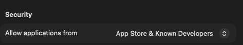
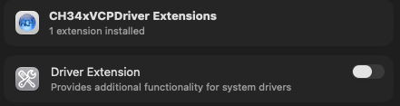

# ESP32-S3 WROOM Setup — macOS

## 1. Install the CH343 USB Driver

The ESP32-S3 WROOM uses the CH343 chip for USB-to-serial communication. You must install its driver before your Mac can communicate with the board.

1. Unzip the driver [CH34XSER_MAC.ZIP](./CH34XSER_MAC.ZIP)
2. If using MacOS 11 or higher open `CH34xVCPDriver.dmg`
    > If using an older version of MacOS ask for help
3. Allow applications from `App Store & Known Developers`
    > Go to System Settings -> Privacy & Security then scroll down to find setting
    
4. Drag the `CH34xVCPDriver` application to the Applications folder
5. Go to the `Applications` folder and open the app
    > Click `Open` when asked if you want to open the app
6. Click the `Install` button in the app window
    > Click `OK` when asked if you want to install a new driver extension
7. Enable Driver Extension in System Settings
    - Go to System Settings -> General -> Login Items & Extensions
    - Click the  next to `CH34xVCPDriver`
    - Click the slider and enter your password when prompted
    
    - Click Done

---

## 2. Install Thonny IDE

Thonny is the recommended Python IDE for programming the ESP32-S3 with MicroPython.

1. Download the installer: https://github.com/thonny/thonny/releases/download/v5.0.0/thonny-5.0.0-x64.pkg
2. Double-click the `.pkg` file and follow the installation prompts.
3. Once installed, open Thonny from your Applications folder


---

## 3. Flash MicroPython Firmware

The ESP32-S3 needs MicroPython firmware flashed onto it before you can run Python programs.

The firmware is located in [setup/Python_Firmware/ESP32_GENERIC_S3-SPIRAM_OCT-20250809-v1.26.0.bin](./Python_Firmware/ESP32_GENERIC_S3-SPIRAM_OCT-20250809-v1.26.0.bin)


**Flash the firmware:**

1. Connect the ESP32-S3 WROOM to your Mac via USB cable.
    - Use the right hand USB3 connection on the microcontroller
    - If the blue light is blinking when connected press the reset (RST) button
2. Open Finder and navigate to `setup` folder.
3. Right-click the `Python_Firmware` folder and select **New Terminal at Folder**.
4. In the Terminal, run:
   ```bash
   python3 mac.py
   ```
5. Wait for the firmware to finish burning. A completion message will appear when done.


---

## 4. Configure Thonny

1. Open Thonny.
2. Go to **View** → enable **Files** and **Shell**.
3. Go to **Run** → **Configure interpreter**.
4. Set the interpreter to **MicroPython (ESP32)**.
5. Set the port to the USB serial port for the ESP32-S3 (it will appear as something like `/dev/cu.usbserial-XXXX` or `/dev/cu.wchusbserial-XXXX`).
6. Click **OK**.
7. Press `Stop` sign to reset

---

## 6. Test the Connection

In the **Shell** panel at the bottom of Thonny, type:

```python
print('hello world')
```

Press **Enter**. If `hello world` is printed back, the connection is working correctly.

---

## 7. Running Code

### Run Online (while connected to Mac)

1. In Thonny, click **Open…** → **This computer**.
2. Navigate to [01_first_examples/code/HelloWorld.py](../01_first_examples/code/HelloWorld.py)
3. Click **Run current script** (green play button).

> Note: If you press the reset button on the ESP32-S3 while running online, the code will not restart automatically.

